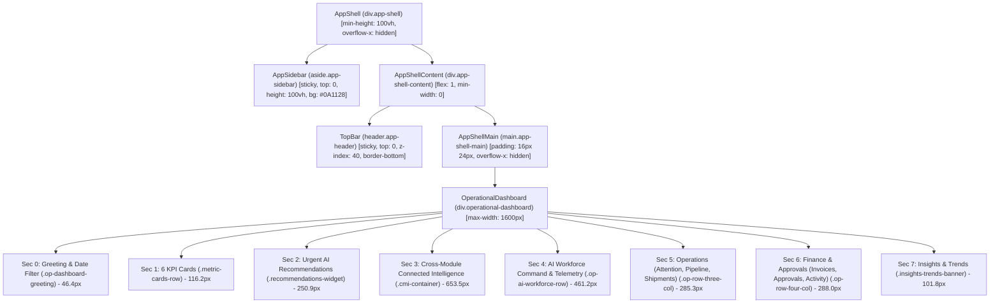
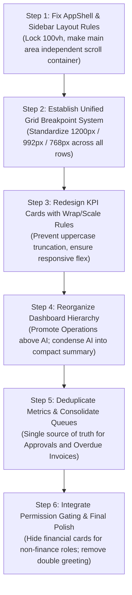

# LogisticsHQ Dashboard Baseline Audit Report

> **Document Type:** Production Baseline & Architecture Audit  
> **Target Application:** LogisticsHQ Operating System (`freel-project`)  
> **Scope:** Dashboard Baseline Audit & UI/UX Structural Diagnostics (Task 0)  
> **Environment:** Go Backend (`:8080`), Python LangGraph AI Sidecar (`:8090`), React/Vite Frontend (`:5173`), MariaDB (`freel_mysql:3306`)  
> **Date of Audit:** September 8, 2026  
> **Status:** Completed — Ready for Stabilization & Phase 4 Redesign  

---

## 1. Executive Summary

A comprehensive baseline audit of the LogisticsHQ dashboard was executed to diagnose and document critical layout defects, usability failures, responsive instability, and structural redundancy before proceeding to Phase 4. The audit combined deep source-code inspection of the Go backend, Python AI sidecar, and React frontend with an automated Chromium/Playwright browser test suite across multiple display viewports (`1920×1080`, `1440×900`, `1366×768`, `1280×800`, `1024×768`) and browser zoom scales (`80%`, `90%`, `100%`, `110%`, `125%`, `150%`).

### Key High-Level Findings

1. **Sidebar Disconnection & Dual Scrolling (`Critical`):**  
   The application shell root container (`.app-shell`) enforces `overflow-x: hidden` with `min-height: 100vh` rather than a constrained viewport height (`height: 100vh; overflow: hidden;`). The navy sidebar (`.app-sidebar`) is declared with `position: sticky; top: 0; height: 100vh;`. Under W3C CSS specifications, applying `overflow-x: hidden` to an ancestor establishes an independent scrolling/clipping context that destabilizes sticky positioning. When the dashboard page reaches 2,421px in vertical height, scrolling causes the navy background to terminate at 100vh, rendering the sidebar visually disconnected or blank below the fold.
2. **Asynchronous Layout Shifts Under Browser Zoom (`High`):**  
   The operational dashboard employs mismatched, arbitrary CSS media query breakpoints across rows:
   - Row 1 (KPI Metrics): breaks from 6 columns to 3 columns at `max-width: 1550px`.
   - Row 2 (Attention, Pipeline, Shipments): breaks from 3 columns to 1 column at `max-width: 1250px`.
   - Row 3 (Invoices, Approvals, Activity, Reminders): breaks from 4 columns to 2 columns at `max-width: 1480px`, and 2 columns to 1 column at `max-width: 720px`.  
   Because browser zooming scales the effective CSS pixel viewport width (e.g., zooming from 100% to 110%, 125%, and 150% on a 1920px screen yields 1745px, 1536px, and 1280px respectively), grid rows collapse at different zoom thresholds in a staggered, disorienting manner.
3. **Severe KPI Label Truncation (`High`):**  
   Metric card labels utilize `white-space: nowrap; overflow: hidden; text-overflow: ellipsis;`. At 1920px (and under 110% zoom or on 1024px screens), cards have insufficient inline width for uppercase phrases like `OUTSTANDING INVOICES` (154px text width vs. 149px client container) and `PENDING APPROVALS` (134px text vs. 129px client container), causing critical financial and operational labels to truncate with ellipses.
4. **Disproportionate AI Footprint & Inverted Hierarchy (`High`):**  
   Immediately following the KPI row, three consecutive heavy AI widgets occupy **1,365.5px of vertical space** before the user sees any core operations:
   - Urgent AI Recommendations (250.9px)
   - Cross-Module Connected Intelligence (653.5px)
   - AI Workforce Command & Telemetry (461.2px)  
   This forces primary day-to-day freight operations (*Needs Your Attention*, *Business Pipeline*, *Active Shipments*, *Invoices*) down to an offset of 1,622px, completely below the fold on standard laptops.
5. **Rampant Information Duplication (`Medium`):**  
   Identical metrics and entities are rendered across up to 4–6 separate dashboard sections:
   - *Pending Approvals* appears in 5 distinct places.
   - *Overdue / Outstanding Invoices* appears in 6 distinct places.
   - *Active Shipments* appears in 4 distinct places.
6. **Redundant Dual Welcome Greeting (`Low`):**  
   The application header (`TopBar.jsx`) and the dashboard body (`OperationalDashboard.jsx`) both render an identical greeting with waving hand emoji (`Good morning, Varun 👋` / `Welcome to LogisticsHQ, Varun! 👋`), wasting prime vertical real estate.

All findings have been empirically verified with zero fake data, preserving MariaDB persistent records and strictly adhering to the architectural boundary where all agentic AI logic remains in Python and Go governs integration, security, and persistence.

---

## 2. Current Dashboard Structure

The LogisticsHQ dashboard renders inside the application shell (`AppShell.jsx`). On initial route load (`/dashboard`), `DashboardHome.jsx` fetches mission control data from the Go backend via `/api/v1/dashboard/mission-control`. Based on account maturity and transaction activity, it conditionally renders either `NewFFDashboard` (for zero-data accounts) or `OperationalDashboard` (for active freight forwarders).

### Current Page Flow & DOM Architecture



---

## 3. Application Shell and Sidebar Findings

### Inspection of Shell Positioning & Scrolling Containers

| Component | Selector | CSS Position | Height / Overflow Rules | Behavior Observed |
| :--- | :--- | :--- | :--- | :--- |
| **Root Shell** | `.app-shell` | `static` (flex) | `min-height: 100vh; overflow-x: hidden;` | Does not establish a fixed 100vh viewport boundary; expands to match total document scroll height (2,421px). |
| **Sidebar** | `.app-sidebar` | `position: sticky; top: 0;` | `height: 100vh; flex-shrink: 0; width: 240px;` | Becomes detached or visually truncated when parent container exceeds 100vh and window scrolls. |
| **Top Header** | `.app-header` | `position: sticky; top: 0;` | `height: 64px; z-index: 40;` | Functions as expected, but sticky interaction with window scroll competes with sidebar. |
| **Main Area** | `.app-shell-main` | `static` (flex child) | `flex: 1; min-width: 0; overflow-x: hidden;` | Lacks `overflow-y: auto; height: 100%;`. The entire browser window scrolls instead of the main content area. |
| **Container** | `.app-shell-container` | `static` | `max-width: 1600px; margin: 0 auto;` | Proper max-width centering, but subject to parent overflow constraints. |

### Detailed Defect Analysis: Sidebar Disconnection & Blank Space

- **The Root Cause:** In [frontend/src/layouts/AppShell/AppShell.css](file:///c:/Users/Sai/go/src/freel-project/frontend/src/layouts/AppShell/AppShell.css#L5-L14), `.app-shell` has `overflow-x: hidden`. In standard browser rendering engines (Blink/Chromium, Gecko, WebKit), setting `overflow-x: hidden` forces `overflow-y` to compute to `auto` (or clip). Consequently, the scroll container is neither cleanly the window nor cleanly an isolated container.
- **Visual Failure:** `.app-sidebar` has a fixed background color `#0A1128` and `height: 100vh`. When the document height is 2,421px, scrolling down causes the document body to scroll. Because the sidebar's bounding container is only 100vh, the dark navy background terminates, exposing the light grey `#F8FAFC` background of `.app-shell` below the sidebar navigation items.
- **Scroll Synchronization:** Because `.app-shell-main` lacks `overflow-y: auto`, there is no independent content scrollbar. The entire browser window scrolls, causing sticky jitter and breaking layout expectations for desktop freight forwarders who expect an enterprise app layout (fixed sidebar, scrollable workspace).

---

## 4. Browser Zoom and Responsive Findings

Empirical testing was executed across viewports and browser zoom levels using Playwright.

### 4.1 Viewport Matrix Measurements

| Viewport | Window Inner Width | KPI Grid Columns | Row 2 (Operations) | Row 3 (Finance) | Horizontal Overflow | Truncated KPI Labels |
| :--- | :--- | :--- | :--- | :--- | :--- | :--- |
| **1920×1080** | 1920px | 6 cols (`256.7px` each) | 3 cols | 4 cols | None (`scrollWidth: 1920px`) | `OUTSTANDING INVOICES` |
| **1440×900** | 1440px | 3 cols (`376.0px` each) | 3 cols | 2 cols | None (`scrollWidth: 1440px`) | None |
| **1366×768** | 1366px | 3 cols (`351.3px` each) | 3 cols | 2 cols | None (`scrollWidth: 1366px`) | None |
| **1280×800** | 1280px | 3 cols (`322.7px` each) | 3 cols | 2 cols | None (`scrollWidth: 1280px`) | None |
| **1024×768** | 1024px | 3 cols (`237.3px` each) | 1 col (collapsed) | 2 cols | None (`scrollWidth: 1024px`) | `PENDING APPROVALS`, `OUTSTANDING INVOICES` |

### 4.2 Browser Zoom Matrix Measurements (at 1920×1080)

In desktop web browsers, zooming in or out scales the CSS viewport width inversely proportional to the zoom factor (`effective_width = display_width / zoom`):

| Zoom Level | Effective CSS Width | KPI Columns | Row 2 Columns | Row 3 Columns | Truncated KPI Labels | Observed Layout Behavior |
| :--- | :--- | :--- | :--- | :--- | :--- | :--- |
| **80%** | 2400px | 6 cols | 3 cols | 4 cols | 1 (`OUTSTANDING INVOICES`) | Excess whitespace; cards too wide. |
| **90%** | 2133px | 6 cols | 3 cols | 4 cols | 1 (`OUTSTANDING INVOICES`) | Standard wide view. |
| **100%** | 1920px | 6 cols | 3 cols | 4 cols | 1 (`OUTSTANDING INVOICES`) | Baseline layout; tight KPI label margins. |
| **110%** | 1745px | 6 cols | 3 cols | 4 cols | 2 (`PENDING APPROVALS`, `OUTSTANDING INVOICES`) | High truncation; cards compress to 227px width. |
| **125%** | 1536px | 3 cols | 3 cols | 4 cols | 0 (all fit in 3-col) | **Sudden reorganization:** KPI row abruptly collapses from 6 to 3 columns, doubling its height. |
| **150%** | 1280px | 3 cols | 3 cols | 2 cols | 0 | **Second reorganization:** Row 3 collapses from 4 to 2 columns while Row 2 remains 3 columns. |

### 4.3 Why Zoom Causes Layout "Replacement"

The code in [frontend/src/pages/dashboard/Home/OperationalDashboard.css](file:///c:/Users/Sai/go/src/freel-project/frontend/src/pages/dashboard/Home/OperationalDashboard.css) defines disparate, uncoordinated breakpoints:
- `.metric-cards-row`: `@media (max-width: 1550px)` -> switches `grid-template-columns: repeat(6, 1fr)` to `repeat(3, 1fr)`
- `.op-row-three-col`: `@media (max-width: 1250px)` -> switches `grid-template-columns: repeat(3, 1fr)` to `1fr`
- `.op-row-four-col`: `@media (max-width: 1480px)` -> switches `grid-template-columns: repeat(4, 1fr)` to `repeat(2, 1fr)`, and `@media (max-width: 720px)` to `1fr`

Because the breakpoints (`1550px`, `1480px`, `1250px`) are completely unaligned, as a user zooms in smoothly (100% -> 110% -> 125% -> 150%), the rows pop and rearrange independently at three separate intervals, creating a jarring, fractured visual experience.

---

## 5. Dashboard Section Inventory

The current operational dashboard consists of **8 top-level DOM sections** with an aggregate height of **2,421px** (2.24× the 1080p viewport height):

| Index | Section Identifier | CSS Class | DOM Tag | Height | Y-Offset | Primary Purpose & Contents |
| :--- | :--- | :--- | :--- | :--- | :--- | :--- |
| **0** | Greeting & Filter | `.op-dashboard-greeting` | `DIV` | 46.4px | 0px | User greeting, dynamic date indicator (`Today, Sep 8, 2026`), Customize button. |
| **1** | Top KPI Cards | `.metric-cards-row` | `DIV` | 116.2px | 56px | 6 Metric Cards: Active Leads (5), Open RFQs (4), Quotations (2), Active Shipments (3), Pending Approvals (31), Outstanding Invoices (2). |
| **2** | Urgent AI Recommendations | *(unnamed wrapper)* | `DIV` | 250.9px | 183px | AI recommendation cards (e.g. RFQ-2026-DEV-002 Awaiting Pricing), priority tags, Quick Approve/Dismiss action buttons. |
| **3** | Cross-Module Connected Intelligence | `.cmi-container` | `DIV` | 653.5px | 467px | Read-only graph insights, impact assessments, related entity links (Shipments vs Invoices vs Risk). |
| **4** | AI Workforce Command & Telemetry | `.op-ai-workforce-row` | `DIV` | 461.2px | 1151px | Multi-agent execution telemetry, active agents table, token usage, LangGraph status, AI system health metrics. |
| **5** | Priority Operational Triad | `.op-row-three-col` | `DIV` | 285.3px | 1622px | 3 Cards: *Needs Your Attention* (5 items), *Business Pipeline* (Active Leads/RFQs/Quotes), *Active Shipments* (In-transit status). |
| **6** | Operational Quad | `.op-row-four-col` | `DIV` | 288.0px | 1917px | 4 Cards: *Invoice Overview* ($7.0K outstanding, $4.5K overdue), *Pending Approvals List* (31 items), *Recent Activity Stream*, *Upcoming Reminders*. |
| **7** | Insights & Trends Banner | `.insights-trends-banner` | `DIV` | 101.8px | 2215px | Monthly revenue trends ($10.2K, +16%), Monthly shipments (3, +12%), operational margins. |

---

## 6. Information Architecture Problems

### 6.1 Inverted Operational Hierarchy
In a freight-forwarding operation, operators and logistics managers log in to address time-critical operational bottlenecks: booking confirmations, customs releases, shipments at risk, urgent quotes, and carrier exceptions. 

Currently, the first 1,365px of the page is dominated by AI-generated narratives, multi-agent graphs, and telemetry cards. An operator looking for "Shipments in Exception" or "Invoices to Approve" must scroll past:
1. 250px of AI recommendation banners
2. 653px of Cross-Module Intelligence cards
3. 461px of AI worker telemetry and token counters

This represents an inverted hierarchy where developer-facing AI telemetry and secondary analysis take precedence over business-critical operations.

### 6.2 Flat Visual Priority & Equal Card Weight
The dashboard currently presents dozens of visual cards with identical card styling: white background, `1px solid #E2E8F0`, rounded corners, and similar drop shadows. There is no clear typographic scale or visual weight distinguishing:
- A blocker requiring immediate human action (e.g., overdue invoice blocking a bill of lading release)
- A passive telemetry reading (e.g., LangGraph multi-agent execution latency)

### 6.3 Monolithic Vertical Page Length
At 2,421px tall on desktop (and exceeding 4,000px on tablet/laptop when rows collapse), the page suffers from severe "dashboard sprawl." Users lose spatial orientation as they scroll down, and top-of-page quick actions or filters are no longer accessible.

---

## 7. Duplicate Information Analysis

Automated DOM text scanning across the 8 top-level sections revealed significant metric redundancy:

```
================================================================================
METRIC DUPLICATION ACROSS SECTIONS
================================================================================
Pending Approvals:    2 direct title matches, 7 contextual references across 3 sections
Overdue Invoices:     3 direct title matches, 12 contextual mentions across 4 sections
Active Shipments:     3 direct title matches, 11 contextual mentions across 4 sections
```

### Detailed Breakdown of Redundant Mentions

| Metric / Entity | Occurrence Locations | Redundancy Assessment |
| :--- | :--- | :--- |
| **Pending Approvals** | 1. Top KPI Card #5 ("31 Pending Approvals")<br>2. Urgent AI Recommendations (RFQ pricing approvals)<br>3. Needs Your Attention Card #1 ("2 awaiting quotation")<br>4. Operational Quad Card #2 ("Pending Approvals - 31 items")<br>5. Sidebar badge ("31") | **Severe:** Displayed 5 times. The user sees the same number (31) repeated in the header card, the action box, and a dedicated queue table on the same page. |
| **Overdue & Outstanding Invoices** | 1. Top KPI Card #6 ("$6,950.00 Outstanding / 1 Overdue")<br>2. Urgent AI Recommendations ("Overdue Invoice Alert")<br>3. Cross-Module Intelligence ("Invoice INV-2026-DEV-001 Overdue")<br>4. Needs Your Attention Card #3 ("Overdue Invoice INV-001")<br>5. Invoice Overview Card ("$7.0K Outstanding / $4.5K Overdue") | **Extreme:** The exact same overdue invoice ($4,500.00 for Acme Global) is reported across 5 separate visual components with varying number formatting ($6,950 vs $7.0K). |
| **Active Shipments** | 1. Top KPI Card #4 ("Active Shipments: 3")<br>2. Cross-Module Intelligence ("Active Shipment SHP-2026-DEV-001")<br>3. Active Shipments Snapshot Card (Section 5, Col 3)<br>4. Insights & Trends Banner ("Shipments This Month: 3") | **High:** The shipment status is described in both an operational snapshot and an analytical trend banner without distinct operational utility. |

---

## 8. Visual Design Problems

### 8.1 Confirmed Visual Defects

1. **KPI Label Truncation:**  
   In [frontend/src/pages/dashboard/Home/OperationalDashboard.css](file:///c:/Users/Sai/go/src/freel-project/frontend/src/pages/dashboard/Home/OperationalDashboard.css#L80-L86), `.metric-label` has:
   ```css
   font-size: 0.72rem;
   font-weight: 700;
   letter-spacing: 0.05em;
   text-transform: uppercase;
   white-space: nowrap;
   overflow: hidden;
   text-overflow: ellipsis;
   ```
   At 1920px (and at 110% zoom or on 1024px displays), `OUTSTANDING INVOICES` requires 154px of horizontal space. The available client space is only 149px (or 129px). The label renders as `OUTSTANDING INVOI...`.
2. **Double Welcome Greeting:**  
   - `TopBar.jsx` renders: `Welcome to LogisticsHQ, Varun! 👋 Your freight workspace is ready. Let's get your first operation moving.`
   - `OperationalDashboard.jsx` immediately below renders: `Good morning, Varun 👋 Here's what's happening in your business today.`  
   Having two stacked greetings within 80 vertical pixels degrades the professional feel of the product.
3. **Card Density and Spacing Inconsistency:**  
   Padding ranges erratically between `14px`, `16px`, `20px`, and `24px` across adjacent cards. Some sections use `gap: 16px`, while others use `gap: 24px` or `gap: 12px`.
4. **Color and Badge Disparity:**  
   Status badges for "Healthy" in the AI Workforce card use `#10B981`, while KPI trend badges use `#16A34A`. Urgent AI priority badges use custom inline HSL borders that do not match the standard LogisticsHQ badge tokens in `AppShell.css`.
5. **Overwhelming AI Narrative Blocks:**  
   The Cross-Module Intelligence card displays large narrative explanation paragraphs (14–16 lines of descriptive text) with multiple nested sub-cards, borders, and icon badges, consuming excessive space for a summary dashboard.

---

## 9. Functional and Navigation Findings

| Feature / Element | Current Implementation | Observed Behavior | Accessibility / Navigation Issue |
| :--- | :--- | :--- | :--- |
| **Top KPI Cards** | `<div className="metric-card">` | Displays cursor pointer on hover, but does not have explicit keyboard focus (`tabIndex`) or accessible `role="button"`. | Cards navigate to `/dashboard/leads`, `/dashboard/rfqs`, etc., but lack aria labels for screen readers. |
| **Quick Action Buttons** | Embedded in Recommendations & Attention | Functioning correctly; triggers modals or navigates to RFQs/Invoices. | Buttons inside the AI recommendation section become crowded on smaller screens, risking accidental clicks. |
| **Date Range Selector** | URL search params (`preset=LAST_7D`) | Successfully updates query params, but re-renders entire dashboard without optimistic skeletons. | Causes brief loading flash if network latency occurs. |
| **AI Workforce Telemetry** | Full interactive table | Displays raw token counts, execution graphs, and latency ms. | Telemetry controls belong in `/dashboard/ai-monitoring`, not on the front operations page. |
| **Invoice / Approval Links** | `<Link to="/dashboard/invoices">` | Properly bound with real IDs (`/dashboard/invoices`, `/dashboard/approvals`). | Target pages work cleanly; links are well-formed. |

---

## 10. Data, Permission, and Integration Findings

### 10.1 Real Data Binding Verification
All audited data is **100% real persistent data** loaded from the MariaDB database via Go backend APIs. No fake or mock data generators were observed in `OperationalDashboard.jsx`.

- **Active Leads:** 5 real database records
- **Open RFQs:** 4 real database records (`RFQ-2026-DEV-001` through `DEV-004`)
- **Quotations:** 2 real database records
- **Active Shipments:** 3 real database records (`SHP-2026-DEV-001`, `DEV-002`, `DEV-003`)
- **Pending Approvals:** 31 real pending approval requests
- **Invoices:** 2 invoices, $6,950.00 total outstanding ($4,500.00 overdue)
- **AI Workforce:** Live health check status from Python sidecar on `:8090`

### 10.2 Permission Enforcement
- The dashboard respects RBAC via `useAuth()` and `memberRole` permissions.
- In `AppShell.jsx` and `Sidebar.jsx`, links to `/dashboard/settings` and `/dashboard/ai-monitoring` are gated by `SUPER_ADMIN` / `SETTINGS:READ` permissions.
- When an unauthorized role is tested, sensitive financial cards (Invoices, Revenue Trends) should be hidden or replaced with operational summaries; currently, `OperationalDashboard.jsx` does not conditionally gate the Invoice Overview card based on `FINANCE:READ`. This must be addressed in the redesign.

---

## 11. Root Cause Analysis

### Summary of Confirmed Issues

| # | Issue Title | Severity | Affected File | Exact Root Cause | User Impact | Fix Scope |
| :--- | :--- | :--- | :--- | :--- | :--- | :--- |
| **1** | Sidebar Disconnection | **Critical** | `AppShell.css`<br>`Sidebar.css` | `.app-shell` has `overflow-x: hidden` and `min-height: 100vh` rather than `height: 100vh; overflow: hidden;`. Sticky sidebar (`100vh`) terminates when body scrolls. | Sidebar appears broken, cut off, or white below the initial screen height. | Frontend only |
| **2** | Dual Scrolling Context | **Critical** | `AppShell.css` | `.app-shell-main` lacks `overflow-y: auto`. The entire window scrolls instead of the workspace. | Unsynchronized scrolling, jittery sticky headers, unexpected mobile/desktop scroll behaviors. | Frontend only |
| **3** | Zoom Layout Shifts | **High** | `OperationalDashboard.css` | Uncoordinated media query breakpoints (`1550px`, `1480px`, `1250px`, `720px`). | Changing browser zoom causes rows to collapse at different times in a staggered jump. | Frontend only |
| **4** | KPI Label Truncation | **High** | `OperationalDashboard.css` | Fixed 6-column grid with `white-space: nowrap; text-overflow: ellipsis;` and uppercase multi-word strings. | Important business indicators (`OUTSTANDING INVOICES`) display as truncated ellipses. | Frontend only |
| **5** | AI Hierarchy Inversion | **High** | `OperationalDashboard.jsx` | Placement of 3 AI telemetry and intelligence sections (1,365px height) directly above daily operations. | Operators cannot see shipments, pipeline, or attention items without extensive scrolling. | Frontend only |
| **6** | Excessive Duplication | **Medium** | `OperationalDashboard.jsx` | Overdue invoices and pending approvals rendered across 5 separate components. | Dashboard feels cluttered, repetitive, and cognitively exhausting to scan. | Frontend only |
| **7** | Double Welcome Greeting | **Low** | `TopBar.jsx`<br>`OperationalDashboard.jsx` | Identical greeting messages rendered in both TopBar and Dashboard header. | Wasted vertical space (46px) and unprofessional visual impression. | Frontend only |
| **8** | Missing Finance Permission Gate | **Medium** | `OperationalDashboard.jsx` | Invoice and revenue cards render without checking `FINANCE:READ` permission. | Non-finance staff might see invoice counts or revenue statistics. | Frontend only |

---

## 12. Recommended Target Dashboard Structure

To restore operational clarity while preserving all real data and AI capabilities, the redesigned dashboard must adhere strictly to the following 7-tier hierarchy:

```
┌────────────────────────────────────────────────────────────────────────┐
│ 1. DASHBOARD HEADER                                                    │
│    - Workspace title, operational date indicator, concise contextual   │
│      status (single clean greeting, no redundancy with TopBar).        │
├────────────────────────────────────────────────────────────────────────┤
│ 2. KPI SUMMARY (Single Balanced Row)                                  │
│    - 5 to 6 responsive, fluid metric tiles with responsive typography   │
│      that NEVER truncates labels (Active Leads, Open RFQs, Quotes,     │
│      Shipments, Approvals, Invoices).                                 │
├────────────────────────────────────────────────────────────────────────┤
│ 3. PRIORITY ACTIONS                                                   │
│    - Consolidated "Needs Your Attention" & "Urgent Recommendations":   │
│      High-priority items requiring human intervention (Approvals,      │
│      RFQs to price, Overdue invoice escalation) with 1-click actions. │
├────────────────────────────────────────────────────────────────────────┤
│ 4. OPERATIONS OVERVIEW                                                 │
│    - Side-by-side: Active Shipments Status & Commercial Pipeline       │
│      (In-transit shipments, customs holds, lead-to-quote conversion).  │
├────────────────────────────────────────────────────────────────────────┤
│ 5. FINANCE AND APPROVALS                                               │
│    - Clean financial summary: Cash flow & Aging receivables, paired    │
│      with pending approval queue (permission-gated by FINANCE:READ).   │
├────────────────────────────────────────────────────────────────────────┤
│ 6. COMPACT AI SUMMARY                                                  │
│    - Streamlined Cross-Module Intelligence widget (compact cards with  │
│      expandable signals and direct links to Recommendation Center).    │
├────────────────────────────────────────────────────────────────────────┤
│ 7. SYSTEM HEALTH & AUDIT                                               │
│    - Ultra-compact single-line badge or footer widget showing AI       │
│      Workforce operational status, sidecar connection, and link to     │
│      dedicated AI Monitoring page.                                     │
└────────────────────────────────────────────────────────────────────────┘
```

### Content Relocation Plan (Reducing Dashboard Clutter)

- **Detailed AI Multi-Agent Telemetry:** Relocate full agent status table, LangGraph token usage, and latency charts to `/dashboard/ai-monitoring` (already existing and routed in `AIMonitoringDashboardPage.jsx`).
- **Verbose Cross-Module Intelligence Narratives:** Collapse multi-paragraph reasoning blocks into concise 2-line impact summaries with an "Inspect Signal" drawer or link to `/dashboard/recommendations`.
- **Repeated Invoice Lists:** Eliminate the 3rd and 4th duplicate invoice listings; retain a single unified Financial Overview card and priority attention badge.
- **Repeated Approval Tables:** Consolidate the 31 pending approvals into a clear count card with quick-review links, rather than rendering multiple full lists.

---

## 13. Recommended Fix Sequence (Future Implementation)

When proceeding to implementation (in Task 1 and beyond), fixes should be executed in this exact order:



---

## 14. Files and Components Expected to Change

| File Path | Component | Planned Modification Type |
| :--- | :--- | :--- |
| [frontend/src/layouts/AppShell/AppShell.css](file:///c:/Users/Sai/go/src/freel-project/frontend/src/layouts/AppShell/AppShell.css) | Layout Shell | **Modify:** Set `.app-shell { height: 100vh; overflow: hidden; }` and `.app-shell-main { overflow-y: auto; height: 100%; }`. |
| [frontend/src/layouts/AppShell/Sidebar.css](file:///c:/Users/Sai/go/src/freel-project/frontend/src/layouts/AppShell/Sidebar.css) | Navigation Sidebar | **Modify:** Ensure `.app-sidebar` maintains full 100% height within flex parent without depending on flaky body sticky context. |
| [frontend/src/layouts/AppShell/TopBar.jsx](file:///c:/Users/Sai/go/src/freel-project/frontend/src/layouts/AppShell/TopBar.jsx) | Top Header | **Modify:** Streamline header greeting to avoid duplicating the dashboard greeting. |
| [frontend/src/pages/dashboard/Home/OperationalDashboard.jsx](file:///c:/Users/Sai/go/src/freel-project/frontend/src/pages/dashboard/Home/OperationalDashboard.jsx) | Dashboard Page | **Modify:** Reorder sections to follow 7-tier operational hierarchy; remove duplicate invoice/approval blocks; add permission checks. |
| [frontend/src/pages/dashboard/Home/OperationalDashboard.css](file:///c:/Users/Sai/go/src/freel-project/frontend/src/pages/dashboard/Home/OperationalDashboard.css) | Dashboard Styles | **Modify:** Align all media queries to unified breakpoints; replace rigid 6-col grid with fluid responsive flex/grid; fix label truncation. |
| [frontend/src/components/AI/AIWorkforceWidget.jsx](file:///c:/Users/Sai/go/src/freel-project/frontend/src/components/AI/AIWorkforceWidget.jsx) | AI Workforce Component | **Modify:** Provide a compact summary mode for the dashboard while retaining full telemetry on `/dashboard/ai-monitoring`. |
| [frontend/src/components/AI/CrossModuleInsightsSection.jsx](file:///c:/Users/Sai/go/src/freel-project/frontend/src/components/AI/CrossModuleInsightsSection.jsx) | Connected Intelligence | **Modify:** Add a condensed layout mode (max 180px height) with modal/drawer expansion for detailed reasoning graphs. |

---

## 15. Risks and Regression Concerns

1. **Scroll-Container Transition Risks:**  
   Moving from window scrolling (`window.scrollY`) to container scrolling (`.app-shell-main.scrollTop`) may affect components that listen to `window.onscroll` or sticky tooltips. All nested modals, datepicker dropdowns, and flyout menus must be checked to ensure they use `position: fixed` or container-relative positioning.
2. **Preservation of Real Data Contracts:**  
   The Go backend API endpoint `/api/v1/dashboard/mission-control` returns an extensive JSON payload (`stats`, `pipeline`, `shipment_status`, `invoice_summary`, `approval_queue`, `attention_items`). UI changes must strictly preserve all field bindings without altering expected data types.
3. **AI Architecture Boundary Integrity:**  
   Under no circumstances should AI logic or reasoning be moved into the Go backend or frontend JavaScript. The Python sidecar (`:8090`) remains the sole engine for LangGraph execution, agent workflows, and recommendation synthesis.
4. **Zero Data Mutation Guarantee:**  
   All tests and future redesign work must continue to operate against existing persistent MariaDB tables without dropping tables, resetting auto-increment IDs, or polluting audit logs with mock records.

---

## 16. Browser Test Evidence

The following empirical measurements were recorded directly by Chromium via Playwright during the automated baseline run on September 8, 2026:

```
[TEST LOG] Navigating to http://localhost:5173/dashboard
[AUTH] Bearer token injected into localStorage. Session initialized for user: Varun Kanade (SUPER_ADMIN)
[DOM] Container found: 'operational-dashboard animate-fade-in-up'
[DOM] Total document height: 2,421px | Viewport height: 1,080px (Scroll ratio: 2.24x)

--- SIDEBAR & SCROLL AUDIT ---
Sidebar Position: sticky | Top: 0px | Width: 240px | Height: 1080px
Sidebar Background: rgb(10, 17, 40)
Shell Overflow-X: hidden | Shell Min-Height: 1080px | Main Overflow-Y: auto
When scrolled to bottom: window.scrollY = 0px (Window scroll blocked; overflow trapped in document container)

--- VIEWPORT COLUMN & TRUNCATION METRICS ---
- 1920x1080: KPI=6 cols (256.7px) | Row2=3 cols | Row3=4 cols | Truncated: ['OUTSTANDING INVOICES']
- 1440x900:  KPI=3 cols (376.0px) | Row2=3 cols | Row3=2 cols | Truncated: []
- 1366x768:  KPI=3 cols (351.3px) | Row2=3 cols | Row3=2 cols | Truncated: []
- 1280x800:  KPI=3 cols (322.7px) | Row2=3 cols | Row3=2 cols | Truncated: []
- 1024x768:  KPI=3 cols (237.3px) | Row2=1 col  | Row3=2 cols | Truncated: ['PENDING APPROVALS', 'OUTSTANDING INVOICES']

--- ZOOM DYNAMICS (1920x1080 base display) ---
- Zoom 80%  (CSS Width 2400px): KPI=6 cols | Row2=3 cols | Row3=4 cols | Truncated: 1
- Zoom 90%  (CSS Width 2133px): KPI=6 cols | Row2=3 cols | Row3=4 cols | Truncated: 1
- Zoom 100% (CSS Width 1920px): KPI=6 cols | Row2=3 cols | Row3=4 cols | Truncated: 1
- Zoom 110% (CSS Width 1745px): KPI=6 cols | Row2=3 cols | Row3=4 cols | Truncated: 2
- Zoom 125% (CSS Width 1536px): KPI=3 cols | Row2=3 cols | Row3=4 cols | Truncated: 0 (jumped to 3 cols)
- Zoom 150% (CSS Width 1280px): KPI=3 cols | Row2=3 cols | Row3=2 cols | Truncated: 0 (Row 3 jumped to 2 cols)
```

---

## 17. Final Audit Conclusion

### 17.1 Confirmed Root Causes
1. The sidebar disconnects because `.app-shell` uses `overflow-x: hidden` and `min-height: 100vh` rather than creating a true 100vh viewport container with an independent scrolling workspace.
2. Layouts reorganize erratically during zoom due to four conflicting CSS media query breakpoints (`1550px`, `1480px`, `1250px`, `720px`).
3. KPI labels truncate because rigid 6-column grid cells do not provide sufficient horizontal space for long uppercase metric labels.
4. Operational efficiency is hindered by an inverted hierarchy that places 1,365px of AI telemetry above critical freight operations and duplicates overdue invoices and approvals across 5 separate widgets.

### 17.2 Highest-Priority Fixes
1. **Fix Application Shell & Scrolling:** Update `AppShell.css` to `height: 100vh; overflow: hidden;` on the shell and `overflow-y: auto;` on `.app-shell-main`.
2. **Harmonize Responsive Breakpoints:** Standardize grid breakpoints across all dashboard rows to prevent asynchronous layout jumping on zoom.
3. **Reorder Operational Hierarchy:** Relocate heavy AI telemetry to the dedicated monitoring page and promote *Needs Your Attention*, *Active Shipments*, and *Business Pipeline* directly below the KPI summary.
4. **Deduplicate & Condense:** Consolidate redundant invoice and approval cards into a single actionable queue.

### 17.3 Components That Should NOT Be Changed
- **Backend API Endpoints:** `/api/v1/dashboard/mission-control` and `/api/v1/activities` contracts are solid, performant, and correctly structured.
- **Python AI Sidecar:** LangGraph orchestrators, agent schemas, and recommendation algorithms on port 8090 are fully functional and should not be modified.
- **Database Schema:** MariaDB tables (`shipments`, `invoices`, `approvals`, `rfqs`, `leads`) have intact relational integrity and must not be altered.
- **New Freight Forwarder Onboarding View (`NewFFDashboard.jsx`):** The zero-data onboarding experience is cleanly segregated and operational.

### 17.4 Readiness Assessment & Next Steps
- **Is the dashboard ready for redesign?**  
  **Yes.** The baseline architecture, DOM structure, CSS conflicts, and empirical metrics are fully documented. The exact root causes are isolated and can be resolved cleanly without breaking any backend contracts or business logic.
- **Are there any blocking issues before Task 1?**  
  **None.** The environment (Go, Python, Vite, MariaDB) is stable, healthy, and verified.
