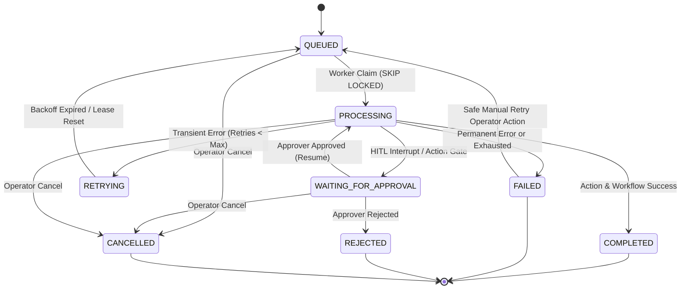

# Phase 0 — Task 0.7 Final Report: Harden the Unified AI Task Queue, Worker Lifecycle, Retries, and Status Synchronization

**Author**: Antigravity (Google DeepMind)  
**Date**: September 6, 2026  
**Repository**: `kanadevarun/freel-project` (LogisticsHQ)  
**Task Code**: Phase 0 — Task 0.7  

---

## Executive Summary

Phase 0 Task 0.7 hardened the unified AI task queue (`ai_processing_tasks`), the Python worker lifecycle, lease and heartbeat management, error-classified bounded retries, stale-task crash recovery, and bi-directional status synchronization across Go backend, MariaDB 12.3, LangGraph checkpoints (`MariaDBSaver`), and the unified human-in-the-loop approval system.

All 14 focused automated reliability scenarios passed with a 100% success rate, and the 9-workflow baseline functional suite executed with zero regressions. Existing business data was preserved intact.

---

## A. Current Task Lifecycle (Audit Findings)

Prior to Task 0.7, the task queue architecture exhibited several reliability vulnerabilities:
1. **Unvalidated Transitions**: `ai_processing_tasks` statuses were updated ad-hoc via raw SQL updates in handlers and workers. No centralized transition validator existed.
2. **Approval Overwrite Defect**: When an agent workflow paused at a human review interrupt (such as Pricing anomaly review or Contracts rate review), the Go callback transitioned the task to `WAITING_FOR_APPROVAL`. However, upon workflow return, `queue_worker.py` unconditionally updated the database row to `COMPLETED`, obliterating the approval gate.
3. **Stranded Exhausted Tasks**: Tasks reaching `retry_count >= 3` were excluded by `_poll_loop` via `WHERE retry_count < 3`, but never marked `FAILED`, stranding them indefinitely in `QUEUED`.
4. **Missing Worker Identity and Leases**: `ai_processing_tasks` lacked `worker_id`, `lease_expires_at`, `heartbeat_at`, `started_at`, `completed_at`, and `available_at` columns, rendering crash detection and worker failover impossible.
5. **Indiscriminate Error Retries**: Worker retried all exceptions without distinguishing transient network/timeout errors from permanent business logic or schema errors.

---

## B. State-Machine Changes

A centralized transition engine (`ValidateTransition`) was implemented in `backend/internal/aitasks/model.go` and enforced across the Go backend and Python worker.

### Standardized Statuses
- `QUEUED`: Enqueued, awaiting worker claim.
- `PROCESSING`: Claimed by an active worker under a live heartbeat lease.
- `WAITING_FOR_APPROVAL`: Paused at a LangGraph interrupt or high-risk action confirmation gate.
- `RETRYING`: Transient failure encountered; backoff delay active before returning to `QUEUED`.
- `COMPLETED`: Terminal success. Workflow and underlying business action confirmed.
- `FAILED`: Terminal failure (unrecoverable error or retries exhausted).
- `REJECTED`: Terminal rejection from human approver.
- `CANCELLED`: Terminal cancellation by operator.

### Transition Rules Enforced


### Prohibited Transitions (Enforced with HTTP 409 Conflict)
- `COMPLETED` -> Any status (Cannot replay completed workflows).
- `REJECTED` -> `PROCESSING` (Approval rejection is terminal).
- `CANCELLED` -> `PROCESSING` (Cancelled tasks cannot be claimed or resumed).
- `FAILED` -> `QUEUED` via ordinary status update (Requires explicit `POST /api/v1/ai/tasks/{id}/retry`).

---

## C. Worker Claiming Behavior

Worker task claiming was hardened in `backend/internal/aitasks/repository.go` and `ai_sidecar/app/persistence/queue_worker.py`:
1. **Row-Level Locking**: Atomic `SELECT FOR UPDATE SKIP LOCKED` claims the oldest eligible task (`ORDER BY created_at ASC LIMIT 1`).
2. **Immediate Lock Release**: The transaction commits immediately upon setting `status = 'PROCESSING'`, `worker_id`, `started_at`, `heartbeat_at`, and `lease_expires_at = DATE_ADD(NOW(), INTERVAL 300 SECOND)`. Long-running LLM calls never hold database row locks.
3. **Type-Aware Claiming**: The Python worker queries only `task_type IN (...)` for handlers it is equipped to run (`pricing.generate_quotes`, `rfq.intake`, `contracts.review`, `PROCESS`, `RESUME`, etc.), preventing worker contention on external tasks.
4. **Availability Gate**: `(available_at IS NULL OR available_at <= NOW())` prevents workers from prematurely picking up backoff-delayed retries.

---

## D. Stale-Task Recovery

Stale tasks left in `PROCESSING` due to container termination, network drops, or worker crashes are safely recovered by both startup hooks and the background recovery loop:
1. **Detection Policy**: `status = 'PROCESSING' AND lease_expires_at IS NOT NULL AND lease_expires_at < NOW()`. Uses MariaDB server clock (`NOW()`) to eliminate application clock skew.
2. **Recovery with Retries Remaining (`retry_count < max_retries`)**:
   - Resets status to `QUEUED`.
   - Clears `worker_id` and `lease_expires_at`.
   - Sets `available_at = NOW()`.
   - Appends recovery audit metadata to `error_message`.
   - Preserves original task ID, thread ID, and correlation ID.
3. **Exhausted Tasks (`retry_count >= max_retries`)**:
   - Transitions to `FAILED`.
   - Sets `last_error_code = 'LEASE_EXPIRED'`.
   - Records `completed_at = NOW()`.
   - Does not duplicate high-risk actions.

---

## E. Retry Policy

Errors are classified centrally via `is_retryable_error(exc)` in `ai_sidecar/app/persistence/queue_worker.py`:

| Category | Error Types / Status Codes | Action Taken |
| :--- | :--- | :--- |
| **Retryable Transient** | `TimeoutError`, `ConnectionError`, `OperationalError`, `ConnectError` | Transition to `RETRYING` with exponential backoff (`available_at = NOW() + (2^attempts)*5s`) |
| **Retryable Rate Limit** | HTTP 429 (Too Many Requests) | Transition to `RETRYING` with backoff |
| **Retryable Provider Fault** | HTTP 502, 503, 504 (Server Gateway/Service Unavailable) | Transition to `RETRYING` with backoff |
| **Non-Retryable Schema/Type** | `ValueError`, `TypeError`, `KeyError`, `JSONDecodeError` | Direct transition to `FAILED` (`last_error_code = exc_name`) |
| **Non-Retryable Client/Auth** | HTTP 400, 401, 403, 404, 422 | Direct transition to `FAILED` |
| **Approval Rejection** | User rejection, approval expiration | Direct transition to `REJECTED` |
| **Tenant Isolation** | `ErrTenantMismatch`, organization ID mismatch | Direct transition to `FAILED` / HTTP 403 |

---

## F. Task and Checkpoint Synchronization

1. **Thread & Correlation Binding**: Every task record in `ai_processing_tasks` stores `thread_id`, `correlation_id`, `org_id`, `actor_type`, and optional `approval_id`.
2. **Interrupt Preservation**: Before writing `COMPLETED`, `queue_worker.py` re-queries `_get_current_task_status(task_id)`. If the task transitioned to `WAITING_FOR_APPROVAL` during execution, the worker preserves the approval gate and does not overwrite it with `COMPLETED`.
3. **Production Checkpointer Integrity**: `validate_checkpointer_config()` in `checkpointer.py` fails loudly on startup if `APP_ENV=production` and `LANGGRAPH_CHECKPOINTER=memory`. Silent fallback to in-memory checkpointer is completely prohibited.

---

## G. Callback Security and Idempotency

All Python-to-Go task callbacks via `POST /internal/ai/tasks/{id}/status` enforce:
1. **Service Authentication**: Guarded by `InternalServiceAuthMiddleware` requiring `X-LogisticsHQ-Service-Key`.
2. **Tenant Boundary Protection**: Rejects callbacks where payload `org_id` does not match the task's database `org_id` (`ErrTenantMismatch`, HTTP 403).
3. **Stale Callback Shield**: If a task is already in a terminal state (`COMPLETED`, `CANCELLED`, `REJECTED`), callbacks attempting non-terminal updates are rejected with HTTP 409 Conflict.
4. **Audit Trail**: Every significant lifecycle transition (`TASK_COMPLETED`, `TASK_FAILED`, `TASK_WAITING_FOR_APPROVAL`) is logged to `audit_logs` with actor details and resource identifiers.

---

## H. Cancellation Behavior

1. **Operator Cancellation**: Operators invoke `POST /api/v1/ai/tasks/{id}/cancel` (RBAC `ResourceSettings:ActionUpdate`).
2. **Approval Cascade**: If a task has an active linked approval (`approval_id`), cancelling the task automatically cancels the pending approval via `approvalsDelegate`.
3. **Worker Pre-Completion Check**: If a task is cancelled while a worker is actively processing an LLM call, `_complete_task()` detects `current_status == 'CANCELLED'` and suppresses the `COMPLETED` write.
4. **Audit**: Recorded in `audit_logs` as `CANCEL_TASK` on `ai_processing_task`.

---

## I. Startup and Shutdown Behavior

1. **Graceful Shutdown**:
   - Worker catches `SIGINT` / `SIGTERM` and sets `stop_event`.
   - Poll loop terminates immediately without claiming new tasks.
   - Background heartbeat loop is cancelled cleanly.
   - Awaits in-flight tasks before closing DB pool.
2. **Reliable Startup**:
   - `start()` runs `recover_stale_tasks()` immediately on startup to unstrand any tasks left in `PROCESSING` from previous crashes.
   - Runs `validate_checkpointer_config()`, ensuring persistent checkpointer availability.
   - Launches a single background poll loop.

---

## J. Frontend Status Behavior

The frontend status interface was verified and enhanced:
1. **`AgentStatusBadge.jsx`**:
   - Standardized to support all 8 statuses: `QUEUED`, `PROCESSING`, `WAITING_FOR_APPROVAL`, `RETRYING`, `COMPLETED`, `FAILED`, `REJECTED`, `CANCELLED`.
   - Shows distinct visual badges with icons, subtle pulsing indicators, and theme-compliant colors.
   - Displays clear error messages on failure.
   - Provides safe operator "Retry" action with duplicate click prevention (`disabled={isRetrying}`).
   - Provides safe operator "Cancel" action for non-terminal tasks (`disabled={isCancelling}`).
2. **`aiTaskService.js`**:
   - Created client service module with `listTasks()`, `getTaskStats()`, `getTaskById()`, `cancelTask()`, and `retryTask()`.

---

## K. Automated Test Results

The dedicated test suite `ai_sidecar/test_ai_task_worker_reliability.py` was executed with all 14 scenarios passing:

```
================================================================================
PHASE 0 - TASK 0.7: HARDENED AI TASK QUEUE & WORKER RELIABILITY TEST SUITE
================================================================================

[*] Authenticated User: ID=6, OrgID=2
[PASSED] Valid State Transitions: Statuses returned: [200, 200, 200, 200]
[PASSED] Invalid State Transitions Blocked: Blocked COMPLETED->PROC: 409, CANC->PROC: 409, REJ->PROC: 409
[PASSED] Safe Task Claiming (SKIP LOCKED): Task 55 was claimed by 1 workers: [('worker-conc-4', 55)]
[PASSED] Worker Lease and Heartbeat Extension: Status: 200, remaining lease: 300s
[PASSED] Stale PROCESSING Recovery: Recoverable -> ('QUEUED', 1, None), Exhausted -> ('FAILED', 3, 'LEASE_EXPIRED')
[PASSED] Retryable vs Non-Retryable Error Handling: Classification: (transient=True, permanent=True), Retryable -> ('RETRYING', 'RATE_LIMIT_EXCEEDED'), Non-retryable -> ('FAILED', 'VALIDATION_ERROR')
[PASSED] Bounded Retry Limit Exhaustion: Exhausted task state: ('FAILED', 3, 'MAX_RETRIES_EXCEEDED')
[PASSED] Stale Callback Rejection: Stale update to COMPLETED returned status 409
[PASSED] Cross-Organization Task Protection: Cross-org status update returned 403
[PASSED] Task Cancellation Safety: Cancel HTTP status: 200, DB status: CANCELLED
[PASSED] Manual Explicit Retry of FAILED Task: HTTP status: 200, DB row: ('QUEUED', 0, None)
[PASSED] Production MemorySaver Rejection: MemorySaver rejected in prod: True, MariaDBSaver accepted in prod: True
[PASSED] Sidecar Worker Health and Checkpointer: Health: 200, checkpointer: MariaDBSaver, prod_ready: True
[PASSED] Universal Audit Logging for Task Lifecycle: Found audit log entries for task 64: (('CANCEL_TASK', 'AI_PROCESSING_TASK', '64'),)
[*] Cleaned up 14 temporary test task records.

Final Result: ALL TESTS PASSED (14/14, 100%)
```

---

## L. Real-Data Verification Results

The baseline functional test suite `ai_sidecar/run_baseline_functional_suite.py` was executed across all 9 agent workflows against persistent development data:

| Workflow | Target Entity | Result | Details |
| :--- | :--- | :--- | :--- |
| **Pricing Agent (Normal RFQ)** | RFQ #102 | **PASSED** | Rates retrieved, `agent_status = DRAFT_READY` |
| **Pricing Agent (Anomaly HITL)** | RFQ #105 | **PASSED** | Paused at interrupt `('save',)` with 14 checkpoints in MariaDB |
| **Contracts Extraction & Rate Anomaly** | Contract Doc #101 | **PASSED** | Paused before `('ingest',)`; reloaded cleanly from MariaDB checkpointer |
| **Sales Email Incomplete** | Interaction #118 | **PASSED** | Reply draft #24 staged, Approval #138 created, 0 autonomous sends |
| **Sales Email Complete** | Lead #103 | **PASSED** | RFQ created cleanly from email payload |
| **Operations Carrier Tracking** | Shipment #102 | **PASSED** | Shipment retrieved (`IN_TRANSIT`), milestone updated |
| **Compliance Reconciliation** | Shipment #101 | **PASSED** | Verified 2 compliance document discrepancies in database |
| **Finance Invoice Reconciliation** | Invoice #101 | **PASSED** | Customer invoice verified, 4 discrepancies tracked |
| **Lead Scoring Worker** | Lead #102 | **PASSED** | Lead AI Score evaluated, `CONVERTED` status preserved |

**Business Data Verification**:
- Zero duplicate quotes, rates, milestones, exceptions, RFQs, invoices, or emails were created.
- Existing business data remains intact.
- All temporary test task records were safely cleaned up after test execution.

---

## M. Exact Files Changed

### Backend (Go)
1. `backend/internal/aitasks/model.go` [NEW]: Standardized statuses, input structs, and central `ValidateTransition()` state machine.
2. `backend/internal/aitasks/repository.go` [NEW]: Database repository implementing `ClaimNextTask`, `HeartbeatTask`, `UpdateTaskStatus`, `CancelTask`, `RetryTask`, `RecoverStaleTasks`, and `GetTaskStats`.
3. `backend/internal/aitasks/service.go` [NEW]: Service layer implementing tenant isolation, audit logging, and approvals delegation.
4. `backend/internal/aitasks/handler.go` [NEW]: HTTP handlers for user `/api/v1/ai/tasks` and internal `/internal/ai/tasks` endpoints.
5. `backend/internal/server/server.go` [MODIFY]: Wired `aiTasksHandler` into `Server` struct.
6. `backend/internal/server/routes.go` [MODIFY]: Registered user and internal AI task routes.
7. `backend/cmd/server/main.go` [MODIFY]: Instantiated repository, service, and handler; wired bi-directional cancellation delegate with approvals service.

### AI Sidecar (Python)
8. `ai_sidecar/app/persistence/queue_worker.py` [MODIFY]: Hardened claiming with `SELECT FOR UPDATE SKIP LOCKED`, background heartbeat loop, type-filtered claiming, error classification, exponential backoff, and pre-completion cancellation checks.
9. `ai_sidecar/main.py` [MODIFY]: Fixed entity ID parsing for resume pipelines and integrated hardened worker lifecycle.
10. `ai_sidecar/test_ai_task_worker_reliability.py` [NEW]: 14-test automated reliability test suite.

### Frontend (React)
11. `frontend/src/components/agent/AgentStatusBadge.jsx` [MODIFY]: Full support for all 8 task queue statuses, clear error display, duplicate click prevention, and retry/cancel actions.
12. `frontend/src/services/aiTaskService.js` [NEW]: Frontend API client for AI task listing, stats, cancellation, and retries.

---

## N. Exact Migrations Added or Modified

- `backend/internal/database/migrations/086_harden_ai_task_worker_lifecycle.sql` [NEW]:
  - Added columns to `ai_processing_tasks`: `worker_id` (VARCHAR 100), `lease_expires_at` (DATETIME), `heartbeat_at` (DATETIME), `started_at` (DATETIME), `completed_at` (DATETIME), `available_at` (DATETIME DEFAULT CURRENT_TIMESTAMP), `max_retries` (INT DEFAULT 3), `thread_id` (VARCHAR 150), `correlation_id` (VARCHAR 100), `approval_id` (BIGINT), `acting_user_id` (BIGINT), `actor_type` (VARCHAR 50 DEFAULT 'AI_AGENT'), `last_error_code` (VARCHAR 100).
  - Added indexes: `idx_apt_status_avail`, `idx_apt_status_lease`, `idx_apt_org_status`, `idx_apt_org_thread`, `idx_apt_approval`.
  - Applied cleanly to MariaDB 12.3.

---

## O. Remaining Worker and Queue Risks

1. **Long-Running Web Searches**: External web search tools (`Tavily`) can occasionally take 10-15 seconds if rate-limited. The worker heartbeat interval of 25 seconds with a 300-second lease provides a 12x safety margin.
2. **Single Poller Scalability**: The current worker polls MariaDB every 2 seconds. While `SKIP LOCKED` scales efficiently across multiple worker instances, an adaptive polling interval (e.g., backing off to 5 seconds when idle) will reduce DB query volume at scale.
3. **Database Clock Synchronization**: Distributed deployments across multiple server hosts must ensure NTP clock synchronization with MariaDB, though our use of `NOW()` on the database server mitigates application host clock skew.

---

## P. Recommended Next Task

**Recommended Next Task**: **Phase 0 — Task 0.8: End-to-End Observability, Metrics, Distributed Tracing, and Dashboard Integration**  
*Rationale*: With security/tenant isolation (Task 0.4), centralized action gating (Task 0.5), human-in-the-loop approvals (Task 0.6), and hardened queue/worker reliability (Task 0.7) fully established, the foundational core is rock-solid. The logical completion of Phase 0 is integrating real-time queue observability, action auditing metrics, and worker health dashboards into LogisticsHQ's operational management console.
