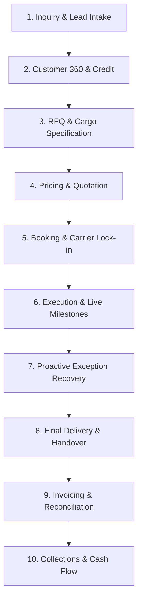

# LogisticsHQ: The Complete Business Operating Journey
## An End-to-End Operational Handbook for Modern Freight Forwarding & Logistics Management

---

## Executive Introduction: The Purpose of This Handbook

This document is the definitive, business-oriented guide to **LogisticsHQ**. It explains how a modern freight forwarding enterprise operates within a unified digital platform—from the very first moment a customer reaches out with a shipping inquiry, all the way through pricing, booking, physical movement across oceans and continents, real-time tracking, proactive problem solving, client communication, billing, cash collections, and long-term contract management.

### Who Is This Handbook For?
- **Company Founders & Executives**: To understand how the platform provides total operational visibility, protects profit margins, and drives business expansion.
- **Operations Managers & Logistics Coordinators**: To see how daily coordination, carrier bookings, documentation, and milestones are executed without spreadsheet chaos.
- **Sales & Commercial Teams**: To discover how inquiries turn into winning quotations in minutes rather than days.
- **Finance & Accounting Personnel**: To see how invoices, carrier costs, credit limits, and payment collections flow seamlessly from operational data.
- **Customer Service Representatives**: To understand how clients receive proactive, accurate answers before they even have to ask.
- **Prospective Clients & Partners**: To evaluate how LogisticsHQ delivers predictability, speed, and transparency to international supply chains.

---

# Part 1 — What is LogisticsHQ?

## 1.1 The Core Business Challenge
International freight forwarding is one of the most complex, high-stakes industries in global commerce. Moving thousands of tons of cargo across oceans, borders, and rail lines requires coordinating dozens of independent parties: shippers, consignees, ocean carriers, airlines, trucking companies, customs brokers, port authorities, and warehouses.

Traditionally, freight forwarders have managed this complexity using **disconnected tools**:
- Sales leads buried in employee email inboxes.
- Price calculations performed manually on custom Excel spreadsheets.
- Bookings confirmed via separate carrier web portals.
- Shipment tracking conducted by manually refreshing shipping line websites multiple times a day.
- Delays and customs holds discovered only when an angry customer calls.
- Billing generated manually days or weeks after delivery, causing delayed cash flow and disputed invoices.

This fragmentation leads to operational bottlenecks, missed revenue, costly demurrage fees, and stressed teams.

## 1.2 The LogisticsHQ Solution
**LogisticsHQ is an all-in-one digital operating platform designed specifically for freight forwarders and logistics service providers.** 

It replaces fragmented tools with a **single, unified workspace** where sales, operations, customer service, and finance work together in real time. 

Every shipment in LogisticsHQ is treated as a single continuous business journey. A piece of information entered by sales during the initial phone call automatically informs the quotation, pre-populates the carrier booking, configures the tracking schedule, sets up customs document checklists, drafts the commercial invoice, and calculates the exact profit margin.

```
┌────────────────────────────────────────────────────────────────────────┐
│               TRADITIONAL FORWARDING vs. LOGISTICSHQ                   │
├───────────────────────────────────┬────────────────────────────────────┤
│ Traditional Forwarding (Fragmented)│ LogisticsHQ (Unified Journey)       │
├───────────────────────────────────┼────────────────────────────────────┤
│ • Inquiries lost in email chains  │ • Centralized AI Lead Intake       │
│ • Manual spreadsheet rate lookups │ • Instant Rate Discovery & Quotes  │
│ • Phone & email carrier booking   │ • Direct Electronic Carrier Booking│
│ • Manual container web tracking   │ • 24/7 Automated Milestone Polling │
│ • Reactive crisis management      │ • Predictive Exception Detection   │
│ • Delayed, error-prone invoices   │ • 1-Click Operational Invoicing    │
│ • Uncoordinated debt collection   │ • Intelligent Collections Engine   │
│ • Siloed operational knowledge    │ • Real-time Executive Control Tower│
└───────────────────────────────────┴────────────────────────────────────┘
```

## 1.3 The Role of Artificial Intelligence: Augmentation, Not Replacement
LogisticsHQ integrates advanced Artificial Intelligence throughout the entire shipment lifecycle. However, its philosophy is strict: **AI is designed to assist and accelerate human professionals, not to operate in the dark.**

- **What the AI Does**: It handles repetitive, time-consuming tasks. It reads unstructured emails to extract cargo details, compares carrier rate sheets, monitors thousands of shipping containers simultaneously for transit delays, highlights missing paperwork, and drafts professional client communications.
- **What Humans Do**: Human experts retain complete decision-making authority. Operations managers review and approve carrier selections; commercial directors approve non-standard discounts; finance controllers confirm payments. 
- **The "Autonomy Dial"**: Leadership can specify exactly how much autonomy the system is granted—from requiring human approval on every single step, to allowing automatic processing of low-risk, routine transactions within strict financial limits.

---

# Part 2 — The Big Picture: The 10-Stage Operating Journey

The entire business lifecycle within LogisticsHQ flows through ten interconnected operational stages:



Below is the stage-by-stage walkthrough of how cargo moves through the business, how each team interacts with the platform, and how value is delivered to the end customer.

---

# Part 3 — Stage 1: Inquiry & Lead Intake

Every shipment begins with an inquiry. Whether a customer reaches out via email, an online form, or a telephone call, LogisticsHQ ensures that no commercial opportunity is overlooked.

### How Inquiries Enter the System
1. **Automated Inbox Syncing**: LogisticsHQ can connect directly to team inboxes (such as `inquiries@freel-logistics.com` or `sales@company.com`). When a new email arrives, the platform automatically logs it as an incoming lead.
2. **Web Inquiries & Manual Entry**: Sales representatives can immediately enter leads received from trade fairs, phone calls, or corporate referrals using an intuitive entry screen.

### The Intelligent Lead Assistant at Work
When an unstructured email arrives—for example:
> *"Hi team, we have 2x40ft High Cube containers of automotive spare parts ready at Nhava Sheva (INNSA) needing transport to Hamburg (DEHAM) next month around October 15th. Door delivery required in Stuttgart. Please quote ocean and trucking."*

LogisticsHQ does not require a sales rep to retype this information. The system's intelligent intake engine automatically:
- Identifies the sender and checks if they represent an existing customer account.
- Extracts key shipping details: Origin (`Nhava Sheva`), Destination (`Hamburg`), Cargo Type (`2x 40ft HC`), Commodity (`Automotive Parts`), Target Date (`October 15`), and Requested Service (`Door Delivery to Stuttgart`).
- Flags missing commercial details (such as whether cargo insurance or export customs clearance is required).
- Drafts an immediate, polite clarification or acknowledgment message for the sales representative to review and send with a single click.

### Business Value Delivered
- **Zero Inquiries Dropped**: Inbound leads are tracked on a central commercial board rather than disappearing in personal inboxes.
- **Speed to First Response**: Response times drop from 24–48 hours to under 15 minutes, dramatically increasing quote-to-deal conversion rates.

---

# Part 4 — Stage 2: Customer 360 & Account Management

Before issuing quotes or committing carrier space, a freight forwarder must know who they are doing business with. LogisticsHQ maintains a comprehensive **Customer 360** profile for every trading partner.

### What the Customer Profile Contains
- **Corporate & Legal Records**: Legal registered business name, tax identification numbers (e.g., GST, VAT, EIN), corporate headquarters, and verified operational branches.
- **Stakeholder Directory**: Key contacts across logistics, procurement, and accounts payable, including direct phone numbers and specific communication preferences.
- **Financial Terms & Credit Limits**: Approved payment credit days (e.g., Net 30, Advance Payment, Cash on Delivery) and assigned credit ceiling amounts.
- **Special Operational Requirements**: Preferred shipping lines, cargo handling constraints (e.g., "Always use food-grade containers", "Never transship through specific ports"), and custom billing instructions.

### Relationship Intelligence
When a sales or operations team member opens a customer's profile, they immediately see:
- **Historical Volume & Lanes**: What routes this customer frequently books, their average cargo weight, and seasonal shipping patterns.
- **Financial Health Indicator**: Whether the customer pays their invoices on time, their current outstanding balance, and remaining credit buffer. If a customer is over their credit limit or has overdue invoices older than 60 days, the platform alerts the commercial team before new bookings are accepted.
- **Past Profitability**: Historical gross profit margins earned on this account, allowing sales reps to negotiate with complete commercial confidence.

---

# Part 5 — Stage 3: Request for Quotation (RFQ) Processing

When an inquiry matures into a formal request for pricing, it enters the **RFQ Management Module**.

### Detailed Cargo Specification
LogisticsHQ supports all standard international shipping modes:
- **Ocean Freight — Full Container Load (FCL)**: Standard 20ft, 40ft, 40ft High Cube, Refrigerated (Reefer), Flat Rack, and Open Top containers.
- **Ocean Freight — Less than Container Load (LCL)**: Consolidated cargo measured by weight (Kilograms/Metric Tons) and volume (Cubic Meters/CBM).
- **Air Freight**: Priority, Standard, and Charter air cargo with automatic volumetric weight calculations (1:6000 ratio).
- **Inland Logistics (Road & Rail)**: First-mile pickup and last-mile door delivery.

### Cargo Compliance & Special Handling Checks
During RFQ creation, the platform prompts the operator for critical cargo classifications:
- **Hazardous Goods (HAZMAT/IMO)**: Checks for UN numbers, IMO classes, and material safety data sheet (MSDS) requirements.
- **Perishable & Temperature-Controlled**: Temperature range tolerances and ventilation settings.
- **Trade Terms (Incoterms 2020)**: Explicitly registers whether the quotation is FOB (Free on Board), CIF (Cost, Insurance & Freight), EXW (Ex Works), or DDP (Delivered Duty Paid). This ensures that origin and destination local charges are billed to the correct party without disputes.

---

# Part 6 — Stage 4: Pricing, Rate Discovery & Quotation

Calculating international freight rates has historically been a slow, manual process. Forwarders must contact multiple shipping lines, check port tariffs, verify fuel surcharges, calculate currency exchange rates, and add their profit markup. LogisticsHQ streamlines this into a fast, transparent workflow.

### The Rate Discovery Engine
1. **Contracted Carrier Rates**: LogisticsHQ stores your pre-negotiated service contracts with major ocean carriers and air freight providers.
2. **Real-Time Spot Benchmarks**: Operators can check current spot market rates across key global shipping lanes.
3. **Comprehensive Cost Itemization**: The platform automatically builds a standardized breakdown covering:
   - **Ocean / Air Freight**: Base freight rate per container or ton.
   - **Bunker & Fuel Surcharges**: BAF, CAF, Emergency Fuel Adjustments.
   - **Origin Local Charges**: Terminal Handling Charges (THC), documentation fees, export customs filing, gate-in fees.
   - **Destination Local Charges**: Delivery orders, destination port handling, import clearance.
   - **Ancillary Services**: Cargo insurance, warehousing, bonded transit, and final delivery trucking.

### Profit Margin Protection
When pricing a quote, the operator sets the target sell price. LogisticsHQ displays:
- **Net Buy Cost**: What the forwarder will pay to carriers and vendors.
- **Gross Sell Price**: What the customer will be billed.
- **Gross Profit (GP) & Margin Percentage**: Calculated in real time across the quotation.
- **Minimum Margin Safeguards**: If a sales representative attempts to quote a rate below company-mandated profit thresholds, the system flags the quote and routes it to the Sales Manager for approval before it can be dispatched.

### One-Click Professional Quotation Dispatch
Once approved, LogisticsHQ generates a clean, branded digital quotation:
- Itemized charges in the customer's preferred currency (USD, EUR, GBP, INR, etc.).
- Explicit validity dates (e.g., "Valid until October 31st").
- Clear terms, inclusions, exclusions, and payment conditions.
- The quote can be sent directly to the client via email, complete with an interactive link allowing the client to accept the quote with a single click.

---

# Part 7 — Stage 5: Booking & Carrier Confirmation

Once the client accepts the quotation, the deal is commercially won. LogisticsHQ immediately converts the quotation into an active **Booking**.

### Eliminating Duplicate Data Entry
In traditional systems, winning a quote requires an operations coordinator to re-enter all cargo, customer, and pricing details into an operational booking file. In LogisticsHQ, **all data flows forward automatically**. The booking inherits the agreed rates, origin/destination ports, container counts, cargo weights, and delivery terms without a single keystroke.

### Securing Carrier Space
To execute the shipment, the forwarder must secure vessel space from the shipping line:
- **Direct Carrier Electronic Booking**: For connected ocean carriers (including Maersk, MSC, Hapag-Lloyd, CMA CGM, ONE, and Evergreen), coordinators can initiate booking requests directly from within the platform.
- **Booking Reference Management**: Once the carrier confirms vessel space, the **Carrier Booking Number**, allocated vessel name, voyage number, container pickup depot, and cutoff dates are recorded in the booking file.
- **Cutoff Management**: The system highlights critical operational deadlines:
  - **Shipping Instruction (SI) Cutoff**: Deadline to submit Bill of Lading details.
  - **VGM Cutoff**: Deadline to submit Verified Gross Mass container weights.
  - **Port Gate-In Cutoff**: Deadline for loaded containers to enter the terminal gates.

### Generating the Booking Confirmation
LogisticsHQ automatically produces an official **Booking Confirmation** document for the shipper, specifying the empty container pickup depot, cargo cutoff times, port terminal details, and sailing schedules.

---

# Part 8 — Stage 6: Shipment Execution & Live Milestones

When the cargo begins its physical journey, the booking transitions into an active **Shipment Record**. This is the operational command center for moving the cargo from origin to destination.

### Operational Data Captured
- **Container Numbers & Seal Numbers**: Specific container identifiers and high-security customs seal numbers.
- **Transport Documents**: Master Bill of Lading (MBL) number issued by the ocean carrier, and House Bill of Lading (HBL) issued by the forwarder to the shipper.
- **Customs Documentation**: Export shipping bills, import customs entry documents, commercial invoices, and packing lists.

### 24/7 Automated Milestone Tracking
Coordination teams no longer spend hours logging into multiple carrier websites to check container statuses. LogisticsHQ connects directly to carrier tracking systems, satellite AIS ship tracking, and port terminal feeds to automatically update the shipment's milestone timeline:

```
[1. Empty Container Released] ──► [2. Gate-in at Origin Port] ──► [3. Customs Export Cleared]
                                                                        │
[6. Vessel Arrival at Destination] ◄── [5. In Ocean Transit] ◄── [4. Loaded on Vessel]
       │
       ▼
[7. Customs Import Cleared] ──► [8. Gate-out from Terminal] ──► [9. Final Door Delivery]
```

Every milestone records:
- **Planned Date & Time**
- **Actual Event Date & Time**
- **Location / Terminal / Vessel**
- **Current Operational Status** (e.g., *Booked, In Transit, Arrived, Delivered*)

### Keeping Customers Informed Automatically
Whenever a critical milestone occurs—such as the vessel departing the origin port or cargo clearing import customs—LogisticsHQ can automatically send an email update to the customer. Shippers receive professional, timely updates without ever needing to chase your coordinators.

---

# Part 9 — Stage 7: Proactive Exception Recovery

In global logistics, unexpected disruptions happen: vessels skip ports due to bad weather, port terminals experience labor congestion, containers miss feeder connections, or customs authorities place holds on cargo. 

The measure of an elite freight forwarder is not whether problems occur, but **how fast and effectively they are solved**.

### What is an Exception in LogisticsHQ?
An exception is any event that threatens the promised delivery schedule, cargo safety, or financial profitability of a shipment. Examples include:
- **Carrier Rollover**: The shipping line overbooks the vessel and rolls the container to the following week.
- **Transit Delay**: Severe weather causes the container ship to arrive 4 days behind schedule.
- **Customs Hold**: Destination customs officials flag documentation discrepancies on the commercial invoice.
- **Port Congestion**: Long terminal dwell times threatening to incur expensive container storage and demurrage fees.

### Predictive Risk Detection
LogisticsHQ does not wait for a delay to become a crisis. Its intelligent monitoring engine constantly cross-references carrier schedules, satellite vessel positions, and port dwell times to **predict delays before they happen**. 
- If a vessel is steaming at reduced speed and will miss its feeder connection in Singapore, the system alerts the operations manager days in advance.
- If a container sits at a destination terminal nearing the end of its free detention period, the system triggers a financial risk alert to prevent expensive demurrage penalties.

### The Exception Resolution Workflow
When an exception is flagged:
1. **Immediate Visual Alert**: The shipment is marked with an amber or red risk indicator on the operational dashboard.
2. **Root Cause Analysis**: The system displays the specific event, the affected containers, and the estimated impact on the final delivery date.
3. **Recovery Action Plan**: The platform presents recommended corrective actions (e.g., booking an alternative rail connection, contacting the customs broker with updated documentation, or notifying the client's receiving warehouse).
4. **Governed Communication**: The system prepares an empathetic, professional customer advisory explaining the situation, the impact, and the recovery steps being taken. An operations coordinator reviews the message, makes any desired edits, and dispatches it with one click.

---

# Part 10 — Stage 8: Delivery & Operational Completion

When the vessel arrives at the port of discharge, the final phase of cargo movement begins:
1. **Discharge & Terminal Handling**: Containers are unloaded from the vessel onto the terminal quay.
2. **Import Customs Clearance**: Documentation is submitted to customs authorities for final duty payment and release.
3. **Inland Drayage & Final Delivery**: Trucking carriers pick up the container from the port terminal and transport it to the consignee's receiving warehouse.
4. **Proof of Delivery (POD)**: Upon physical handover, the receiving warehouse signs the delivery receipt. The signed POD is photographed or scanned, uploaded to the shipment record in LogisticsHQ, and immediately made available to both the forwarder's team and the customer.
5. **Empty Container Return**: The system tracks the empty container's return to the carrier's designated inland container depot (ICD), verifying that the container interchange receipt is logged and no late-return fees are incurred.

With physical delivery complete and the POD recorded, the shipment status moves to **Delivered**.

---

# Part 11 — Stage 9: Invoicing & Cost Reconciliation

Once cargo is delivered, the shipment transitions from physical movement to financial settlement. LogisticsHQ connects operational milestones directly to accounting, ensuring fast, accurate billing.

### Generating the Sales Invoice
In traditional companies, invoicing can take days while finance asks operations for rate sheets and billable weights. In LogisticsHQ, the sales invoice is generated in **one click**:
- **Automatic Rate Inheritance**: Every line item from the accepted quotation (ocean freight, local charges, trucking fees) is automatically pre-filled.
- **Actual Quantity Verification**: The invoice automatically reflects verified container counts, billable weights, and customs declarations.
- **Accurate Currency Conversion**: Multi-currency shipments (e.g., ocean freight quoted in USD, local transport in EUR) are converted using verified corporate exchange rates.
- **Tax & Compliance Compliance**: Applicable sales taxes (e.g., GST, VAT) are calculated automatically based on the trading countries involved.

### Vendor Cost Reconciliation & Profit Locking
True financial control requires managing buy costs as rigorously as sales invoices:
- **Carrier Purchase Invoices**: Shipping line freight bills, terminal charges, and trucker invoices are logged against the shipment record.
- **Automated Cost Matching**: LogisticsHQ compares the carrier's invoice against the original booking purchase order. If a shipping line adds an unexpected surcharge of $250, the system flags the discrepancy before payment is authorized.
- **Locked Net Profit**: Once customer invoices and carrier costs are reconciled, the platform calculates the **final locked gross profit** for the shipment. Management can see the exact profitability of every container moved.

---

# Part 12 — Stage 10: Collections & Cash Flow Management

An invoice generated is not revenue until the money is in the bank. Freight forwarders operate on significant cash-flow cycles, frequently advancing ocean freight payments to shipping lines before receiving funds from customers. LogisticsHQ includes an active **Finance & Collections Engine** to protect working capital.

### Real-Time Accounts Receivable (AR) Dashboard
The finance team maintains total visibility over outstanding customer balances, categorized into standard aging categories:
- **Current / Unbilled**: Invoices within standard payment terms.
- **1–30 Days Overdue**: Mildly delayed payments.
- **31–60 Days Overdue**: Requiring active escalation.
- **60+ Days Overdue**: Critical credit risk.

### Smart Collections Communication
Rather than relying on stressful manual follow-up emails, LogisticsHQ provides structured, courteous collection workflows:
- **Automated Friendly Reminders**: 3 days prior to invoice due dates, sending a digital copy of the invoice and statement of account.
- **Overdue Statements**: Structured escalation notices summarizing unpaid invoices, payment bank details, and payment confirmation links.
- **Payment Reconciliation**: When a wire transfer or check arrives, the accountant matches the payment to specific invoice numbers. Partial payments are supported, with the remaining balance clearly displayed on future statements.

---

# Part 13 — Long-Term Contracts & Trade Compliance

Beyond daily spot shipments, LogisticsHQ supports long-term enterprise logistics operations through dedicated **Contract & Compliance** management.

### Long-Term Customer Service Contracts
Many major manufacturers and retailers do not book on spot rates; they negotiate annual or quarterly contracts with agreed volume commitments and fixed pricing matrixes across dozens of shipping lanes.
- **Contract Storage & Lane Matrixes**: LogisticsHQ stores master service agreements, contracted rate matrixes, and agreed transit time SLAs.
- **Volume Tracking**: Monitors contract performance in real time (e.g., *"Customer XYZ has committed to 500 TEUs on the Shanghai-Rotterdam lane this year and has completed 312 TEUs to date"*).
- **Rate Expiry Alerts**: Notifies the commercial team 60 days before contracted rates expire so negotiations can begin early.

### Automated Document & Trade Compliance
International logistics involves stringent cross-border regulations. LogisticsHQ acts as a compliance gatekeeper:
- **Automated Document Auditing**: The platform's document engine inspects uploaded Commercial Invoices, Packing Lists, and Bills of Lading to verify that cargo weights, descriptions, container numbers, and consignee names match across all documents without discrepancies.
- **Denied Party & Sanctions Screening**: Helps forwarders prevent inadvertent violations by flagging restricted trading entities or embargoed destinations.
- **Complete Forensic Audit Trail**: Every user action—every price change, milestone update, document upload, and invoice approval—is recorded permanently with user identification and timestamps, providing an audit-ready compliance history for customs authorities and corporate auditors.

---

# Part 14 — The Enterprise Control Tower: Executive Visibility

For company founders, managing directors, and operations executives, LogisticsHQ provides an overarching **Command Center & Control Tower**.

Instead of reading through hundreds of individual emails or compiling weekly status reports, leadership opens a single, real-time operational dashboard:

```
┌──────────────────────────────────────────────────────────────────────────┐
│                   LOGISTICSHQ ENTERPRISE CONTROL TOWER                   │
├─────────────────────┬──────────────────────┬─────────────────────────────┤
│  ACTIVE SHIPMENTS   │  REVENUE THIS MONTH  │    CRITICAL EXCEPTIONS      │
│       1,482         │     $3,420,000       │             14              │
│  (84% On-Schedule)  │  (+12% vs. Target)   │   (All Recovery Active)     │
├─────────────────────┴──────────────────────┴─────────────────────────────┤
│ GLOBAL CARGO PIPELINE                                                    │
│ • RFQs in Progress: 38 ($420k potential)                                 │
│ • Bookings Pending Carrier Space: 19                                     │
│ • Containers at Sea: 894 TEUs                                            │
│ • Customs Clearance in Progress: 62                                      │
│ • Outstanding Invoices Under Review: $184k                               │
├──────────────────────────────────────────────────────────────────────────┤
│ DOMAIN RISK HEATMAP                                                      │
│ [Weather Alert: Typhoon in East China Sea — 6 vessels monitored]         │
│ [Port Congestion: Rotterdam terminal dwell time +48 hours]               │
└──────────────────────────────────────────────────────────────────────────┘
```

### Executive Capabilities
- **Bottleneck Identification**: Identify which ports, shipping lines, or inland routes are causing recurring delays.
- **Customer Profitability Rankings**: See which client accounts generate the healthiest margins and which consume excessive operational resources.
- **Operational Capacity Balancing**: Monitor coordinator workloads to ensure operational responsibilities are balanced across the team.

---

# Part 15 — The AI Workforce: Your Digital Logistics Assistants

Throughout the platform, users are supported by specialized **Digital AI Assistants** that work alongside human employees:

1. **Lead Intake & Qualification Assistant**: Continuously monitors incoming communication channels, extracts cargo details from natural language messages, and populates initial inquiries.
2. **Pricing & Margin Assistant**: Checks carrier tariffs, applies company markup rules, and alerts the sales team to missing surcharges or margin risks.
3. **Carrier Tracking & Logistics Assistant**: Automatically checks container statuses across ocean carriers, airlines, and tracking feeds 24/7, updating milestones and eliminating manual portal lookups.
4. **Exception Early-Warning Assistant**: Constantly evaluates satellite vessel speeds, weather patterns, and terminal dwell times to predict delays before they disrupt the customer.
5. **Customer Communication Assistant**: Drafts professional milestone notifications, exception advisories, and quote cover letters for human review.
6. **Finance & Collections Assistant**: Monitors invoice aging, prepares statements of accounts, and drafts polite payment follow-up reminders.

**The Golden Principle**: Digital assistants handle the data-gathering, calculations, and initial drafting. Human logistics professionals maintain final control, make the critical business decisions, and nurture long-term client relationships.

---

# Part 16 — Security, Roles & Multi-Tenant Data Protection

LogisticsHQ is built to protect sensitive commercial and customer information at enterprise standards.

### Role-Based Access Control (RBAC)
Not every employee needs access to every piece of information:
- **Sales Representatives**: Access leads, customers, RFQs, and quotations; restricted from viewing full company financial ledger balances.
- **Operations Coordinators**: Full access to bookings, shipments, carrier communications, milestones, and exception management.
- **Finance Controllers**: Full authority over sales invoicing, vendor bills, payment recording, credit terms, and financial reports.
- **Managing Directors / Administrators**: Unrestricted access across all operational, commercial, financial, and system settings.

### Complete Organizational Privacy
LogisticsHQ operates with strict tenant data isolation. If your business operates multiple independent branches, regional offices, or distinct subsidiary brands, each organization's customer records, rate agreements, and financial transactions are strictly segregated. No unauthorized user can ever view or modify another organization's records.

---

# Part 17 — The Tangible Business Value of LogisticsHQ

When a freight forwarding business runs on LogisticsHQ, the impact is felt across every department and by every customer:

| Operational Dimension | Before LogisticsHQ | With LogisticsHQ | Business Outcome |
| :--- | :--- | :--- | :--- |
| **Quote Turnaround Time** | 24 to 48 hours | Under 15 minutes | **Higher quote conversion rates & faster sales cycles** |
| **Milestone Tracking** | Manual carrier website lookups | 24/7 automated background tracking | **Saves 2+ hours per coordinator per day** |
| **Exception Handling** | Reactive after customer complains | Proactive detection days in advance | **Protects client trust & eliminates demurrage fines** |
| **Invoicing Speed** | 3 to 7 days post-delivery | Instant 1-click generation upon delivery | **Accelerates cash flow & lowers Days Sales Outstanding (DSO)** |
| **Operational Visibility** | Outdated weekly spreadsheet reports | Real-time Executive Control Tower | **Complete confidence and immediate strategic control** |

---

### Conclusion: A Unified Journey for Modern Logistics

LogisticsHQ transforms freight forwarding from a stressful, reactive struggle against spreadsheets and communication silos into a **streamlined, predictable, and scalable digital business journey**.

By connecting people, cargo data, shipping lines, and artificial intelligence into one unified operating model, LogisticsHQ empowers logistics professionals to deliver what global shippers value above all else: **total transparency, unwavering reliability, and flawless execution.**
