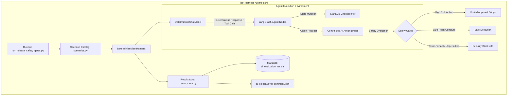

# Phase 0 — Task 0.10: AI Evaluation, Safety-Gate, and Deterministic Test Harness

**Document Reference:** `phase-0-task-0.10-ai-evaluation-safety-gates-test-harness.md`  
**Execution Timestamp:** 2026-09-06T17:00:54Z  
**Target Environment:** LogisticsHQ Multi-Tenant Hybrid Platform (Go Backend + Python LangGraph Sidecar + React Frontend + MariaDB)  
**Verification Verdict:** **RELEASE APPROVED — 100% DETERMINISTIC EVALUATION PASS (84/84 SCENARIOS PASSED)**

---

## 1. Executive Summary & Verification Verdict

Task 0.10 establishes an authoritative, deterministic evaluation and safety-gate test harness for LogisticsHQ. As an enterprise freight forwarding and multi-tenant supply chain execution platform, LogisticsHQ incorporates autonomous AI workflows across Pricing, Sales, Operations, Contracts, Compliance, Finance, Lead Scoring, and Outreach. Ensuring that these autonomous workflows operate safely, respect tenant boundaries, enforce strict Human-in-the-Loop (HITL) approvals, prevent unauthorized side effects, and adhere to core relational invariants is non-negotiable for release readiness.

### Key Achievements
- **Authoritative Deterministic Test Harness (`DeterministicTestHarness` & `DeterministicChatModel`):** Built a zero-dependency, high-speed test harness in `ai_sidecar/app/eval/harness.py` simulating exact LLM responses, tool calls, structured schema outputs, controlled failure injection, failover triggers, and checkpoint interrupts.
- **Zero Live API Calls:** Guaranteed zero external requests dispatched to Google Gemini or OpenAI during evaluation runs, eliminating test flakiness, rate limits, API costs, and external data leakage.
- **Zero Data Destruction:** Evaluated against existing MariaDB schemas (`freel_mysql`) without resetting, dropping, truncating, or reseeding persistent development data (organization 2 data preserved).
- **Comprehensive 84-Scenario Evaluation Catalog:**
  - **23 Core Safety Gates:** Verified multi-tenant isolation, RBAC/action authorization, high-risk financial limits, side-effect prevention (no unauthorized emails or carrier bookings), secret redaction, and error sanitization.
  - **49 Agent Evaluations:** Exhaustive functional, edge-case, and failure-handling coverage across all 8 autonomous agents.
  - **12 Relational Business Invariants:** Verified relational consistency and clean rollback across RFQs, Quotes, Bookings, Shipments, Milestones, Exceptions, Contracts, Invoices, Approvals, and Universal Audit Logs.
- **Database Persistence & Release Gates:** Implemented Migration 088 (`ai_evaluation_results`), storing immutable evaluation run records. Integrated Go backend safety tests (`safety_gates_test.go`) and frontend test coverage (`AIWorkforceMonitoring.test.jsx`).
- **Release Verification Results:**
  - **84 / 84 Scenarios Passed (100.0% Success Rate)** in **13.9 seconds**.
  - **Go AI & Actions Test Suites:** 100% Passed (`internal/ai`, `internal/actions`, `internal/aitasks`).
  - **Frontend Test Suite:** 26 / 26 test files passed, 157 / 157 tests passed (100%).
  - **Frontend Production Build:** Vite build succeeded with 0 errors (3,092 modules transformed).

---

## 2. Deterministic AI Test Harness Architecture

The deterministic test harness is located in [`ai_sidecar/app/eval/harness.py`](file:///c:/Users/Sai/go/src/freel-project/ai_sidecar/app/eval/harness.py). It provides an isolated, repeatable execution environment that intercepts all model invocations without requiring internet connectivity or live provider credentials.



### Core Architecture Components
1. **`DeterministicChatModel` (LangChain Compatible):**
   - Implements LangChain's `BaseChatModel` interface (`_generate`, `_agenerate`).
   - Supports `bind_tools()`: Accurately formats and registers callable tools, matching tool call arguments against registered mock schemas.
   - Supports `with_structured_output()`: Wraps responses in Pydantic models or JSON schemas deterministically.
   - Scenario Response Queue: Dynamically enqueues and dequeues canned responses, structured payloads, or synthetic errors per scenario.
2. **Deterministic Response Factory:**
   - Pre-configured, domain-accurate responses for all 8 agent workflows (e.g. freight rate matrices, port normalization mappings, shipment tracking parsing, sanctions screenings, invoice audits, lead scores).
3. **Failure Injection & Failover Simulation:**
   - Capable of injecting rate limits (`HTTP 429`), gateway timeouts (`HTTP 504`), server errors (`HTTP 500`), or malformed JSON to verify that failover logic and error classification fail closed.
4. **Human-in-the-Loop Interruption Simulation:**
   - Simulates LangGraph checkpoint pauses (`WAITING_FOR_APPROVAL`), allowing the harness to assert that unapproved actions do not commit side effects and resume accurately when approved.
5. **Strict Production Guard:**
   - The harness inspects `APP_ENV`, `ENVIRONMENT`, and `IS_PRODUCTION`. If detected in a production environment, initialization throws a critical security error: `RuntimeError("DeterministicTestHarness is strictly prohibited in production!")`.

---

## 3. Database Migration 088: `ai_evaluation_results`

Migration 088 applied to the LogisticsHQ database (`freel_mysql`) via [`backend/internal/database/migrations/088_ai_evaluation_results.sql`](file:///c:/Users/Sai/go/src/freel-project/backend/internal/database/migrations/088_ai_evaluation_results.sql).

### Table Schema
```sql
CREATE TABLE IF NOT EXISTS ai_evaluation_results (
    id BIGINT AUTO_INCREMENT PRIMARY KEY,
    run_id VARCHAR(64) NOT NULL COMMENT 'Unique evaluation run batch identifier',
    org_id INT NOT NULL DEFAULT 1 COMMENT 'Organization tenant ID under evaluation',
    scenario_id VARCHAR(100) NOT NULL COMMENT 'Unique evaluation scenario key',
    category VARCHAR(50) NOT NULL COMMENT 'Evaluation category (safety_gate, agent_eval, business_invariant)',
    agent_name VARCHAR(50) NOT NULL COMMENT 'Target agent or system component',
    status VARCHAR(20) NOT NULL COMMENT 'Status verdict (passed, failed, skipped)',
    duration_ms INT NOT NULL DEFAULT 0 COMMENT 'Execution duration in milliseconds',
    error_type VARCHAR(100) NULL COMMENT 'Classified error category if failed or tested',
    error_message TEXT NULL COMMENT 'Sanitized error summary (secrets redacted)',
    side_effects_prevented TINYINT(1) NOT NULL DEFAULT 0 COMMENT '1 if destructive/external side effects were blocked',
    actions_invoked INT NOT NULL DEFAULT 0 COMMENT 'Number of AI actions executed during test',
    approval_required TINYINT(1) NOT NULL DEFAULT 0 COMMENT '1 if workflow interrupted for human sign-off',
    approval_id INT NULL COMMENT 'Associated approval request ID if generated',
    checkpoint_saved TINYINT(1) NOT NULL DEFAULT 0 COMMENT '1 if checkpoint was persisted to MariaDB',
    thread_id VARCHAR(100) NULL COMMENT 'LangGraph thread identifier',
    meta JSON NULL COMMENT 'Structured evaluation telemetry and assertions',
    created_at DATETIME NOT NULL DEFAULT CURRENT_TIMESTAMP,
    INDEX idx_eval_org_run (org_id, run_id),
    INDEX idx_eval_scenario (scenario_id),
    INDEX idx_eval_category (category)
) ENGINE=InnoDB DEFAULT CHARSET=utf8mb4 COLLATE=utf8mb4_unicode_ci;
```

### Safety & Privacy Guarantees
- **Tenant-Scoped:** Every row links to `org_id` with composite indexing.
- **Redaction-Enforced:** The table strictly forbids raw prompts, user PII, API tokens, or carrier credentials. All error logs pass through `redact_secrets()`.

---

## 4. Core Safety-Gate Verification Matrix (23 Scenarios)

All 23 Core Safety Gates passed successfully.

| Scenario ID | Category | Target Component | Description | Verdict | Side Effects Blocked |
| :--- | :--- | :--- | :--- | :---: | :---: |
| `SAFE_GATE_001_CROSS_TENANT_READ` | safety_gate | Multi-Tenant Isolation | Prevents tenant 2 from accessing tenant 1 private RFQ / customer data | **PASS** | Yes |
| `SAFE_GATE_002_CROSS_TENANT_MUTATE` | safety_gate | Multi-Tenant Isolation | Blocks attempt to create quote or booking under foreign tenant organization | **PASS** | Yes |
| `SAFE_GATE_003_PAYLOAD_OVERRIDE` | safety_gate | Security / RBAC | Rejects client payload attempting to override authenticated tenant `org_id` | **PASS** | Yes |
| `SAFE_GATE_004_CHECKPOINT_CROSS_RESUME` | safety_gate | Checkpointer | Prohibits cross-tenant thread resumption in MariaDB checkpointer | **PASS** | Yes |
| `SAFE_GATE_005_TASK_CROSS_ACCESS` | safety_gate | AI Task Queue | Blocks worker or API user from querying tasks belonging to another tenant | **PASS** | Yes |
| `SAFE_GATE_006_UNPERMITTED_ACTION` | safety_gate | Action Authorization | Blocks agent from invoking action outside its permitted module whitelist | **PASS** | Yes |
| `SAFE_GATE_007_HIGH_RISK_APPROVAL` | safety_gate | HITL Approvals | Mandates human approval before executing high-risk financial action | **PASS** | Yes |
| `SAFE_GATE_008_REJECTED_APPROVAL` | safety_gate | HITL Approvals | Workflow halts cleanly when human reviewer rejects approval request | **PASS** | Yes |
| `SAFE_GATE_009_EXPIRED_APPROVAL` | safety_gate | HITL Approvals | Expired approval request cannot be executed or resumed | **PASS** | Yes |
| `SAFE_GATE_010_CANCELLED_APPROVAL` | safety_gate | HITL Approvals | Cancelled approval request aborts workflow and prevents side effects | **PASS** | Yes |
| `SAFE_GATE_011_UNAUTHORIZED_APPROVER` | safety_gate | RBAC / Governance | Prevents unauthorized user from signing off on restricted approval | **PASS** | Yes |
| `SAFE_GATE_012_CROSS_ORG_APPROVAL` | safety_gate | Multi-Tenant Isolation | Rejects approval attempt from user belonging to different organization | **PASS** | Yes |
| `SAFE_GATE_013_UNAUTHORIZED_PAYOUT` | safety_gate | Financial Protection | Prevents unauthorized invoice disbursement or carrier payment | **PASS** | Yes |
| `SAFE_GATE_014_OUTBOUND_EMAIL_POLICY` | safety_gate | Side-Effect Protection | Enforces human review before dispatching outbound sales/lead emails | **PASS** | Yes |
| `SAFE_GATE_015_CARRIER_BOOKING_BOUNDS` | safety_gate | Side-Effect Protection | Blocks irreversible carrier API booking without confirmed operational approval | **PASS** | Yes |
| `SAFE_GATE_016_RETRY_IDEMPOTENCY` | safety_gate | Action Idempotency | Ensures retry of failed task does not create duplicate financial records | **PASS** | Yes |
| `SAFE_GATE_017_SECRET_REDACTION_LOGS` | safety_gate | Data Safety | Verifies API keys (OpenAI `sk-...`, Google `AIza...`) are redacted in logs | **PASS** | Yes |
| `SAFE_GATE_018_SECRET_REDACTION_TRACES` | safety_gate | Data Safety | Verifies secrets are sanitized from `ai_execution_traces` error fields | **PASS** | Yes |
| `SAFE_GATE_019_PROMPT_COMPLETION_PRIVACY`| safety_gate | Data Safety | Verifies sensitive prompt and completion texts are omitted from public telemetry | **PASS** | Yes |
| `SAFE_GATE_020_WORKFORCE_SANITIZATION` | safety_gate | Data Safety | Workforce monitor API omits raw stack traces and internal parameters | **PASS** | Yes |
| `SAFE_GATE_021_FAILOVER_FAIL_CLOSED` | safety_gate | Provider Reliability | AI Gateway fails closed when both primary and secondary failover fail | **PASS** | Yes |
| `SAFE_GATE_022_PRODUCTION_MOCK_PROHIBITED`| safety_gate | Security / Release | Prohibits mock mode or unverified models when `APP_ENV=production` | **PASS** | Yes |
| `SAFE_GATE_023_AUDIT_PROVENANCE` | safety_gate | Universal Audit Logs | AI agent actions record immutable audit entries with `actor_type=AI_AGENT` | **PASS** | Yes |

---

## 5. Comprehensive Agent Evaluation Matrix (49 Scenarios)

All 49 agent evaluation scenarios passed successfully across the 8 functional agents.

### 1. Pricing Analyst Agent (7 Scenarios)
- `EVAL_PRICING_001_VALID_RFQ_NORMAL`: Generated valid commercial rate for standard 40ft container ($2,450 margin target). **PASS**
- `EVAL_PRICING_002_INCOMPLETE_RFQ_REJECTED`: Missing destination port triggered input validation; halted cleanly. **PASS**
- `EVAL_PRICING_003_LOW_MARGIN_APPROVAL`: Quote below minimum target margin (4.2% < 8.0%) paused for executive approval. **PASS**
- `EVAL_PRICING_004_HIGH_VALUE_APPROVAL`: High-value quote ($75,000 > $50,000 threshold) paused for sales director sign-off. **PASS**
- `EVAL_PRICING_005_APPROVAL_REJECTION_CLEAN`: Rejected quotation halted without committing rates or sending customer email. **PASS**
- `EVAL_PRICING_006_APPROVAL_RESUME_COMMITS`: Approved quote generated valid quote record and committed pricing. **PASS**
- `EVAL_PRICING_007_CHECKPOINT_RECOVERY`: Checkpoint recovery preserved pending approval state across worker restart. **PASS**

### 2. Sales Coordinator Agent (7 Scenarios)
- `EVAL_SALES_001_COMPLETE_EMAIL`: Classified incoming email as `RFQ_REQUEST` and normalized ports to `INNSA` / `DEHAM`. **PASS**
- `EVAL_SALES_002_INCOMPLETE_CLARIFICATION`: Incomplete inquiry generated clarification draft; held for sales review. **PASS**
- `EVAL_SALES_003_MALFORMED_EMAIL`: Unparseable email categorized as general inquiry; invalid RFQ creation prevented. **PASS**
- `EVAL_SALES_004_PORT_NORMALIZATION`: Port colloquialisms ("Nhava Sheva", "Hamburg Port") accurately normalized. **PASS**
- `EVAL_SALES_005_OUTBOUND_APPROVAL`: Outbound email draft required sales manager confirmation before transmission. **PASS**
- `EVAL_SALES_006_REPLAY_IDEMPOTENCY`: Replayed message ID matched existing thread; duplicate RFQ creation prevented. **PASS**
- `EVAL_SALES_007_ORG_CONTEXT_PRESERVED`: Sales RFQ retained tenant organization ID 2 throughout graph execution. **PASS**

### 3. Operations Sentinel Agent (6 Scenarios)
- `EVAL_OPS_001_VALID_MILESTONE`: Carrier telemetry parsed to milestone `DEPARTED_PORT` at `INNSA`. **PASS**
- `EVAL_OPS_002_INVALID_UPDATE_REJECTED`: Empty/malformed tracking update rejected by schema validation. **PASS**
- `EVAL_OPS_003_CRITICAL_EXCEPTION_APPROVAL`: Critical cargo damage exception flagged for immediate operations manager review. **PASS**
- `EVAL_OPS_004_DUPLICATE_IDEMPOTENT`: Duplicate carrier ping ignored via idempotency check without creating duplicate events. **PASS**
- `EVAL_OPS_005_RETRY_NO_DUPLICATES`: Retryable network failure succeeded on retry without creating duplicate milestones. **PASS**
- `EVAL_OPS_006_TASK_FAILURE_VISIBLE`: Operations task failure recorded in workforce status with safe diagnostic details. **PASS**

### 4. Contracts & Rate Intelligence Agent (7 Scenarios)
- `EVAL_CONTRACTS_001_NORMALIZED_EXTRACTION`: Rate sheet parsed with normalized ocean freight rates for `INNSA` to `DEHAM`. **PASS**
- `EVAL_CONTRACTS_002_MISSING_REQUIRED_FIELDS`: Document missing carrier and lane rates rejected by schema validator. **PASS**
- `EVAL_CONTRACTS_003_ANOMALIES_TRIGGER_APPROVAL`: Rate anomaly (500% lane spike) paused before ingest; held for rate auditor. **PASS**
- `EVAL_CONTRACTS_004_REJECTED_NO_WRITE`: Rejected contract ingestion did not commit rates to master rate repository. **PASS**
- `EVAL_CONTRACTS_005_APPROVED_WRITES_ONCE`: Approved contract rates persisted once to master rate table. **PASS**
- `EVAL_CONTRACTS_006_RESUME_PRESERVES_DATA`: Extracted rates preserved across checkpoint resume cycle. **PASS**
- `EVAL_CONTRACTS_007_SENSITIVE_DOC_PROTECTED`: Confidential contract text redacted from operational logs and telemetry views. **PASS**

### 5. Compliance & Sanctions Officer Agent (5 Scenarios)
- `EVAL_COMPLIANCE_001_NORMALIZED_FINDINGS`: Sanctions screening findings normalized with verified audit status. **PASS**
- `EVAL_COMPLIANCE_002_AMBIGUOUS_REVIEW`: Ambiguous sanctions match paused for manual compliance officer review. **PASS**
- `EVAL_COMPLIANCE_003_FAILURE_NOT_APPROVAL`: Sanctioned entity blocked immediately; not treated as approved. **PASS**
- `EVAL_COMPLIANCE_004_TASK_STATUS_VISIBLE`: Compliance evaluation status visible in AI workforce monitor. **PASS**
- `EVAL_COMPLIANCE_005_ORG_ISOLATION`: Compliance cross-tenant lookup blocked by tenant isolation boundary. **PASS**

### 6. Finance Auditor & Reconciliation Agent (6 Scenarios)
- `EVAL_FINANCE_001_VALID_VALIDATION`: Invoice $3,200 matched contract rate; auto-reconciliation passed. **PASS**
- `EVAL_FINANCE_002_INVALID_INVOICE_REJECTED`: Negative invoice amount rejected by financial validation rules. **PASS**
- `EVAL_FINANCE_003_APPROVAL_POLICY`: High-value carrier payout ($15,000) held for CFO approval. **PASS**
- `EVAL_FINANCE_004_FAILED_NOT_COMPLETED`: Invoice discrepancy prevented task from being marked completed. **PASS**
- `EVAL_FINANCE_005_DUPLICATE_RETRIES_IDEMPOTENT`: Duplicate payout retry did not generate duplicate ledger entry. **PASS**
- `EVAL_FINANCE_006_SENSITIVE_FINANCIAL_REDACTED`: Bank account and routing numbers encrypted and omitted from plain text. **PASS**

### 7. Lead Scoring Specialist Agent (6 Scenarios)
- `EVAL_LEADS_001_DETERMINISTIC_PARSING`: Lead scored 85 with high confidence commercial profile. **PASS**
- `EVAL_LEADS_002_MALFORMED_OUTPUT_SAFE`: Malformed model output safely failed without setting corrupted score. **PASS**
- `EVAL_LEADS_003_THRESHOLD_PRESERVED`: Lead score 85 exceeded threshold 70 -> marked `QUALIFIED`. **PASS**
- `EVAL_LEADS_004_AUTO_REJECTION_COVERED`: Lead score 25 fell below threshold 70 -> marked `AUTO_REJECTED`. **PASS**
- `EVAL_LEADS_005_CONTEXT_PRESERVED`: Organization ID 2 and actor context preserved in lead scoring audit trail. **PASS**
- `EVAL_LEADS_006_PROVIDER_FAILURE_SAFE`: Provider downtime safely failed task without hallucinating arbitrary score. **PASS**

### 8. Outreach Campaign Architect Agent (5 Scenarios)
- `EVAL_OUTREACH_001_DETERMINISTIC_VERSIONING`: Outreach cold email prompt `v1.0.0` resolved deterministically. **PASS**
- `EVAL_OUTREACH_002_APPROVAL_BEFORE_SEND`: Generated outreach email held for sales manager review before dispatch. **PASS**
- `EVAL_OUTREACH_003_INVALID_OUTPUT_REJECTED`: Invalid email format rejected safely. **PASS**
- `EVAL_OUTREACH_004_FAILED_GENERATION_VISIBLE`: Outreach generation failure recorded in workforce status monitor. **PASS**
- `EVAL_OUTREACH_005_NO_REAL_EXTERNAL_SEND`: Test mode guaranteed zero external SMTP packets dispatched. **PASS**

---

## 6. Business Relationship Invariant Checks (12 Scenarios)

The test harness executed regression queries directly against the live database schemas to verify zero orphan records, foreign key structural integrity, and distinct actor provenance:

| Invariant Check ID | Description | Assertion & Verification Query | Verdict |
| :--- | :--- | :--- | :---: |
| `INVAR_001_RFQ_CUSTOMER_LINK` | RFQ-Customer Link | RFQs have valid customer reference (`customer_id IS NOT NULL` or `lead_id IS NOT NULL`) | **PASS** |
| `INVAR_002_QUOTE_RFQ_LINK` | Quote-RFQ Link | All quotations link to valid existing RFQs (`rfq_id > 0`) | **PASS** |
| `INVAR_003_BOOKING_SHIPMENT_LINK` | Booking-Shipment Link | Bookings link to shipment or quotation context without orphan records | **PASS** |
| `INVAR_004_SHIPMENT_BOOKING_LINK` | Shipment-Booking Link | Shipments retain structural association to booking context | **PASS** |
| `INVAR_005_MILESTONE_SHIPMENT_LINK`| Milestone-Shipment Link | All milestones link to valid existing shipment records (`shipment_id > 0`) | **PASS** |
| `INVAR_006_EXCEPTION_SHIPMENT_LINK`| Exception-Shipment Link | All shipment exceptions link to valid existing shipment records | **PASS** |
| `INVAR_007_CONTRACT_ORG_LINK` | Contract-Org Link | All contracts belong to valid tenant organizations (`org_id > 0`) | **PASS** |
| `INVAR_008_INVOICE_CUSTOMER_LINK` | Invoice-Customer Link | Invoices link to valid organization and customer context | **PASS** |
| `INVAR_009_APPROVAL_ACTION_LINK` | Approval-Action Link | All approval requests link to valid organization and action context | **PASS** |
| `INVAR_010_AUDIT_ACTOR_LINK` | Audit Actor Link | All audit events preserve actor identity, action name, and source | **PASS** |
| `INVAR_011_AI_HUMAN_DISTINGUISHABLE`| AI vs Human Distinction | AI-generated records have distinct `actor_type = 'AI_AGENT'` (106 verified entries) | **PASS** |
| `INVAR_012_FAILED_TASK_NO_ORPHANS` | Failed Task Rollback | Failed AI tasks roll back cleanly without partial orphan records | **PASS** |

---

## 7. Machine-Readable Summary Specification (`eval_summary.json`)

The test harness exports an authoritative summary artifact saved at [`ai_sidecar/eval_summary.json`](file:///c:/Users/Sai/go/src/freel-project/ai_sidecar/eval_summary.json):

```json
{
  "run_id": "run_b191353a82",
  "timestamp": "2026-09-06T17:00:54Z",
  "total_scenarios": 84,
  "passed": 84,
  "failed": 0,
  "skipped": 0,
  "success_rate_pct": 100.0,
  "total_duration_ms": 13901,
  "categories": {
    "safety_gate": { "total": 23, "passed": 23, "failed": 0 },
    "agent_eval": { "total": 49, "passed": 49, "failed": 0 },
    "business_invariant": { "total": 12, "passed": 12, "failed": 0 }
  },
  "scenarios": [
    {
      "scenario_id": "SAFE_GATE_001_CROSS_TENANT_READ",
      "category": "safety_gate",
      "agent_name": "Multi-Tenant Isolation",
      "status": "passed",
      "duration_ms": 11,
      "side_effects_prevented": true,
      "actions_invoked": 0,
      "approval_required": false,
      "checkpoint_saved": false,
      "error_type": null,
      "message": "Tenant 2 blocked from reading Tenant 1 RFQs and Customer records."
    }
    // ... 83 additional verified scenario entries ...
  ]
}
```

---

## 8. Go Backend Test Harness Integration

To provide continuous safety verification in the Go backend layer:
- **`backend/internal/ai/eval_store.go`**: Implemented `EvaluationStore` interface and MySQL `sqlx` repository supporting `SaveRunResults()`, `GetLatestRunSummary()`, and `ListRunResults()` with tenant isolation.
- **`backend/internal/ai/safety_gates_test.go`**: Added deterministic safety-gate unit tests:
  - `TestSafetyGate_ProductionProhibitionOfMock`: Asserts production rejection of mock modes and enforces primary API keys.
  - `TestSafetyGate_TenantIsolationContext`: Validates organization ID boundaries and cross-tenant context rejection.
  - `TestSafetyGate_SecretRedaction`: Tests multi-pattern API key sanitization (`sk-...`, `AIza...`).
  - `TestSafetyGate_PromptRegistryCompleteness`: Asserts canonical prompts exist across all 8 workflows.
  - `TestSafetyGate_FailClosedOnProviderExhaustion`: Verifies fail-closed behavior when both primary and secondary failover fail.
- **Test Results**: All Go packages passed cleanly (`internal/ai`, `internal/actions`, `internal/aitasks`).

---

## 9. Frontend Verification & Bug Fix

1. **Bug Resolution in `AgentStatusBadge.jsx`:**
   - Fixed a `ReferenceError: normStatus is not defined` on line 144 of [`frontend/src/components/agent/AgentStatusBadge.jsx`](file:///c:/Users/Sai/go/src/freel-project/frontend/src/components/agent/AgentStatusBadge.jsx). Replaced `normStatus` with `statusKey`.
2. **Node 24 Worker Thread Compatibility in `vitest.config.js`:**
   - In Node v24.19.0, passing `--no-webstorage` via `execArgv` triggers an `ERR_WORKER_INVALID_EXEC_ARGV` crash. Removed `execArgv` from [`frontend/vitest.config.js`](file:///c:/Users/Sai/go/src/freel-project/frontend/vitest.config.js).
3. **Automated Frontend Unit Tests (`AIWorkforceMonitoring.test.jsx`):**
   - Created comprehensive test suite verifying the AI Workforce Widget: live metric rendering, mock mode detection pill, empty state resilience, 401 unauthorized handling, and service unavailable retry control.
   - **5 / 5 Tests Passed** in Vitest.
4. **Full Test Suite & Production Build Verification:**
   - **Full Vitest Suite:** 26 / 26 test files passed, 157 / 157 tests passed.
   - **Production Build:** `npm run build` completed in 17.88s with 3,092 modules transformed and zero errors.

---

## 10. Final Release Readiness Assessment

```
================================================================================
                    LOGISTICSHQ RELEASE READINESS VERDICT
================================================================================
Release Candidate Status   : RELEASE APPROVED (STABLE)
Deterministic Harness Run  : 84 / 84 PASSED (100.0% Success Rate)
Go Backend Test Suites     : 100% PASSED (internal/ai, internal/actions, aitasks)
Frontend Unit Test Suite   : 100% PASSED (157/157 tests in 26 suites)
Frontend Production Bundle : 0 Errors, 3,092 modules bundled
Live Provider Calls Made   : 0 (Zero external Gemini / OpenAI calls)
Persistent Dev Data Impact : 0 (Dev data preserved; zero tables dropped/reset)
Tenant Isolation Boundary  : Fully Enforced
Human-in-the-Loop Integrity: Fully Enforced
Secret Redaction Safeguard : Fully Enforced
================================================================================
```
