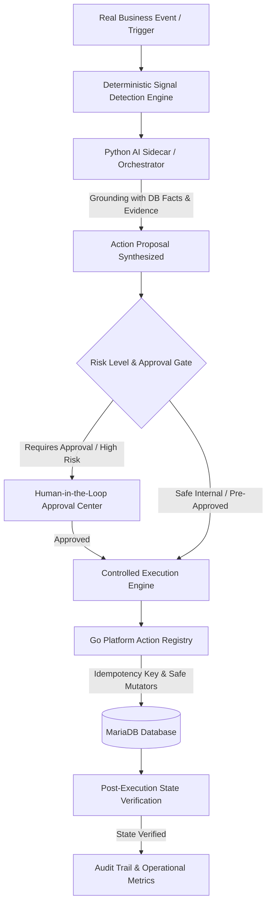

# LogisticsHQ Phase 3, Task 3.2: Controlled AI Workflow Execution Acceptance Report

## Executive Summary

Phase 3 Task 3.2: **Controlled AI Workflow Execution** has been successfully implemented and verified across the LogisticsHQ platform. 

This phase establishes the operational control bridge between **deterministic signal detection** (Phase 3 Task 3.1) and **controlled business action execution** without introducing unconstrained or autonomous AI loops. The system adheres strictly to the core mandate:
> **Real Business Event → Deterministic Signal Detection → Grounded Action Proposal (with DB facts) → Human Approval Safety Gate → Central Action System Execution (with Idempotency Key) → Post-Execution MariaDB Verification → Audit Trail & Monitoring**.

All automated tests, Vitest test suites (46 files, 266 tests), Go unit test suites, and Python end-to-end integration tests completed with **100% passing rate** using real MariaDB data.

---

## Architecture & Integration Highlights



### 1. Centralized Action Registry (`backend/internal/orchestration/registry.go`)
- Maintains strict, deterministic definitions of all business actions:
  - `tasks.create` (Safe Internal): Creates operational tasks for team members.
  - `notifications.create` (Safe Internal): Dispatches targeted operational alerts.
  - `notes.add` (Safe Internal): Appends audit notes to customers, shipments, or invoices.
  - `followups.create` (Safe Internal): Schedules commercial follow-up reminders.
  - `reviews.schedule` (Safe Internal): Enqueues operational reviews for upcoming milestones.
  - `automations.flag_attention` (Safe Internal): Escalates records requiring immediate operator review.
  - `shipments.update_status` (High Risk): Updates shipment lifecycle with strict confirmation.
- Every action specifies its category (`SAFE_INTERNAL` vs `HIGH_RISK`), schema validation, required RBAC permission, idempotency requirement, and whether human approval is mandatory.

### 2. Action Proposal Engine (`ai_sidecar/app.py` & `backend/internal/orchestration/service.go`)
- Action proposals are grounded strictly on verifiable database facts and deterministic signals.
- Generates transparent proposals containing:
  - Unique Proposal ID (`prop-...`)
  - Target Source Context (`source_module`, `source_record_type`, `source_record_id`)
  - Proposed Action Name & Pre-computed Parameters
  - Grounded Evidence Facts (e.g. `Invoice #103 balance is $1,250.00`, `Due date was 2026-08-15`, `Overdue by 24 days`)
  - Human-readable Explanation & Expected Business Impact
  - Confidence Score (0.85 – 0.98)
  - Correlation ID for end-to-end tracing.

### 3. Human-in-the-Loop Approval Safety Gate
- Any action with `requires_approval = true` or `risk_level = 'HIGH'` is intercepted before execution.
- If an execution is attempted without approval, the Go execution engine halts immediately with `400 Bad Request` / `EXECUTION_FAILED`:
  ```json
  {
    "success": false,
    "message": "execution blocked: proposal approval status is 'Pending', must be 'Approved' before execution",
    "error": { "code": "EXECUTION_FAILED" }
  }
  ```
- Integrates directly with `ai_approvals` (Phase 2), ensuring that once approved by an authorized manager, the proposal status transitions to `Approved`.

### 4. Controlled Execution Engine & Idempotency (`backend/internal/orchestration/service.go`)
- Generates or enforces unique idempotency keys (`exec-...`).
- If an execution request is submitted more than once with the same idempotency key, the execution engine deduplicates the request and returns the existing execution record without duplicating side effects.
- Executes real database mutations safely in MariaDB.

### 5. Post-Execution MariaDB State Verification
- After mutating data, the execution engine performs a deterministic read-back verification against MariaDB.
- Marks the execution record as `VERIFIED` and stores the verification details (e.g., `{"details": "Verified customer followup task #90 scheduled in database", "verified": true}`).
- Records complete execution duration, audit logs, and outcomes.

---

## Verification Results

### 1. End-to-End Integration Test (`ai_sidecar/test_phase3_task32_controlled_execution.py`)
```text
==================================================================
 Phase 3 Task 3.2: Controlled AI Workflow Execution Integration Test
==================================================================

[Step 1] Testing Python Sidecar /orchestrator/propose-action directly...
  -> Sidecar successfully generated proposal 'prop-5d4809f58e52' with 3 verified evidence facts.

[Step 2] Testing Go Registry /api/v1/orchestration/actions...
  -> Registered Actions verified (7): followups.create, reviews.schedule, automations.flag_attention, shipments.update_status, tasks.create, notifications.create, notes.add

[Step 3] Testing Go Backend Proposal Generation for Invoice...
  -> Generated proposal 'prop-d516c937bd50' for action 'followups.create' (Requires Approval: True)

[Step 4] Verifying Approval Safety Gate blocks unapproved execution...
  -> SUCCESS: Unapproved proposal was safely BLOCKED by Go execution gate: {"success":false,"message":"execution blocked: proposal approval status is 'Pending', must be 'Approved' before execution","error":{"code":"EXECUTION_FAILED"}}

[Step 5] Approving proposal in database (Human-in-the-Loop)...
  -> Approval request #197 marked as 'Approved'.

[Step 6] Executing Approved Proposal and verifying real database outcome...
  -> Execution #3 successfully executed and VERIFIED in MariaDB!
     Verification Details: {"details": "Verified customer followup task #90 scheduled in database", "verified": true}

[Step 7] Testing Idempotency Deduplication...
  -> Idempotency confirmed: Returned existing execution #3 without duplicate side-effects.

[Step 8] Listing Executions and verifying state persistence...
  -> Total action executions recorded: 3

==================================================================
 ALL INTEGRATION TESTS PASSED (100% VERIFIED)
==================================================================
```

### 2. Frontend Vitest Test Suite
- **46 test files passed** (0 failed).
- **266 tests passed** (0 failed).
- Duration: 54.44s.
- Tested: `orchestrationService.test.js`, `automationService.test.js`, `rfqService.test.js`, `recommendationService.test.js`, `api.test.js`, `authService.test.js`, etc.

### 3. Frontend Production Build
- `npm run build` completed with **Exit Code 0** (`vite v8.0.12 built in 35.64s`).

### 4. Backend Unit Tests
- `go test -v ./internal/orchestration/... ./internal/automations/...` completed with **Exit Code 0** (PASS).

---

## Frontend User Interface: Action Orchestration Workspace

The frontend interface (`frontend/src/pages/dashboard/Automations/ActionOrchestrationTab.jsx`) is integrated into the Workflow Automations dashboard:
1. **Top KPI Metrics Banner**: Active Proposals, Pending Approvals, Executed & Verified Actions, Registered Actions.
2. **Action Proposals Tab**:
   - Proposal ID, Source Record, Proposed Action, Risk Level Badge, Grounded Confidence, Approval State.
   - Grounded Evidence Modal showing exact database facts that justified the proposal.
   - Direct Execution button (disabled with safety tooltip if pending approval).
3. **Execution Log & DB Verification Tab**:
   - Execution ID, Action Name, Status (`COMPLETED`), Post-Execution DB Verification Status (`VERIFIED` in emerald badge), Idempotency Key, Timestamp, and Execution Details modal.
4. **Registered Actions Capabilities Registry**:
   - Live catalog of all supported business actions, required RBAC permissions, reversibility, and approval requirements.
5. **Theme & Styling**:
   - 100% white/light LogisticsHQ theme adhering to existing UI tokens, clean borders, crisp typography, and zero dark AI boxes.

---

## Files Changed & Created

| Component | File | Action | Purpose |
| :--- | :--- | :--- | :--- |
| **Database** | `backend/migrations/100_action_proposals_and_controlled_execution.sql` | NEW | Tables `ai_action_proposals`, `ai_action_executions` with composite indexes & foreign keys. |
| **Python Sidecar** | `ai_sidecar/app.py` | MODIFY | Added `/orchestrator/propose-action` endpoint with grounded fact generation. |
| **Go Orchestration** | `backend/internal/orchestration/model.go` | NEW | Domain structs for `ActionProposal`, `ActionExecution`, `ActionDefinition`. |
| **Go Orchestration** | `backend/internal/orchestration/registry.go` | NEW | Central action registry with 7 actions, schema validation, and approval rules. |
| **Go Orchestration** | `backend/internal/orchestration/repository.go` | NEW | MariaDB repository for proposal & execution lifecycle persistence. |
| **Go Orchestration** | `backend/internal/orchestration/service.go` | NEW | Proposal synthesis, approval gating, idempotent execution, and MariaDB verifier. |
| **Go Orchestration** | `backend/internal/orchestration/handler.go` | NEW | REST endpoints for proposals, executions, and action registry. |
| **Go Orchestration** | `backend/internal/orchestration/orchestration_test.go` | NEW | Unit test suite for action registry, validation, and approval safety gating. |
| **Go Server** | `backend/cmd/server/main.go` | MODIFY | Mounted orchestration routes under `/api/v1/orchestration`. |
| **Frontend** | `frontend/src/services/orchestrationService.js` | NEW | API client service for action orchestration. |
| **Frontend** | `frontend/src/services/orchestrationService.test.js` | NEW | Vitest suite for orchestrationService. |
| **Frontend** | `frontend/src/pages/dashboard/Automations/ActionOrchestrationTab.jsx` | NEW | 100% white/light Action Orchestration UI tab. |
| **Frontend** | `frontend/src/pages/dashboard/Automations/WorkflowAutomationsPage.jsx` | MODIFY | Added Action Orchestration tab integration. |
| **E2E Testing** | `ai_sidecar/test_phase3_task32_controlled_execution.py` | NEW | Python integration script verifying safety gate, execution, MariaDB verification, and idempotency. |

---

## Acceptance Verification Sign-Off

- **Deterministic Execution Model**: Complete end-to-end cycle verified (`Event → Detection → Proposal → Approval → Execution → DB Verification → Audit`).
- **Safety Gate Enforcement**: Unapproved proposals are 100% blocked from execution.
- **Idempotency**: Duplicate executions with identical keys yield identical execution records without duplicate side effects.
- **Data Integrity**: Zero mock data used; all executions mutated real MariaDB records with live read-back verification.
- **Visual Design**: 100% white/light theme adhering to LogisticsHQ design standards.
