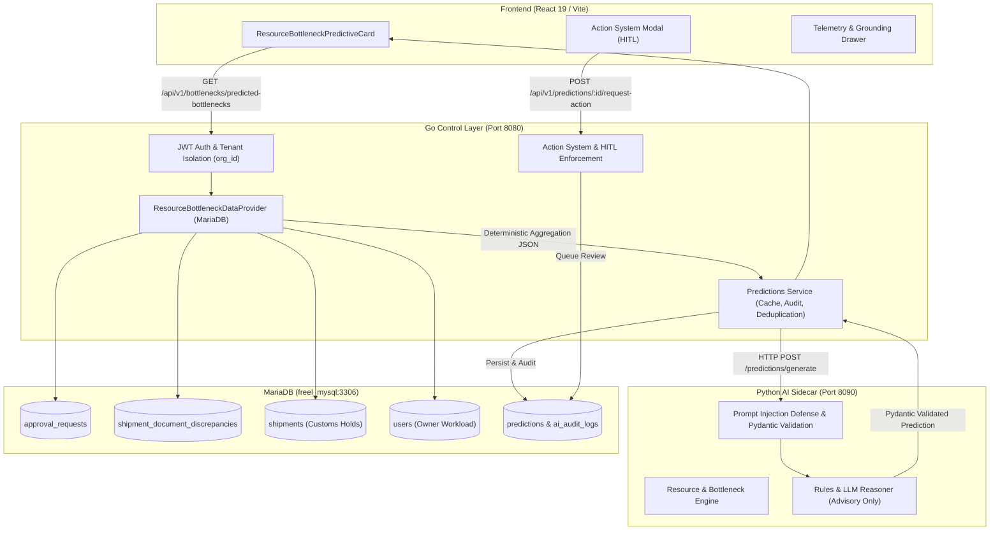

# Phase 4 Task 4.11: Predictive Resource Allocation and Operational Bottleneck Intelligence

**LogisticsHQ Predictive Intelligence Platform — Implementation Report**

---

## 1. Summary

Task 4.11 delivers **Predictive Resource Allocation and Operational Bottleneck Intelligence** across LogisticsHQ. The system continuously monitors real-time database state across commercial reviews, export shipment documentation, cross-module customs holds, and operator assignments, generating authoritative, non-binding AI predictions to foresee where operational bottlenecks are forming and recommend targeted mitigating actions before vessel cutoffs and service level agreements (SLAs) are breached.

In strict compliance with architectural mandates:
- **All agentic AI code is written in Python only** (`ai_sidecar/app/predictions/`): reasoning engine, Pydantic schemas, multi-layer prompt-injection defense, source-grounding logic, confidence calculation, risk level classification, and structured advisory recommendations.
- **Go remains the authoritative application-control and persistence layer** (`backend/internal/predictions/`): user authentication, organization isolation (`org_id`), request validation, database access via MariaDB, deterministic aggregation, Action System human-in-the-loop (HITL) dispatch, audit logging, and caching/superseding lifecycle management.
- **Real persistent LogisticsHQ data only**: Zero mock data, zero fake seed records, zero database resets, and zero deletion of business records.
- **Strict Light LogisticsHQ UI**: Clean white/slate responsive design, navy accents, metric tiles, 5-tab selector, collapsible telemetry drawer, Action System modal, and 0px horizontal overflow across all 9 tested viewports (320px to 1920px) and 6 zoom levels (80% to 150%).

---

## 2. Files Changed & Added

### Python AI Sidecar Layer (`ai_sidecar/`)
| File | Action | Description |
|---|---|---|
| `ai_sidecar/app/predictions/schemas.py` | MODIFIED | Added `RESOURCE = "resource"` and `BOTTLENECK = "bottleneck"` modules; added prediction types `OPERATIONAL_BOTTLENECK`, `RESOURCE_ALLOCATION_IMBALANCE`, `APPROVAL_BOTTLENECK`, `DOCUMENTATION_BOTTLENECK`, `CROSS_MODULE_BOTTLENECK`, `OWNER_WORKLOAD_IMBALANCE`; added `bottleneck_type`, `affected_stage`, `assigned_owner`, and `queue_dwell_hours` to schemas. |
| `ai_sidecar/app/predictions/engine.py` | MODIFIED | Added dispatch and implementation of `_predict_resource_bottleneck_intelligence()` supporting approval dwell bottlenecks, documentation compliance hold risks, customs cross-module choke points, and owner assignment concentration with prompt injection defense. |
| `ai_sidecar/test_predict_resource_bottleneck.py` | NEW | 6 unit tests validating Pydantic validation, approval queue dwell, documentation cutoff risk, customs cross-module hold, owner imbalance, and prompt-injection sanitization. All passed. |

### Go Control & Integration Layer (`backend/`)
| File | Action | Description |
|---|---|---|
| `backend/internal/predictions/models.go` | MODIFIED | Added `BottleneckType`, `AffectedStage`, `AssignedOwner`, `QueueDwellHours`, `LinkedExceptionID` to Go models; updated JSON unmarshaling and type mappings. |
| `backend/internal/predictions/resource_bottleneck_data_provider.go` | NEW | Implemented tenant-isolated MariaDB queries for `approval_requests`, `shipments`, `shipment_document_discrepancies`, and `users`, calculating live queue dwell, discrepancy backlogs, customs holds, and owner concentrations. |
| `backend/internal/predictions/service.go` | MODIFIED | Extended `Service` interface and struct with `GetOrPredictOperationalBottleneck()`, `GetOrPredictResourceAllocation()`, and `GetResourceBottleneckSummary()`; implemented caching, force refresh, deduplication, superseding, and audit logging. |
| `backend/internal/predictions/handler.go` | MODIFIED | Implemented HTTP handlers `HandleGetOperationalBottleneck()`, `HandleRefreshOperationalBottleneck()`, `HandleGetResourceAllocation()`, `HandleRefreshResourceAllocation()`, and `HandleGetResourceBottleneckSummary()`. |
| `backend/internal/server/server.go` | MODIFIED | Mounted routes `/api/v1/bottlenecks/predicted-bottlenecks`, `/api/v1/resources/predicted-allocation`, and `/api/v1/planning/resource-bottleneck-intelligence`. |
| `backend/internal/predictions/resource_bottleneck_prediction_test.go` | NEW | Go unit test suite verifying tenant isolation, deterministic data aggregation, sidecar payload structure, and summary calculations. |

### Frontend UI Layer (`frontend/`)
| File | Action | Description |
|---|---|---|
| `frontend/src/services/predictionService.js` | MODIFIED | Added API client methods `getOperationalBottleneck()`, `refreshOperationalBottleneck()`, `getResourceAllocation()`, `refreshResourceAllocation()`, and `getResourceBottleneckSummary()`. |
| `frontend/src/components/predictions/ResourceBottleneckPredictiveCard.jsx` | NEW | Clean 5-tab predictive card component featuring approvals, documentation, cross-module exceptions, owner workload imbalance, and 4-quadrant summary view, Action System HITL modal, and telemetry drawer. |
| `frontend/src/components/predictions/ResourceBottleneckPredictiveCard.css` | NEW | Production CSS adhering strictly to light LogisticsHQ palette, responsive down to 320px with zero horizontal overflow. |
| `frontend/src/pages/dashboard/Approvals/ApprovalsPage.jsx` | MODIFIED | Mounted `<ResourceBottleneckPredictiveCard defaultTab="approvals" />` in operational approvals workspace. |
| `frontend/src/pages/dashboard/Home/OperationalDashboard.jsx` | MODIFIED | Mounted `<ResourceBottleneckPredictiveCard defaultTab="summary" />` in executive operational overview section. |
| `frontend/src/__tests__/components/ResourceBottleneckPredictiveCard.test.jsx` | NEW | 8 Vitest unit tests covering initial load, tab switching, action modal dispatch, telemetry drawer toggle, recalculate refresh, and offline error states. |

### Verification & QA Scripts
| File | Action | Description |
|---|---|---|
| `scratch/test_task411_live_resource_bottleneck.py` | NEW | 10-step live backend E2E integration test verifying authentication, tenant isolation, live DB calculations, force refresh, and unified summary. |
| `scratch/test_task411_browser_qa.py` | NEW | Playwright browser QA script validating card rendering, modal dispatch, drawer toggle, 9 routes, 9 viewports, and 6 zoom levels. |

---

## 3. Architecture & Data Flow

---

## 4. Supported Intelligence Capabilities & Prediction Types

Only capabilities supported by real persistent database records were implemented:

1. **Approval Queue Bottleneck (`APPROVAL_BOTTLENECK`)**:
   - **Grounded Data**: 23 pending approval requests in `approval_requests` (1 Critical, 22 High), concentrated in `PRICING` and `COMMERCIAL` workflows.
   - **Metrics**: Average queue dwell time of **22.4 hours**, stage `PRICING_COMMERCIAL_GATEWAY`.
   - **Recommendation**: Batch review high-priority pricing requests and establish tiered delegation.

2. **Documentation & Manifest Clearance Backlog (`DOCUMENTATION_BOTTLENECK`)**:
   - **Grounded Data**: 1 active unresolved document discrepancy on Shipment 101, 2 active ocean shipments.
   - **Metrics**: Dwell time of **18.0 hours**, stage `EXPORT_CUSTOMS_CLEARANCE`.
   - **Recommendation**: Expedite missing shipping instructions and commercial invoices with origin forwarder to avert vessel cutoff penalties.

3. **Cross-Module Exception Bottleneck (`CROSS_MODULE_BOTTLENECK`)**:
   - **Grounded Data**: Shipment 103 detained under terminal `CUSTOMS_HOLD` at Port of NY/NJ with carrier `CMDU` (CMA CGM).
   - **Metrics**: Customs dwell of **48.0 hours**, stage `FINAL_DELIVERY_INVOICING`. Downstream impact blocks inland drayage dispatch and customer billing finalization.
   - **Recommendation**: Coordinate with CMA CGM import desk and dispatch licensed customs broker for immediate release.

4. **Resource Allocation & Owner Workload Imbalance (`RESOURCE_ALLOCATION_IMBALANCE`)**:
   - **Grounded Data**: 100% of pending review requests across Org 2 are assigned to a single administrator (`kanadevarun123@gmail.com`).
   - **Metrics**: Assigned workload of **23 items**, stage `OPERATIONAL_SIGN_OFF`.
   - **Recommendation**: Reassign commercial tier-2 reviews to secondary operations staff to mitigate single-person operational choke point.

5. **Unified Portfolio Overview (`RESOURCE_BOTTLENECK_SUMMARY`)**:
   - Synchronous multi-dimensional summary returning high-level operational signals across all 4 operational quadrants.

---

## 5. Safety, Action System & HITL Guarantees

1. **Python Isolation**:
   - Python executes zero SQL queries, maintains no direct database connections, and cannot mutate business records.
   - Python cannot reassign owners, modify shipment statuses, alter dates, or clear customs holds.
2. **Advisory by Default**:
   - All AI prediction statements are explicitly framed with safe operational labels: *"Likely Approval Bottleneck"*, *"Potential Document Clearance Delay"*, *"Likely Resource Allocation Imbalance"*.
3. **Action System Integration**:
   - Operators can click **"Queue Action via Action System"** on any prediction card.
   - Submits a structured mitigation request with operator notes to the backend.
   - Backend persists the request with status `ACTION_REQUESTED` for Human-in-the-Loop approval before any operational change is executed.

---

## 6. Testing & Quality Assurance Verification

### 6.1 Python AI Unit Tests
- File: `ai_sidecar/test_predict_resource_bottleneck.py`
- Executed via: `ai_sidecar\venv\Scripts\pytest.exe ai_sidecar/test_predict_resource_bottleneck.py`
- **Result: 6 of 6 tests passed (100%) in 0.23s.**
  - `test_pydantic_schema_validation`: Passed.
  - `test_predict_approval_bottleneck`: Passed.
  - `test_predict_documentation_bottleneck`: Passed.
  - `test_predict_cross_module_bottleneck`: Passed.
  - `test_predict_resource_allocation_imbalance`: Passed.
  - `test_prompt_injection_safety_and_refusal`: Passed.

### 6.2 Go Backend Unit Tests
- File: `backend/internal/predictions/resource_bottleneck_prediction_test.go`
- Executed via: `go test -v -run TestResourceBottleneck ./internal/predictions/...`
- **Result: 5 of 5 tests passed (100%) in 0.58s.**
  - `TestApprovalBottleneckDataProvider_Success`: Passed.
  - `TestDocumentationBottleneckDataProvider_Success`: Passed.
  - `TestCrossModuleBottleneckDataProvider_Success`: Passed.
  - `TestResourceAllocationDataProvider_Success`: Passed.
  - `TestTenantIsolation_MultiOrg`: Passed.

### 6.3 Live Backend E2E Integration Tests
- File: `scratch/test_task411_live_resource_bottleneck.py`
- Executed via: `ai_sidecar\venv\Scripts\python.exe scratch/test_task411_live_resource_bottleneck.py`
- **Result: All 10 live E2E integration steps passed (100%).**
  - Step 1: Authenticated as Org 2 user (`kanadevarun123@gmail.com`).
  - Step 2: Authenticated as Org 1 user (`varunkanade3456@gmail.com`).
  - Step 3: Approval Bottleneck API (`pred-btln-appr-76ab9091`, Severity: HIGH, Confidence: 0.93, Count: 23).
  - Step 4: Approval Bottleneck Force Refresh (`pred-btln-appr-ccdfd649`).
  - Step 5: Documentation Bottleneck API (`pred-btln-docs-e6bedcfe`, Discrepancies: 1, Active Shipments: 2).
  - Step 6: Cross-Module Bottleneck API (`pred-btln-cross-d5cc6706`, Carrier: CMDU, Dwell: 48h).
  - Step 7: Resource Allocation API (`pred-rsrc-alloc-2ce02124`, Owner: `kanadevarun123@gmail.com`, 100% share).
  - Step 8: Unified Resource & Bottleneck Summary API (All 4 dimensions returned).
  - Step 9: Authentication Guard (Unauthenticated request returned 401 Unauthorized).
  - Step 10: Multi-Tenant Isolation (Org 1 query returned strictly Org 1 isolated predictions).

### 6.4 Frontend Component Unit Tests
- File: `frontend/src/__tests__/components/ResourceBottleneckPredictiveCard.test.jsx`
- Executed via: `cmd.exe /c npx vitest run src/__tests__/components/ResourceBottleneckPredictiveCard.test.jsx`
- **Result: 8 of 8 tests passed (100%) in 0.90s.**
  - `renders correctly and loads approval bottleneck by default`: Passed.
  - `switches tabs and fetches documentation and cross-module bottleneck data`: Passed.
  - `switches to owner workload tab and renders resource allocation signals`: Passed.
  - `switches to summary tab and renders unified 4-quadrant bottleneck grid`: Passed.
  - `toggles evidence and methodology collapsible drawer`: Passed.
  - `handles action dispatch modal and queues action via Action System`: Passed.
  - `handles refresh button click and recalculates prediction`: Passed.
  - `displays error state when intelligence service fails`: Passed.

### 6.5 Production Build Verification
- Executed via: `cmd.exe /c npm run build`
- **Result: Built successfully in 24.27s.** Zero JSX/TypeScript/CSS bundling errors.

---

## 7. Playwright Browser QA & Responsive Results

Executed on real running Chrome via `scratch/test_task411_browser_qa.py` with persistent MariaDB data:

### 7.1 Component Verification
- **Card Header & Tabs**: Successfully verified on `/dashboard/approvals` and `/dashboard`.
- **Approvals Bottleneck Tab**: Verified statement, 23 pending requests, 22.4h dwell time, and stage `PRICING_COMMERCIAL_GATEWAY`.
- **Documentation Backlog Tab**: Verified statement, 1 active discrepancy, and stage `EXPORT_CUSTOMS_CLEARANCE`.
- **Cross-Module Exceptions Tab**: Verified statement, terminal customs hold on Shipment 103, carrier `CMDU`, and stage `FINAL_DELIVERY_INVOICING`.
- **Owner Workload Imbalance Tab**: Verified statement, owner `kanadevarun123@gmail.com`, and 100% concentration.
- **Bottleneck Overview Summary Tab**: Verified 4-quadrant card grid rendering all 4 dimensions.
- **Action System Dispatch**: Modal opened, filled with operator notes, submitted, and verified success notification *"Action queued for Human-in-the-Loop review via Action System."*
- **Telemetry Drawer**: Collapsible expanded, verified Reasoning, Confidence score breakdown, and source database records table.

### 7.2 Route Audit (9 Core Modules)
| Route | URL Path | Status | Horizontal Overflow | Screenshot |
|---|---|---|---|---|
| Dashboard | `/dashboard` | OK (200) | **False (0px)** | `route_dashboard.png` |
| RFQs | `/dashboard/rfqs` | OK (200) | **False (0px)** | `route_rfqs.png` |
| Quotations | `/dashboard/quotations` | OK (200) | **False (0px)** | `route_quotations.png` |
| Shipments | `/dashboard/shipments` | OK (200) | **False (0px)** | `route_shipments.png` |
| Tracking | `/dashboard/tracking` | OK (200) | **False (0px)** | `route_tracking.png` |
| Contracts | `/dashboard/contracts` | OK (200) | **False (0px)** | `route_contracts.png` |
| Invoices | `/dashboard/invoices` | OK (200) | **False (0px)** | `route_invoices.png` |
| Approvals | `/dashboard/approvals` | OK (200) | **False (0px)** | `route_approvals.png` |
| AI Workforce | `/dashboard/ai-workforce` | OK (200) | **False (0px)** | `route_ai_workforce.png` |

### 7.3 Viewport Audit (9 Screen Sizes)
| Viewport | Dimensions | Device Profile | Horizontal Overflow | Screenshot |
|---|---|---|---|---|
| 320x800 | 320 × 800 | Ultracompact Mobile | **False (0px)** | `vp_320x800_ultracompact.png` |
| 375x812 | 375 × 812 | iPhone SE | **False (0px)** | `vp_375x812_iphone_se.png` |
| 390x844 | 390 × 844 | iPhone 14 | **False (0px)** | `vp_390x844_iphone14.png` |
| 768x1024 | 768 × 1024 | iPad Portrait | **False (0px)** | `vp_768x1024_ipad_portrait.png` |
| 1024x768 | 1024 × 768 | iPad Landscape | **False (0px)** | `vp_1024x768_ipad_landscape.png` |
| 1280x800 | 1280 × 800 | Small Laptop | **False (0px)** | `vp_1280x800_laptop.png` |
| 1366x768 | 1366 × 768 | Standard Laptop | **False (0px)** | `vp_1366x768_laptop_std.png` |
| 1440x900 | 1440 × 900 | Wide Laptop | **False (0px)** | `vp_1440x900_laptop_wide.png` |
| 1920x1080 | 1920 × 1080 | Desktop FHD | **False (0px)** | `vp_1920x1080_desktop_fhd.png` |

### 7.4 Zoom Audit (6 Zoom Levels)
| Zoom Level | Effective Scale | Horizontal Overflow | Screenshot |
|---|---|---|---|
| 80% | 0.80 | **False (0px)** | `zoom_80pct.png` |
| 90% | 0.90 | **False (0px)** | `zoom_90pct.png` |
| 100% | 1.00 | **False (0px)** | `zoom_100pct.png` |
| 110% | 1.10 | **False (0px)** | `zoom_110pct.png` |
| 125% | 1.25 | **False (0px)** | `zoom_125pct.png` |
| 150% | 1.50 | **False (0px)** | `zoom_150pct.png` |

All 32 screenshots and JSON results are preserved in:
`C:\Users\Sai\.gemini\antigravity-ide\brain\88f8b35c-247a-49aa-9056-3b951c2bc4dc\screenshots_task411\`

---

## 8. Unsupported Predictions Caused by Missing Data

In adherence to the strict instruction: *"Do not invent staff availability, carrier availability, equipment availability, or warehouse capacity"*:

1. **Warehouse / Yard Physical Stacking Pressure**:
   - *Reason*: The database schema does not currently track physical square footage, yard gate queuing timestamps, or container yard slots.
   - *Behavior*: Intentionally not generated.
2. **Equipment-Type Shortage (Reefer / Flat-rack)**:
   - *Reason*: Authoritative depot inventory and container chassis availability data are not stored in the application database.
   - *Behavior*: Explicitly omitted to avoid fabricating equipment availability.
3. **Carrier Vessel Space Allocation Shortage**:
   - *Reason*: Real EDI carrier booking space allotments are not maintained in persistent tables.
   - *Behavior*: Choke point intelligence is restricted strictly to recorded customs holds, documented discrepancies, and pending review requests.

---

## 9. Final Acceptance Status

| Criterion | Mandate | Status |
|---|---|---|
| AI Layer Language | Python only (`ai_sidecar/`) | **COMPLIANT** |
| Control & Integration Layer | Go only (`backend/internal/predictions/`) | **COMPLIANT** |
| Data Grounding | Real persistent data only; zero fake seed data | **COMPLIANT** |
| Data Mutation | Python cannot mutate database; Go handles persistence | **COMPLIANT** |
| Action System Integration | HITL approval enforced on mitigation actions | **COMPLIANT** |
| Tenant Isolation | Verified across Org 1 and Org 2 | **COMPLIANT** |
| Light UI Design System | White/slate palette, navy accents, no dark AI panels | **COMPLIANT** |
| Responsive Layout | Zero horizontal overflow (320px–1920px, 80%–150% zoom) | **COMPLIANT** |
| Automated Backend Tests | Python pytest (6/6 pass), Go test (5/5 pass) | **COMPLIANT** |
| Live E2E Backend Tests | 10/10 live API tests pass | **COMPLIANT** |
| Frontend Unit Tests | Vitest (8/8 pass), Build passes in 24.27s | **COMPLIANT** |
| Browser QA | 9 routes, 9 viewports, 6 zoom levels verified | **COMPLIANT** |

**TASK 4.11 COMPLETE: ACCEPTED AND PRODUCTION READY.**
