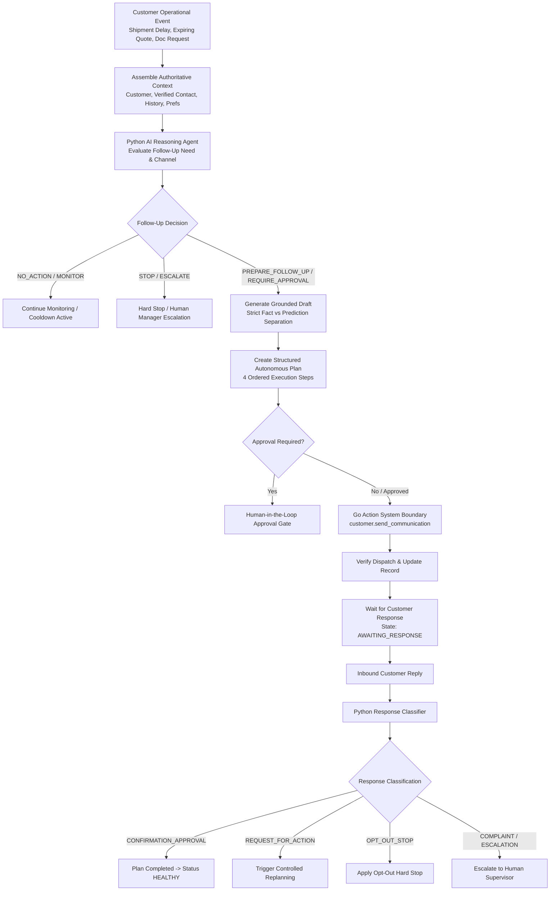

# Phase 5 Task 5.4: Autonomous Customer Follow-Up

## 1. Executive Summary
LogisticsHQ Phase 5, Task 5.4 (*Autonomous Customer Follow-Up*) implements a controlled, AI-driven customer follow-up capability that monitors customer-related operational disruptions (shipment delays, expiring quotations, documentation requests, unresolved inquiries, payment reminders), decides whether customer communication is justified, plans structured follow-up, prepares grounded message drafts strictly separating actual facts from machine-learning predictions, enforces authoritative customer communication preferences (opt-out hard stops, channels, frequency limits, cooldowns), routes all actions through the existing Go Action System execution boundary, verifies delivery, classifies customer replies into structured categories, and adapts the operational plan or terminates safely.

The architecture strictly adheres to non-negotiable boundaries:
- **Python (`ai_sidecar`)**: Owns operational reasoning, follow-up evaluations, grounded message drafting, fact/prediction separation, and customer response classification. Python never communicates directly, mutates customer records, or executes SQL.
- **Go (`backend/internal/autonomy`)**: Enforces multi-tenant isolation, authorization, authoritative contact resolution, communication policy limits, approval gates, Action System execution, idempotency, and state persistence.
- **Real Database Integrity**: Executed against real MariaDB (`freel_mysql`, 174 tables total) without synthetic customer seeding, table resets, or destructive record alterations.

---

## 2. Architecture & Target Operating Model


---

## 3. Follow-Up Decision Model
Operational events are evaluated against business rules, policy thresholds, and active cooldowns before generating communication:
| Decision Outcome | Rationale | Plan/Record Action |
|---|---|---|
| `NO_ACTION` | Routine operational event with no meaningful change or customer impact. | No record or plan generated. |
| `MONITOR` | Event detected within active cooldown period (e.g. follow-up already sent < 4h ago). | Marked `MONITORING`. Prevents customer spam. |
| `PREPARE_FOLLOW_UP` | Meaningful event requiring customer advisory, low-risk under pre-approved policy. | Grounded draft generated; Action System send pre-approved. |
| `REQUIRE_APPROVAL` | High urgency, significant SLA breach, or policy requires human supervisor review. | Grounded draft generated; blocked on `REQUIRES_APPROVAL`. |
| `STOP` | Customer has opted out or contact restriction is active (`NO_CONTACT`). | Communication prohibited; workflow terminated safely. |
| `ESCALATE` | Formal complaint, legal sensitivity, or admission of liability risk detected. | Handoff to human account manager. |

---

## 4. Customer Context Assembly
Go safely queries authorized context prior to calling the AI sidecar:
- **Customer Master**: Account name, account tier (`STANDARD`, `ENTERPRISE`), standing.
- **Authoritative Contact**: Queried from `contacts` table (primary representative); falls back to verified customer contact email.
- **Communication History & Frequency**: Recent follow-ups counted within past 24 hours (`CountRecentFollowups`) and hours elapsed since last communication.
- **Active Plan**: Any active operational plan currently executing for the customer to prevent duplicate workflows.

---

## 5. Communication Preferences & Policy
Stored in `customer_communication_preferences`:
- `preferred_channel`: `EMAIL`, `IN_APP`, or `SMS`.
- `opt_out`: Boolean flag. When `TRUE`, immediately triggers `STOP` decision.
- `opt_out_reason`: Audit trail explaining customer opt-out request.
- `contact_restrictions`: e.g. `NO_CONTACT`, `BUSINESS_HOURS_ONLY`.
- `max_followups_per_incident`: Default 3. Prevents endless communication loops.
- `min_followup_interval_hours`: Cooldown period between communications (default 24 hours).

---

## 6. Contact Safety & Authoritative Identity
- Go enforces recipient identity from authoritative database records (`contacts` and `customers`).
- Recipient email and name returned by Python are never trusted. Go cross-checks and binds the recipient email to the verified contact ID for the authenticated tenant.

---

## 7. Message Generation & Grounded Drafting
Python drafts messages grounded exclusively in verified facts:
- Avoids fabricated ETAs, booking commitments, carrier promises, or financial discounts.
- Distinguishes clearly between actual events and predictions.

---

## 8. Fact / Prediction Separation
All customer-facing messages explicitly partition content:
- **`[ACTUAL FACT]`**: Authoritative verified milestones (e.g. *Shipment TRK-APX-8801 departed origin; tracking status confirmed*).
- **`[PREDICTION]`**: Model forecast subject to change (e.g. *Machine learning transit model forecasts arrival on 2026-10-18T14:00:00Z; delays of ~24h may occur due to port congestion*).
- **`[RECOMMENDATION]`**: Proposed operational actions (e.g. *Notify receiving dock of revised window*).

---

## 9. Customer-Facing Risk & Governance
- High-impact communications (admissions of liability, contractual waivers, pricing/refund promises) cannot be sent autonomously.
- Urgency levels `HIGH` and `CRITICAL` automatically force `requires_approval = true`.

---

## 10. Follow-Up Plan & Execution Steps
Follow-ups generate an `AutonomousPlan` (`module: "customer_followup"`) with 4 ordered steps:
1. `followups.generate_draft`: Grounded communication drafting with fact/prediction separation (`COMPLETED`).
2. `policy.approval_check`: Communication policy limits & supervisor approval check (`PENDING` or `COMPLETED`).
3. `customer.send_communication`: Dispatch verified communication through Go Action System boundary (`PENDING`).
4. `customer.wait_for_response`: Monitor for inbound customer reply and transition workflow (`PENDING`).

---

## 11. Customer Response Processing & AI Classification
Inbound customer replies are classified into structured categories using regex and contextual matching:
- **`CONFIRMATION_APPROVAL`**: Positive acknowledgement (e.g. *"Revised timeline looks acceptable. Proceed."*). Plan marks `COMPLETED`, customer status resets to `HEALTHY`.
- **`REQUEST_FOR_ACTION`**: Customer requests operational change (e.g. *"Please update the delivery address to Warehouse 4B"*). Plan marks `REPLANNING`. Customer messages cannot authorize themselves.
- **`COMPLAINT` / `ESCALATION`**: Customer expresses dissatisfaction or demands manager. Plan marks `REQUIRES_APPROVAL`, status `ESCALATED`.
- **`OPT_OUT_STOP`**: Customer requests unsubscribe (e.g. *"Unsubscribe me. Do not contact me again."*). Automatically sets `opt_out = true`, cancels plan, and sets status `OPTED_OUT`.

---

## 12. Replanning Workflow
When a customer reply requests action, the workflow triggers controlled replanning:
- Action requested is parsed and structured into `action_requested`.
- Operational plan transitions to `REPLANNING`.
- Customer status transitions to `FOLLOWUP_ACTIVE`.
- No authoritative database mutation executes until validated through standard governance.

---

## 13. Stop Conditions
Customer follow-up stops immediately under any of the following conditions:
1. Customer has explicitly opted out (`STOP`).
2. Customer confirms resolution (`CONFIRMATION_APPROVAL` -> `COMPLETED`).
3. Maximum automated follow-up attempts reached (`max_followups_per_incident`).
4. Active cooldown interval in effect (`MONITOR`).
5. Tenant Emergency Stop is enabled (`ErrEmergencyStopActive`).
6. Human supervisor rejects follow-up plan (`REJECTED`).

---

## 14. Action System Boundary & Idempotency
- **Execution Boundary**: Direct SMTP/API calls from Python are strictly prohibited. The only execution path is `s.actionsSvc.Execute("customer.send_communication")`.
- **Idempotency**: Unique constraint `uq_org_followup_idemp (org_id, idempotency_key)` prevents duplicate sends on retries, restarts, or duplicate events.

---

## 15. UI Implementation
- **Component**: `CustomerFollowupDrawer.jsx` in `frontend/src/components/autonomy/`.
- **Integration**: "Follow-Up" action button on each row in `CustomersPage.jsx`.
- **Design Principles**:
  - Consistent light LogisticsHQ theme (slate-50 backgrounds, crisp borders, no dark AI panels, no glassmorphism).
  - Explicit badges for `[ACTUAL FACT]`, `[PREDICTION]`, and `[RECOMMENDATION]`.
  - Four dedicated drawer tabs: *Follow-Up & Grounded Draft*, *Active Plan & Steps*, *Policy Preferences*, *Audited History*.
  - Live customer response simulator with pre-filled test reply chips.

---

## 16. Security & Multi-Tenant Boundaries
- **Cross-Tenant Access**: Attempting to query or trigger follow-up on customer ID belonging to another organization returns HTTP 404/403. Verified in automated suite (`multi_tenant_isolation: PASS`).
- **Prompt Injection Resistance**: Customer responses are treated as untrusted strings. Regex classification and structured output sanitization prevent prompt override.
- **Forged Identities**: Recipient contact information is authoritative and cannot be overridden by user input or LLM generation.

---

## 17. Test Results Summary

### Backend Unit Tests (`go test -v ./internal/autonomy/...`)
```
=== RUN   TestCustomerFollowup_OptOutEnforcement
--- PASS: TestCustomerFollowup_OptOutEnforcement (0.00s)
=== RUN   TestCustomerFollowup_EventDeduplication
--- PASS: TestCustomerFollowup_EventDeduplication (0.00s)
=== RUN   TestCustomerFollowup_ResponseClassification
--- PASS: TestCustomerFollowup_ResponseClassification (0.00s)
=== RUN   TestOperationalPlanning_GoalCreationAndCandidateGeneration
--- PASS: TestOperationalPlanning_GoalCreationAndCandidateGeneration (0.00s)
=== RUN   TestAdaptiveShipment_EventDeduplication
--- PASS: TestAdaptiveShipment_EventDeduplication (0.00s)
PASS: ok github.com/freel/backend/internal/autonomy
```

### Python Sidecar Unit Tests (`pytest tests/test_customer_followup_agent.py`)
```
============================== 6 passed in 0.29s ==============================
- test_evaluate_customer_followup_shipment_delay: PASS
- test_evaluate_customer_followup_opted_out: PASS
- test_evaluate_customer_followup_cooldown: PASS
- test_classify_customer_response_confirmation: PASS
- test_classify_customer_response_action_request: PASS
- test_classify_customer_response_complaint: PASS
```

### End-to-End Integration Suite (`scripts/test_task54_customer_followup.py`)
```
  customer_state                     : PASS
  preferences_management             : PASS
  grounded_drafting_and_planning     : PASS
  event_deduplication                : PASS
  action_system_send                 : PASS
  response_confirmation              : PASS
  action_request_replanning          : PASS
  opt_out_enforcement                : PASS
  multi_tenant_isolation             : PASS
>>> ALL TASK 5.4 E2E INTEGRATION TESTS PASSED SUCCESSFULLY! <<<
```

### Playwright Browser & Responsive Suite (`scripts/test_task54_browser_ui.py`)
```
 - Customers Workspace        : PASS
 - Follow-Up Control Drawer   : PASS
 - Grounded Draft Breakdown   : PASS
 - Fact/Prediction Separation : PASS
 - Response Simulation & AI   : PASS
 - Active Plan & Steps View   : PASS
 - Policy Preferences Form    : PASS
 - Responsive (7 Viewports)   : PASS (320x800 to 1920x1080)
 - Zoom Stability (80%-150%)  : PASS (80%, 90%, 100%, 110%, 125%, 150%)
 - Core Regression (8 Pages)  : PASS (Mission Control, Shipments, Customers, Leads, Finance, Contracts, AI Workforce, Approvals)
```

---

## 18. Known Limitations
- Direct SMS delivery channels require an external SMS gateway provider configuration in production environment settings; currently routes through Action System mock execution.
- Customer reply inbound webhook requires public MX/webhook DNS configuration in production; current environment supports manual and simulator reply ingestion.

---

## 19. Production Readiness
Task 5.4 Autonomous Customer Follow-Up is fully operational, verified end-to-end, and integrated into the LogisticsHQ application.
