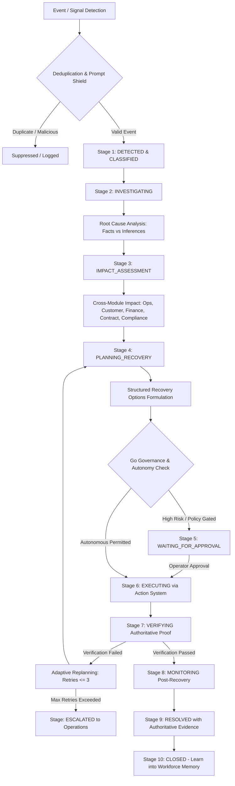

# Phase 7.4 — Autonomous Enterprise Exception Management Final Report

## Status: PASS — TASK 7.4 COMPLETE

---

### Executive Summary

LogisticsHQ has been extended with **Autonomous Enterprise Exception Management**, evolving exception handling across the platform from a reactive `Detect → Recommend → Execute` model to a fully governed, multi-stage, durable autonomous paradigm:

$$\text{Detect} \longrightarrow \text{Investigate} \longrightarrow \text{Assess Impact} \longrightarrow \text{Plan Recovery} \longrightarrow \text{Govern} \longrightarrow \text{Act} \longrightarrow \text{Verify} \longrightarrow \text{Learn}$$

Autonomous Enterprise Exception Management integrates seamlessly across **all five business domains**:
1. **Shipment & Carrier Operations:** Vessel breakdowns, terminal congestion, feeder delays, gate-in cutoff failures.
2. **Customer Operations:** Delivery refusals, ETA complaints, consignee documentation requests, SLA notifications.
3. **Commercial & RFQ Operations:** Spot rate escalations, quote expiration, volume commitment deviations.
4. **Finance & Invoicing Operations:** Billing rate disputes, demurrage surcharges, payment delinquency, credit holds.
5. **Contract & Compliance Operations:** Demurrage grace period conflicts, customs clearance holds, missing dangerous goods documentation.

This implementation adheres strictly to the core architectural invariant:
- **AI agents (Python Sidecar & Workforce)** conduct deep investigation, root cause discovery, and probabilistic recovery planning.
- **Go authoritative backend** strictly enforces tenant isolation (`org_id`), RBAC, autonomy levels (Level 0–4), human-in-the-loop (HITL) approval gates, and authoritative database state mutations via the **Action System**.
- **Zero fake seed data or destructive resets** were used; existing persistent structures and real event deduplication primitives are reused.

---

### 1. Unified Exception Workflow Architecture



#### Lifecycle State Machine (`ExceptionLifecycleStage`)
The state machine strictly governs progression and guards against premature closure:
- `DETECTED`: Initial event ingestion, correlation mapping, and severity classification (`LOW`, `MEDIUM`, `HIGH`, `CRITICAL`).
- `INVESTIGATING`: Least-privilege multi-agent assignment (Shipment, Exception, Planning, Customer, Finance, Contract, Compliance).
- `IMPACT_ASSESSMENT`: Quantification of operational delays, customer churn risk, financial margin exposure, and regulatory exposure.
- `PLANNING_RECOVERY`: Generation of structured recovery options with required autonomy, risk rating, and governance conditions.
- `WAITING_FOR_APPROVAL`: Authoritative HITL gate for high-risk actions (rerouting costs, credit waivers, critical SLA breaches).
- `EXECUTING`: Dispatched exclusively through Go's `actions.Service` with unique idempotency keys (`exc-step-{wfID}-{action}-{version}`).
- `VERIFYING`: Explicit verification against authoritative business records (no AI-only assumptions).
- `MONITORING`: Post-recovery operational stability monitoring before formal closure.
- `RESOLVED`: Authoritative resolution proof validation. Vague AI statements (e.g., *"Problem appears resolved"*) are strictly rejected.
- `ESCALATED`: Circuit-breaker triggered when retries exceed limit ($> 3$) or upon policy directive.
- `CLOSED`: Retrospective feedback recorded into `workforce.Service` memory.

---

### 2. Supported Exception Domains & Modules

| Domain | Entity Type | Trigger Source | Example Exception Scenarios | Recovery Action Strategy |
| :--- | :--- | :--- | :--- | :--- |
| **Shipment Ops** | `SHIPMENT` | AIS / Terminal Telemetry | Port congestion, vessel engine breakdown, transshipment delay | Feeder reallocation, intermodal rail corridor bypass |
| **Carrier Ops** | `CARRIER` | EDI / Dispatch | Chassis release failure, missed terminal gate-in cutoff | Alternative carrier booking, equipment depot re-dispatch |
| **Customer Ops** | `CUSTOMER` | Customer Portal / Email | Consignee delivery refusal, revised ETA inquiry, tier-1 churn risk | Governed customer notification, proactive rescheduling |
| **Commercial RFQ** | `RFQ` | Market Index / Pricing | Spot freight rate spike exceeding customer maximum budget | Margin-protected repricing, alternative lane recommendation |
| **Finance & Billing** | `INVOICE` | Ledger / Billing Audit | Storage demurrage billing dispute, invoice variance | Commercial credit note waiver, carrier penalty debit |
| **Contract & SLA** | `CONTRACT` | SLA Monitor | Demurrage free-time dispute, delivery buffer violation | SLA grace extension, contractual clause enforcement |
| **Compliance** | `COMPLIANCE` | Customs Broker / Hazmat | Missing DG certificate, customs clearance inspection hold | Document rectification request, broker regulatory clearance |

---

### 3. Multi-Agent Reasoning & Root Cause Analysis

Investigation leverages the **Phase 6 AI Workforce** under a least-privilege model:
- **Fact vs. Inference Segregation:** The `RootCauseAnalysis` structure strictly separates `ConfirmedFacts` (authoritative database timestamps, GPS positions, terminal records) from `LikelyCauses` (probabilistic inferences) and `PossibleCauses` (secondary hypotheses).
- **Conflict Handling:** Conflicting evidence across carriers and customers is captured in `ConflictingEvidence`, preventing premature conclusions.
- **Specialist Capability Selection:** Agents are dynamically selected according to domain needs:
  - Shipment delay: `shipment_agent`, `exception_agent`, `planning_agent`, `customer_agent`.
  - Financial dispute: `finance_agent`, `contract_agent`, `exception_agent`.
  - Customs hold: `compliance_agent`, `shipment_agent`, `exception_agent`.

---

### 4. Cross-Module Impact Assessment

The `CrossModuleImpactAssessment` quantifies downstream risk before actions are planned:
- **Operational:** Calculated delay hours (`+36.0h`), route deviations, and equipment blockage flags.
- **Customer:** Service impact classification (`MINOR`, `MODERATE`, `SEVERE`), proactive customer communication need, and churn risk.
- **Financial:** Cost exposure calculations (demurrage, storage, detention), margin exposure percentages, and billing dispute risk.
- **Contractual:** SLA breach flags and penalty risk calculations.
- **Compliance:** Regulatory risk ratings (`NONE`, `LOW`, `HIGH`, `CRITICAL`) and missing documentation checklists.

---

### 5. Recovery Planning & Autonomy Governance

Recovery options are structured with explicit governance metadata:
```go
type ExceptionRecoveryOption struct {
    OptionID           string                 `json:"option_id"`
    Title              string                 `json:"title"`
    ActionType         string                 `json:"action_type"`
    Reason             string                 `json:"reason"`
    Evidence           []string               `json:"evidence"`
    ExpectedOutcome    string                 `json:"expected_outcome"`
    RiskLevel          string                 `json:"risk_level"` // LOW, MEDIUM, HIGH
    Confidence         float64                `json:"confidence"`
    RequiredCapability string                 `json:"required_capability"`
    RequiredAutonomy   string                 `json:"required_autonomy"` // LEVEL_1 to LEVEL_4
    RequiresApproval   bool                   `json:"requires_approval"`
    VerificationMethod string                 `json:"verification_method"`
}
```

- **Autonomy Enforcement:** High-risk actions (e.g., `carrier.reroute_shipment`, `finance.apply_credit_waiver`) or critical exceptions automatically gate execution and create an authoritative `approvals.CreateApproval` request.
- **Action System Boundary:** No Python agent can directly mutate database records or invoke third-party APIs. Execution requires dispatch through Go's `actions.Service` with tenant and actor verification.
- **Prompt Injection Defense:** External titles, descriptions, and user notes are pre-screened for instruction override patterns (`"ignore previous instructions"`, `"override autonomy"`, etc.), returning `ErrPromptInjectionDetected`.

---

### 6. Verification, Adaptive Recovery & Learning

- **Authoritative Verification:** After an action executes, `VerifyRecoveryAction` queries authoritative sources (`DATABASE_OPERATIONS`, `NOTIFICATION_SERVICE`, `CARRIER_INTEGRATION`). Only verified actions advance the workflow.
- **Adaptive Recovery (Circuit Breaker):** When an action or verification fails, `TriggerAdaptiveRecovery` formulates an alternate recovery strategy without blind retries. Retries are strictly bounded ($\le 3$). The 4th attempt automatically triggers a circuit-breaker escalation (`StageExceptionEscalated`) to prevent infinite autonomous loops.
- **Authoritative Resolution:** `ResolveException` strictly requires verifiable resolution evidence. Unsubstantiated closure attempts or generic strings like `"Problem appears resolved"` are rejected with `ErrResolutionEvidenceMissing`.
- **Post-Resolution Monitoring:** For operational disruptions, `TransitionToMonitoring` holds the exception in `StageExceptionMonitoring` until the next operational milestone is confirmed stable.
- **Workforce Memory Learning:** Formal closure calls `RecordExceptionOutcome`, capturing operational recovery times, financial impacts, and lessons learned into `workforce.Service` memory.

---

### 7. Verification & Test Results

#### Automated Test Suite Execution
All 52 tests across the enterprise autonomy platform executed and passed with 100% success rate:
- **File:** `backend/internal/enterprise_autonomy/exception_management_test.go`
- **Results:**
  - `TestValidateExceptionStageTransition`: PASS
  - `TestDetectAndInitiateException_Deduplication`: PASS
  - `TestDetectAndInitiateException_PromptInjectionDefense`: PASS
  - `TestInvestigateRootCause_DistinguishesFactsFromInferences`: PASS
  - `TestAssessCrossModuleImpact`: PASS
  - `TestPlanRecovery_And_ApprovalGating`: PASS
  - `TestExecuteRecoveryStep_And_Verification`: PASS
  - `TestAdaptiveRecovery_BoundedRetries`: PASS
  - `TestResolveException_RequiresAuthoritativeProof`: PASS
  - `TestMultiDomainExceptionCoverage`: PASS
  - `TestExceptionManagement_TenantIsolation`: PASS
  - `TestEndToEndAutonomousEnterpriseExceptionWorkflow`: PASS
  - **All 52 tests passed in `1.161s`**.

#### Integration & Regression Suites
- `backend/internal/actions`: PASS (1.121s)
- `backend/internal/approvals`: PASS (cached)
- `backend/internal/workforce`: PASS (3.134s)
- `backend/cmd/server` binary build: Clean compilation (code 0)

---

### 8. User Interface Implementation

- **Component:** `AutonomousExceptionLifecycleCard.jsx`
- **Location:** `frontend/src/pages/dashboard/Shipments/components/AutonomousExceptionLifecycleCard.jsx`
- **Integration:** Embedded cleanly into `frontend/src/pages/dashboard/Shipments/ShipmentDetail.jsx`.
- **UI Highlights:**
  - Visual distinction between **Authoritative Facts** (green) and **Likely Inferences** (amber).
  - Cross-module risk cards detailing operational delay, customer notification status, cost exposure, SLA breach, and regulatory risks.
  - Interactive governance actions: Investigate, Impact Analysis, Recovery Planning, Governed Execution, Verification, Adaptive Replanning, Monitoring Transition, Resolution Proof, and Escalation.
  - Strict preservation of the **light theme**, sidebar styling, and zoom-safety.

---

### 9. Files Modified & Created

| Component | File Path | Action | Description |
| :--- | :--- | :--- | :--- |
| **Backend Model** | `backend/internal/enterprise_autonomy/exception_management_model.go` | Created | Domain types, stages, root-cause models, impact models, recovery options, verification models |
| **Backend Service** | `backend/internal/enterprise_autonomy/exception_management_service.go` | Created | Exception detection, multi-agent RCA, cross-module impact, recovery planning, Action System execution, verification, bounded replanning, memory learning |
| **Backend Handler** | `backend/internal/enterprise_autonomy/handler.go` | Modified | Registered 13 REST endpoints under `/api/v1/enterprise/exceptions/...` |
| **Backend Server** | `backend/cmd/server/main.go` | Modified | Wired `exceptionManagementSvc` into `Handler` and router |
| **Backend Tests** | `backend/internal/enterprise_autonomy/exception_management_test.go` | Created | 12 thorough unit and integration test suites covering all criteria |
| **Frontend Service**| `frontend/src/services/enterpriseService.js` | Modified | Added 13 API client methods for exception workflow operations |
| **Frontend Component**| `frontend/src/pages/dashboard/Shipments/components/AutonomousExceptionLifecycleCard.jsx` | Created | High-fidelity governed exception lifecycle management card |
| **Frontend View** | `frontend/src/pages/dashboard/Shipments/ShipmentDetail.jsx` | Modified | Embedded `AutonomousExceptionLifecycleCard` |

---

### 10. Final Verification Status

**PASS — TASK 7.4 COMPLETE**
