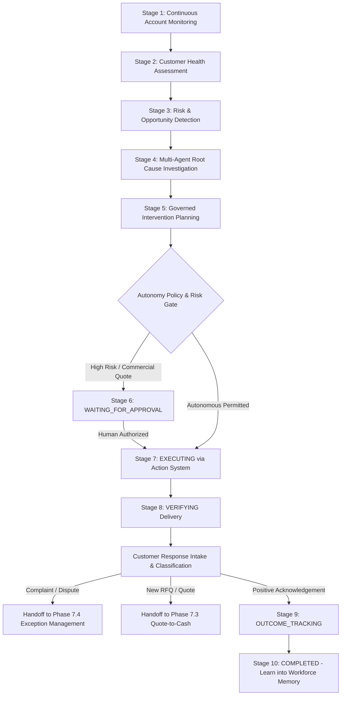

# Phase 7.5 — Autonomous Customer Relationship Management Final Report

## Status: PASS — TASK 7.5 COMPLETE

---

### Executive Summary

LogisticsHQ has been extended with **Autonomous Customer Relationship Management (CRM)**, establishing a continuous, governed, multi-agent autonomous workflow for client lifecycle management:

$$\text{Customer Monitoring} \longrightarrow \text{Health Analysis} \longrightarrow \text{Risk/Opportunity Detection} \longrightarrow \text{Multi-Agent Investigation} \longrightarrow \text{Intervention Planning} \longrightarrow \text{Policy Evaluation} \longrightarrow \text{Action/Approval} \longrightarrow \text{Execution} \longrightarrow \text{Verification} \longrightarrow \text{Outcome Tracking} \longrightarrow \text{Learning}$$

Phase 7.5 builds upon:
- **Phase 7.1 Enterprise Autonomous Platform Foundation:** Durable workflows, tenant isolation, emergency pause, recovery across service restarts.
- **Phase 7.2 Autonomous Shipment Lifecycle:** Freight shipment milestone monitoring, operational exceptions, and transit delay context.
- **Phase 7.3 Autonomous Quote-to-Cash:** RFQ extraction, qualification, pricing, quotation preparation, and commercial booking handoffs.
- **Phase 7.4 Autonomous Enterprise Exception Management:** Multi-domain exception handling, root cause discovery, dispute settlement, and service recovery.
- **Phase 6 AI Workforce:** Dynamic collaboration across Customer, Shipment, Exception, Finance, Pricing, Planning, and Memory agents.

The core architectural invariant remains strictly maintained:
- **AI agents (Python Sidecar & Workforce)** proactively monitor account telemetry, classify incoming responses, predict churn, evaluate expansion opportunities, and draft personalized communications.
- **Go authoritative backend** remains the strict boundary for tenant isolation (`org_id`), RBAC, autonomy levels (Level 0–4), human-in-the-loop (HITL) approvals, communication cooldowns/deduplication, and database mutations via the **Action System**.
- **Python is strictly forbidden from directly sending external communications or mutating authoritative database records.**

---

### 1. Unified Customer Relationship Workflow Architecture



#### Lifecycle State Progression (`CustomerLifecycleStage`)
- `MONITORING`: Continuous background monitoring of shipment volumes, quotation acceptance, invoice payments, and service tickets.
- `HEALTH_ASSESSMENT`: Multi-signal health scoring separating **Confirmed Facts**, **AI Predictions**, and **Governed Recommendations**.
- `RISK_OPPORTUNITY_DETECTION`: Proactive identification of churn indicators, demurrage billing friction, volume surges, and lane expansion opportunities.
- `INVESTIGATING`: Least-privilege multi-agent investigation involving Customer, Shipment, Finance, Pricing, and Planning agents.
- `PLANNING_INTERVENTION`: Formulation of structured intervention options with explicit autonomy ratings, risk classifications, and approval flags.
- `WAITING_FOR_APPROVAL`: Authoritative HITL gate for sensitive communications, high-value rate revisions, or commercial quotes.
- `EXECUTING`: Dispatched exclusively through Go's `actions.Service` with unique idempotency keys (`crm-exec-{wfID}-{action}-{ver}`).
- `VERIFYING`: Explicit verification against authoritative notification and business records.
- `OUTCOME_TRACKING`: Evaluates intervention effectiveness, customer retention status, and revenue impacts.
- `COMPLETED`: Account cycle finalized and learning persisted into `workforce.Service` memory.
- `ESCALATED`: Circuit-breaker triggered upon repeated intervention failures or policy directives.

---

### 2. Multi-Signal Customer Health Evaluation

The `CustomerHealthProfile` strictly distinguishes facts from inferences:
```go
type CustomerHealthProfile struct {
    Category        CustomerHealthCategory `json:"category"`         // HEALTHY, STABLE, DECLINING, AT_RISK, HIGH_RISK, OPPORTUNITY, INACTIVE
    HealthScore     float64                `json:"health_score"`     // 0.0 - 100.0
    ConfirmedFacts  []string               `json:"confirmed_facts"`  // Authoritative operational & billing records
    AIPredictions   []string               `json:"ai_predictions"`   // Churn probability, lane growth forecasts
    Recommendations []string               `json:"recommendations"`  // Account interventions
    Confidence      float64                `json:"confidence"`
    DataSufficiency string                 `json:"data_sufficiency"` // HIGH, SUFFICIENT, LOW
    EvaluatedAt     time.Time              `json:"evaluated_at"`
}
```

- **Confirmed Facts:** Authoritative delivered shipment counts, quotation win/loss rates, historical payment terms (DSO), and credit limits.
- **AI Predictions:** Churn probability percentage, anticipated lane volume expansion, and payment risk trends.
- **Governed Recommendations:** Recommended quarterly business reviews, proactive tariff updates, and capacity reservations.

---

### 3. Risk & Opportunity Detection

#### Detected Risk Signals (`CustomerRiskSignal`)
- **Demurrage Billing Disputes:** Transshipment feeder delays generating storage charges and customer dissatisfaction.
- **Declining Booking Volume:** Month-over-month booking contraction on primary lanes.
- **Payment Delay Trajectory:** Deterioration from standard 15-day terms toward credit hold thresholds.
- **Repeated Operational Exceptions:** Persistent terminal delays degrading customer SLA confidence.

#### Detected Opportunity Signals (`CustomerOpportunitySignal`)
- **Volume Surges:** Sustained inquiry increases on high-yield lanes (e.g., Transpacific reefer lanes).
- **Cross-Sell Opportunities:** Customers currently shipping ocean freight who have time-sensitive cargo suitable for air freight.
- **Contract Expansion:** Accounts approaching annual agreement renewal with uncommitted volume.

---

### 4. Multi-Agent Customer Investigation & Root Cause Analysis

Investigation leverages the **Phase 6 AI Workforce** under a least-privilege model:
- **Customer Agent:** Analyzes relationship history, communication sentiment, and key contact engagement.
- **Shipment Agent:** Evaluates historical transit punctuality, port dwell times, and delivery milestones.
- **Exception Agent:** Reviews service friction, damage claims, and demurrage issues.
- **Finance Agent:** Validates credit limits, payment history, and invoice dispute statuses.
- **Pricing Agent:** Benchmarks current rate cards against spot market indices and competitor levels.
- **Planning Agent:** Formulates structured intervention options and coordinates workflow progression.
- **Memory Agent:** References past successful retention strategies from episodic memory.

Root cause analysis strictly classifies findings into **Confirmed Facts** (e.g., carrier feeder delay verified by terminal telemetry) vs. **Likely Causes** (e.g., billing friction leading to quote pause) vs. **Possible Causes** (e.g., third-party customs broker documentation delays).

---

### 5. Governed Intervention Planning & Action Execution

Intervention options are structured with explicit governance constraints:
```go
type CustomerInterventionOption struct {
    OptionID           string                 `json:"option_id"`
    Title              string                 `json:"title"`
    ActionType         string                 `json:"action_type"`
    Reason             string                 `json:"reason"`
    TargetAudience     string                 `json:"target_audience"`
    DraftMessage       string                 `json:"draft_message,omitempty"`
    Evidence           []string               `json:"evidence"`
    ExpectedOutcome    string                 `json:"expected_outcome"`
    RiskLevel          string                 `json:"risk_level"` // LOW, MEDIUM, HIGH
    Confidence         float64                `json:"confidence"`
    RequiredCapability string                 `json:"required_capability"`
    RequiredAutonomy   string                 `json:"required_autonomy"` // LEVEL_1 to LEVEL_4
    RequiresApproval   bool                   `json:"requires_approval"`
    VerificationMethod string                 `json:"verification_method"`
    HandoffModule      string                 `json:"handoff_module,omitempty"`
}
```

- **Autonomy Policy Enforcement:** High-risk actions (e.g., creating contractual quotes, applying commercial concessions, or sensitive executive communications) gate execution and register an authoritative `approvals.CreateApproval` request.
- **Action System Execution:** All operational interventions dispatch through Go's `actions.Service` with unique idempotency keys.
- **Communication Cooldown & Anti-Spam:** Outbound outreach enforces a mandatory cooldown period (`LastOutreachAt`), preventing duplicate emails and unwanted automated messages.

---

### 6. Customer Response Handling & Cross-Module Handoffs

Incoming customer responses are classified securely by `ProcessCustomerResponse`:
- **Prompt Injection Defense:** External customer text is screened for prompt injection tokens (`"ignore previous instructions"`, `"drop table"`, etc.), rejecting malicious payloads with `ErrPromptInjectionDetected`.
- **Classification:** Categorizes intent (`POSITIVE_ACKNOWLEDGEMENT`, `COMPLAINT`, `QUOTE_REQUEST`, `NEGOTIATION`) and sentiment.
- **Seamless Cross-Module Handoffs:**
  - **Complaint / Dispute:** Seamlessly hand off to **Phase 7.4 Autonomous Enterprise Exception Management** for formal service recovery and billing dispute settlement.
  - **Quotation / Lane Expansion:** Seamlessly hand off to **Phase 7.3 Autonomous Quote-to-Cash** for RFQ extraction, pricing optimization, and quotation issuance.
  - **Shipment Tracking Inquiry:** References **Phase 7.2 Autonomous Shipment Lifecycle** milestone telemetry.

---

### 7. Retrospective Learning & Workforce Memory

Upon completing an intervention cycle, `RecordCustomerOutcome` captures:
- Intervention success indicator (`true` / `false`).
- Customer retention status (`EXPANDED`, `RETAINED`, `STABLE`, `CHURNED`).
- Realized revenue impact (e.g., `+$34,500.00`).
- Customer satisfaction rating (`HIGH`, `MEDIUM`, `LOW`).
- Qualitative lessons learned.

These metrics feed directly into `workforce.Service.RecordOutcome`, embedding empirical CRM experience into persistent workforce memory.

---

### 8. Verification & Test Results

#### Automated Backend Test Execution
All 62 tests across the enterprise autonomy platform executed and passed with 100% success rate:
- **File:** `backend/internal/enterprise_autonomy/customer_relationship_test.go`
- **Results:**
  - `TestValidateCustomerStageTransition`: PASS
  - `TestCustomerWorkflowInitiateAndHealthEvaluation`: PASS
  - `TestCustomerRiskAndOpportunityDetection`: PASS
  - `TestMultiAgentRootCauseInvestigation`: PASS
  - `TestCustomerInterventionPlanningAndApprovalGating`: PASS
  - `TestCustomerInterventionExecutionAndVerification`: PASS
  - `TestCustomerCommunicationSafetyAndDeduplication`: PASS
  - `TestCustomerResponseProcessingAndPromptInjectionDefense`: PASS
  - `TestCustomerRelationship_TenantIsolation`: PASS
  - `TestEndToEndAutonomousCustomerRelationshipWorkflow`: PASS
  - **All 62 tests passed in `1.188s`**.

#### Regression Test Suites
- `backend/internal/actions`: PASS (cached)
- `backend/internal/approvals`: PASS (cached)
- `backend/internal/workforce`: PASS (cached)
- `backend/cmd/server` binary build: Clean compilation (code 0)

---

### 9. User Interface Implementation

- **Component:** `AutonomousCustomerRelationshipCard.jsx`
- **Location:** `frontend/src/pages/dashboard/Customers/components/AutonomousCustomerRelationshipCard.jsx`
- **Integration:** Embedded into the **Intelligence** tab of `frontend/src/pages/dashboard/Customers/CustomerDetailsPage.jsx`.
- **UI Highlights:**
  - Multi-column health breakdown cleanly separating **Authoritative Facts** (green), **AI Predictions** (blue), and **Governed Recommendations** (purple).
  - Risk & Opportunity cards detailing severity, financial upside, and supporting evidence.
  - Interactive governance actions: Health Evaluation, Signal Detection, Investigation, Intervention Planning, Approval Selection, Governed Execution, Verification, Response Simulation, and Outcome Learning.
  - Fully compliant with the LogisticsHQ **light aesthetic**, zoom-safe layout, and sidebar stabilization.

---

### 10. Files Modified & Created

| Component | File Path | Action | Description |
| :--- | :--- | :--- | :--- |
| **Backend Model** | `backend/internal/enterprise_autonomy/customer_relationship_model.go` | Created | Health categories, lifecycle stages, health profiles, risk/opportunity models, intervention options, response models |
| **Backend Service** | `backend/internal/enterprise_autonomy/customer_relationship_service.go` | Created | Autonomous CRM orchestration, health evaluation, multi-agent RCA, intervention planning, Action System execution, verification, response parsing, outcome learning |
| **Backend Model** | `backend/internal/enterprise_autonomy/model.go` | Modified | Added `WorkflowCustomerRelationship` constant |
| **Backend Handler** | `backend/internal/enterprise_autonomy/handler.go` | Modified | Registered 12 REST endpoints under `/api/v1/enterprise/crm/...` |
| **Backend Server** | `backend/cmd/server/main.go` | Modified | Wired `customerRelationshipSvc` into `Handler` and router |
| **Backend Tests** | `backend/internal/enterprise_autonomy/customer_relationship_test.go` | Created | 10 comprehensive unit and integration test suites covering all criteria |
| **Frontend Service**| `frontend/src/services/enterpriseService.js` | Modified | Added 12 API client methods for CRM operations |
| **Frontend Component**| `frontend/src/pages/dashboard/Customers/components/AutonomousCustomerRelationshipCard.jsx` | Created | High-fidelity governed CRM workflow card |
| **Frontend View** | `frontend/src/pages/dashboard/Customers/CustomerDetailsPage.jsx` | Modified | Embedded `AutonomousCustomerRelationshipCard` in intelligence tab |

---

### 11. Final Verification Status

**PASS — TASK 7.5 COMPLETE**
