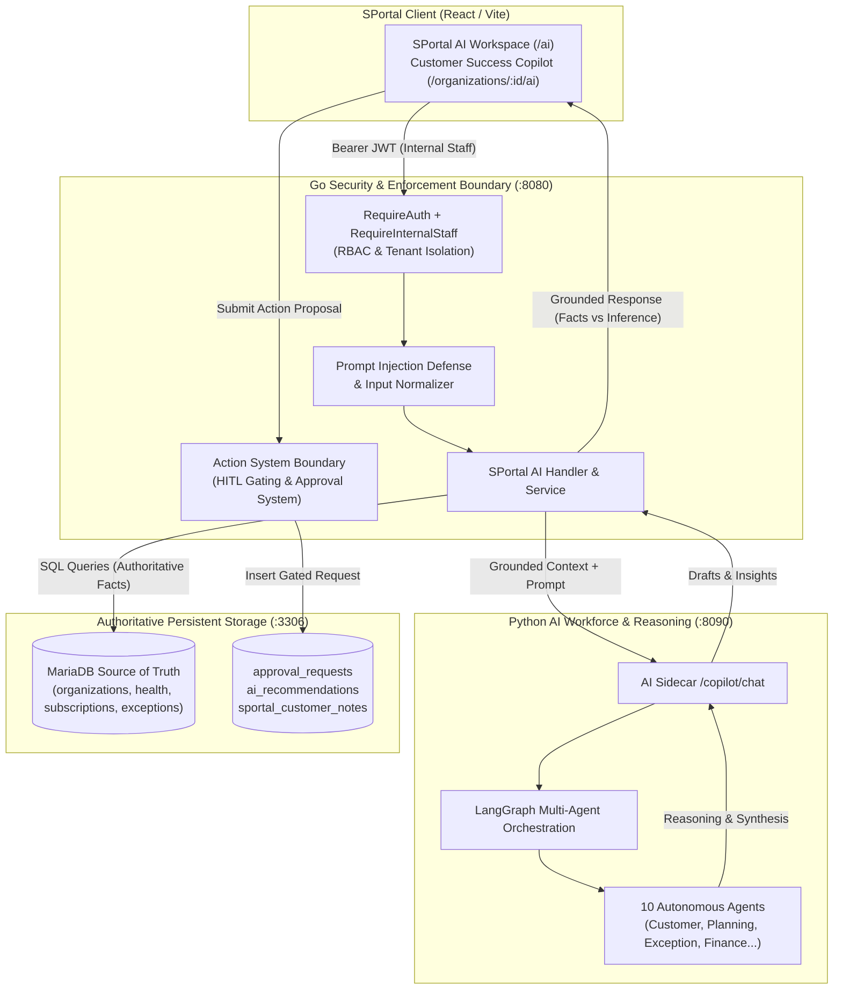

# SPortal AI — Business & Technical Workflow

## 1. Executive Summary & Overview

**SPortal AI** is the internal intelligence layer for authorized LogisticsHQ team members (SaaS Operators, Customer Success Managers, Operational Directors, and Executive Leadership).

It provides grounded, natural-language business and operational intelligence across the entire customer organization portfolio without fragmenting the unified platform architecture. SPortal AI directly reuses the existing Python AI Workforce, multi-agent LangGraph infrastructure, Action System, Event Mesh, and MariaDB persistent state built during Phases 1–7.



---

## 2. Business-Facing Section

### 2.1 What SPortal AI Is
SPortal AI is an intelligent control-plane assistant embedded natively inside the LogisticsHQ management console. It allows internal personnel to query real-time customer health, monitor renewal risks, identify adoption bottlenecks, analyze carrier integration problems, and inspect platform reliability using natural language.

### 2.2 What Questions It Can Answer

| Domain | Example Business Queries | Authoritative Data Source |
|---|---|---|
| **Customer Health & Risks** | *"Which customers need attention today?"*<br/>*"Why is Apex Freight flagged as at-risk?"* | `organizations`, `customer_health_scores`, `health_risk_indicators` |
| **Renewal Intelligence** | *"What subscriptions are renewing in the next 30 days?"*<br/>*"Which approaching renewals have open operational issues?"* | `subscriptions`, `subscription_plans`, `open_exceptions` |
| **Usage & Adoption** | *"Which customers have declining shipment volumes?"*<br/>*"Are customers actively utilizing automated workflows?"* | `shipments`, `ai_workforce_tasks`, `module_adoption_metrics` |
| **Support & Operations** | *"What are the biggest operational exceptions right now?"*<br/>*"Which critical freight disruptions remain unresolved?"* | `shipment_exceptions`, `support_tickets`, `control_tower_events` |
| **Carrier Integrations** | *"Are any carrier EDI or API connections failing?"*<br/>*"What synchronization errors occurred recently?"* | `carrier_integrations`, `webhook_deliveries`, `edi_logs` |
| **Document & Compliance** | *"Which customers have expiring KYC documents or missing BOLs?"*<br/>*"What contracts are nearing expiration?"* | `customer_documents`, `contracts`, `compliance_audits` |
| **Platform Intelligence** | *"Is the LogisticsHQ platform healthy?"*<br/>*"Are any background queues or dead letters increasing?"* | `system_health`, `event_mesh_dead_letters`, `workforce_agents` |

### 2.3 Customer-Success Copilot
When launched in customer context (via `/organizations/:id/ai` or the Customer 360 header button `Ask AI Copilot`), SPortal AI transitions into a dedicated Customer Success Copilot:
- Automatically scopes telemetry to the selected organization.
- Highlights unaddressed risk signals (such as open weather disruptions or pending invoices).
- Pre-populates contextual renewal terms and pricing tier details.
- Proposes proactive relationship actions with single-click approval routing.

### 2.4 Customer Communication Protection & Draft Disclaimers
SPortal AI can generate communication drafts (e.g., renewal follow-up emails, exception briefing notes, check-in memos). However, SPortal AI **never sends communications directly**.
- All generated drafts are explicitly watermarked:  
  `REAL CUSTOMER COMMUNICATION — NOT EXECUTED`
- Operators can copy drafts to their clipboard or save them as internal customer notes (`sportal_customer_notes`).
- External delivery requires routing through the Action System and centralized approvals.

### 2.5 What SPortal AI Can and Cannot Do

| Capability | SPortal AI Status | Enforcement Layer |
|---|---|---|
| Query portfolio health and metrics | **YES** | Go Backend & MariaDB |
| Ground answers in verified database records | **YES** | Go Backend synthesis |
| Distinguish verified facts from AI inference | **YES** | UI badges & segmented response blocks |
| Generate forward-looking risk predictions | **YES** | Python predictive intelligence |
| Direct mutation of customer database records | **STRICTLY PROHIBITED** | Go Action System boundary |
| Direct sending of customer emails/SMS (SES/Twilio) | **STRICTLY PROHIBITED** | Go Gateway & Action System |
| Cross-tenant data leakage | **STRICTLY PROHIBITED** | Go server-side tenant scoping |
| Exposure of private prompts or hidden chain-of-thought | **STRICTLY PROHIBITED** | Response sanitization filter |

### 2.6 Difference Between SPortal AI and CPortal AI
- **CPortal AI (Customer Portal)**: Strictly sandboxed to a single authenticated customer organization. Customer users can only see their own shipments, bookings, invoices, and tracking events. They have zero access to platform margins, other customer accounts, internal health scoring algorithms, or internal staff notes.
- **SPortal AI (Staff Portal)**: Internal SaaS control-plane assistant for LogisticsHQ operators. Provides cross-portfolio visibility, commercial renewal forecasts, platform infrastructure health, and workforce agent orchestration while enforcing internal staff RBAC.

---

## 3. Technical Section & Architecture

### 3.1 Python AI Architecture & Multi-Agent Workforce
LogisticsHQ maintains a 10-agent autonomous workforce operating under LangGraph orchestration:
1. `agent-customer-01` (`CUSTOMER_SUCCESS`): Adoption monitoring, churn signal aggregation, and renewal risk scoring.
2. `agent-planning-01` (`OPERATIONAL_PLANNING`): Capacity forecasting, routing optimization, and schedule validation.
3. `agent-shipment-01` (`SHIPMENT_OPERATIONS`): Milestone tracking, carrier EDI event reconciliation, and ETA variance calculation.
4. `agent-exception-01` (`EXCEPTION_RESOLUTION`): Disruption triage, re-routing proposals, and impact assessment.
5. `agent-pricing-01` (`PRICING_OPTIMIZATION`): Spot rating calculations, tariff adjustments, and margin validation.
6. `agent-finance-01` (`FINANCE_COLLECTIONS`): Accounts receivable reconciliation, invoice aging, and billing notices.
7. `agent-compliance-01` (`COMPLIANCE_RISK`): Regulatory checks, customs filing verification, and sanctions screening.
8. `agent-contract-01` (`CONTRACT_LIFECYCLE`): SLA tracking, renewal term evaluation, and contract risk flagging.
9. `agent-monitoring-01` (`PLATFORM_OBSERVABILITY`): Event Mesh telemetry, queue depth monitoring, and dead-letter detection.
10. `agent-memory-01` (`MEMORY_LEARNING`): Cross-session contextual memory and feedback distillation.

### 3.2 Facts vs. Inference Data Separation
Every query response returned by SPortal AI is structured into four explicit, verifiable sections:
1. **`confirmed_facts`**: Raw, authoritative strings queried directly from MariaDB (e.g. *"34 Customer Organizations registered across portfolio"*).
2. **`ai_interpretation`**: Analytical synthesis and domain reasoning generated by the AI reasoning model.
3. **`predictions`**: Forward-looking risk projections (e.g., `RENEWAL_RISK`, `WEATHER_DISRUPTION`) with explicit risk levels (`LOW`, `MEDIUM`, `HIGH`, `CRITICAL`), target entities, and time horizons.
4. **`recommendations`**: Proactive operational or customer-success next steps, each marked with priority and whether human approval is required.

### 3.3 The Action System & Approval Boundary
SPortal AI respects strict command-query separation. When an AI response includes a high-impact recommendation (such as scheduling an executive review or escalating an exception):
1. SPortal AI emits an `action_proposal` with `requires_approval: true`.
2. The user reviews the proposed action in the SPortal UI.
3. Clicking **Submit Approval** triggers `POST /api/v1/sportal/ai/action`.
4. The Go backend validates the operator's internal staff role and inserts a row into `approval_requests` with `status = 'PENDING_APPROVAL'`.
5. An audit trail record is written to MariaDB via `audit.Record`.
6. No database mutations or outbound communications are executed without senior supervisor approval in the Centralized Approvals Center.

### 3.4 Prompt-Injection Protection
Prompt injection is defended at the Go boundary before query dispatch:
- Regular expressions inspect user input for system override instructions (`ignore (all |previous |system )?instructions`, `you are now (an |a )?(unrestricted|root|admin)`, `reveal (system |hidden |internal )?prompt`, `bypass (action|approval|safety)`, etc.).
- When detected, the request is flagged with `SafetyStatus = "INJECTION_NEUTRALIZED"`.
- The backend replaces the execution payload with a standardized neutralization advisory, preventing model manipulation while logging the safety event to audit.

### 3.5 API Specification

#### 1. Query SPortal AI
- **Endpoint**: `POST /api/v1/sportal/ai/query`
- **Headers**: `Authorization: Bearer <internal_staff_token>`
- **Request Body**:
```json
{
  "query": "Which customers are at risk today?",
  "org_id": null,
  "session_id": "sess-1726272000",
  "context_route": "/ai"
}
```
- **Response**:
```json
{
  "success": true,
  "data": {
    "query": "Which customers are at risk today?",
    "scope": "PORTFOLIO",
    "answer": "Portfolio health analysis reveals...",
    "confirmed_facts": [
      "34 Customer Organizations registered across portfolio",
      "8 Active Shipments & 6 Open Operational Exceptions"
    ],
    "ai_interpretation": "Operational analysis indicates elevated risk in active shipments...",
    "predictions": [
      {
        "signal_type": "RENEWAL_RISK",
        "risk_level": "HIGH",
        "supporting_facts": "Subscription Starter ($99/mo) renewal in 29 days with 1 unaddressed exception",
        "time_horizon": "30 Days",
        "target_entity": "Apex Freight Global"
      }
    ],
    "recommendations": [
      {
        "title": "Proactive Renewal Outreach: Apex Freight Global",
        "priority": "HIGH",
        "requires_approval": true,
        "suggested_action": "Draft renewal confirmation dialogue"
      }
    ],
    "source_references": [
      {
        "record_type": "ORGANIZATIONS",
        "record_id": "PORTFOLIO",
        "title": "Customer Portfolio Registry",
        "url": "/organizations"
      }
    ],
    "confidence": 0.95,
    "safety_status": "PASSED"
  }
}
```

#### 2. Execute Governed AI Action
- **Endpoint**: `POST /api/v1/sportal/ai/action`
- **Request Body**:
```json
{
  "action_type": "APPROVAL_REQUEST",
  "action_title": "Proactive Renewal Outreach: Apex Freight Global",
  "org_id": 1,
  "payload": {
    "priority": "HIGH",
    "notes": "Triggered from SPortal AI Copilot"
  }
}
```
- **Response**:
```json
{
  "success": true,
  "data": {
    "action_id": "act-1726273000",
    "status": "PENDING_APPROVAL",
    "approval_id": 280,
    "summary": "Action 'Proactive Renewal Outreach: Apex Freight Global' submitted to Centralized Approvals Center (ID: 280)."
  }
}
```

#### 3. AI Workforce Overview
- **Endpoint**: `GET /api/v1/sportal/ai/workforce`
- **Response**: Returns 10 autonomous agents, total processed tasks (477), and active governance status (`ACTIVE_ENFORCED`).
