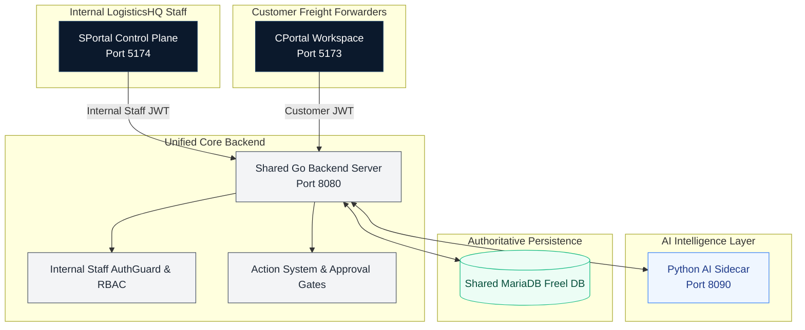
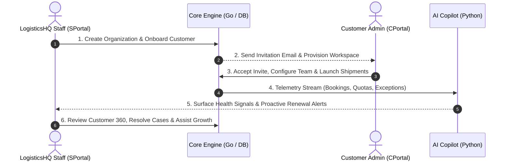

# SPortal Complete End-to-End Business Validation Guide

## Overview

**SPortal** is the internal SaaS control-plane for the **LogisticsHQ** internal operations, customer success, finance, and engineering teams. While freight forwarding customers use **CPortal** to manage shipments, track cargo, approve quotes, and pay invoices, the LogisticsHQ team uses **SPortal** to oversee the entire customer portfolio, manage subscriptions, monitor system health, and provide proactive support.

This document explains the complete business journey of SPortal in clear, nontechnical language, describing how each module operates, how human teams and AI collaborate, and how data remains consistent across the entire platform.

---

## The Dual-Portal Architecture & Shared Source of Truth

Both portals connect to a single shared platform powered by an enterprise Go backend and a MariaDB database. 

### Why There Is Only One Source of Truth
- **No Duplicate Records:** When a customer books a shipment or pays an invoice in CPortal, that exact transaction is immediately visible in SPortal's Customer 360 and Usage telemetry.
- **Strict Boundary Security:** Customer users cannot access SPortal routes. If a customer attempts to call an internal SPortal API, the request is blocked (`HTTP 403 Forbidden`) and an audit record is logged.
- **AI Stays Within Reason:** The Python AI sidecar is purely an advisor. It analyzes data and drafts recommendations, but it cannot alter database records or charge customer credit cards without human staff review and authorization through the Go Action System.

---

## The Complete Customer Business Lifecycle

The lifecycle follows a natural, structured path from initial onboarding to ongoing operational success:

---

## Detailed Step-by-Step Business Journey

### 1. Internal Staff Authentication & Login
- **Who uses this:** LogisticsHQ staff members (Executives, Account Managers, Customer Success Managers, Support Engineers, Technical Operations).
- **What happens:** Staff navigate to SPortal and sign in with their corporate credentials. SPortal validates that the user is an internal LogisticsHQ employee (Belonging to Internal Org #1).
- **Security safeguard:** If a customer attempts to sign in or if credentials are invalid, access is immediately rejected. Every login attempt is permanently recorded in the audit log.

### 2. The Executive Dashboard: Portfolio at a Glance
- **What you see:** Upon signing in, staff see a clean command center summarizing:
  - **Active Organizations:** How many freight forwarders are actively using the platform.
  - **Monthly Recurring Revenue (MRR):** Commercial health, upcoming renewals, and subscription tier breakdowns.
  - **Platform Health:** The operational status of integrations, AI workers, tracking schedulers, and background sync queues.
  - **Attention Feed:** A prioritized list of organizations experiencing exceptions, pending invitations, or contract expirations.

### 3. Customer Onboarding & Organization Setup
- **What happens:** When a new freight forwarding customer joins LogisticsHQ, internal staff open the Onboarding module to register them.
- **Workflow:**
  1. Company Profile (Legal name, registered address, tax ID, primary contact).
  2. Subscription Plan selection (Standard, Professional, or Enterprise).
  3. Commercial limits and initial storage quotas.
  4. Designating the initial Customer Super Admin.
- **Immediate Result:** The customer's tenant is provisioned in the shared database. The customer admin receives an invitation to log in to CPortal and start operations.

### 4. Customer Administration & User Management
- **What happens:** Internal staff can view all registered users across all organizations.
- **Capabilities:**
  - View user roles (Admin, Dispatcher, Billing, Viewer).
  - Resend pending invitations if a customer user missed their email.
  - Suspend or reactivate user accounts upon customer request.
  - Audit when a user last logged in.

### 5. Subscriptions & Commercial Management
- **What happens:** Account managers track each customer's commercial tier:
  - Monthly vs Annual billing cycles.
  - Auto-renewal dates and notice windows.
  - Quota limits (number of RFQs, monthly shipments, team seats, and cloud document storage).
  - Upgrade paths and custom enterprise add-ons.

### 6. Customer 360: The Complete Operational Record
- **What it is:** SPortal's single pane of glass for any customer organization.
- **Real Business Information Available:**
  - **Organization Identity:** Legal registration, primary contacts, account age.
  - **Subscription Status:** Current plan, billing interval, and expiration countdown.
  - **Operational Telemetry:** Real shipment volumes, active quote conversion rates, and invoice aging.
  - **Team Directory:** Customer admin details and active member counts.
  - **Live Exceptions & Alerts:** Unresolved delivery exceptions or overdue invoices flagged in real-time.

### 7. Usage Telemetry & Quota Tracking
- **Why it matters:** Prevents service disruptions and identifies upsell opportunities.
- **What is tracked:**
  - Real-time quota consumption against plan limits (e.g. 5 of 50 monthly RFQs used).
  - Monthly shipment creation vs completion trends.
  - Module adoption score (how deeply the customer utilizes tracking, billing, quotes, and document parsing).
  - Automated threshold alerts when a customer reaches 80% or 100% of their plan capacity.

### 8. Customer Health & Early Risk Warning
- **Objective:** Prevent customer churn before it happens.
- **How it works:** Rather than relying on guesswork, SPortal analyzes real operational indicators:
  - *Are shipment exceptions piling up?*
  - *Are invoices overdue by more than 30 days?*
  - *Has user activity dropped significantly over the last two weeks?*
  - *Are any critical carrier integrations showing errors?*
- **Outcome:** The customer is categorized into **Good**, **Needs Attention**, or **At Risk**, accompanied by plain-language explanations of the underlying operational causes.

### 9. Integrations Gateway
- **What it does:** Oversees external connections that power freight operations:
  - **Carrier Tracking:** Real-time container milestones and GPS telemetry.
  - **Email (Amazon SES / SMTP):** Inbound quote parsing and notification delivery.
  - **SMS (Twilio):** Urgent milestone alerts to drivers and dispatchers.
  - **Storage (AWS S3):** Secure storage of bills of lading, customs declarations, and commercial invoices.
  - **OCR (AWS Textract):** Automated document data extraction.
- **Operational Safeguard:** If a carrier API experiences an outage, SPortal marks the connector as degraded, alert banners appear, and fallback queues engage without crashing the customer's portal.

### 10. Documents, Contracts & Compliance
- **What is monitored:**
  - Service Level Agreements (SLAs) and master freight service agreements.
  - Contract expiration dates within 30, 60, or 90 days.
  - Mandatory documentation compliance (customs filings, dangerous goods declarations).

### 11. Support Cases & Operational Escalations
- **What happens:** Internal support engineers manage tickets and escalations:
  - Priority levels (Critical, High, Medium, Low).
  - SLA timers and resolution status.
  - Linked shipments or invoices so engineers have instant context without asking the customer repetitive questions.

### 12. Activity & Audit Trail
- **Compliance & Integrity:** Every sensitive action taken across both portals is permanently recorded in an append-only audit ledger:
  - *Who did it?* (User ID, role, IP address)
  - *When did it happen?* (Exact timestamp)
  - *What was changed?* (Old value vs new value)
  - *Was it successful?*

### 13. Notifications Center
- **What it does:** Controls how and when alerts are delivered:
  - Rule-based notification triggers (e.g., alert account manager if customer exceeds quota).
  - Multi-channel delivery: Email, SMS, and in-app bell notifications.

### 14. SPortal AI: LogisticsHQ Executive Intelligence & Copilot
- **What it is:** An intelligent internal assistant that answers complex portfolio questions in natural language:
  - *"Which customers have contracts expiring in the next 60 days?"*
  - *"Why is Varun Logistics marked as Needs Attention?"*
  - *"What are the top three delivery exceptions this week?"*
- **Grounded Facts Only:** SPortal AI queries verified operational data. It distinguishes clearly between historical facts and forward-looking predictions.
- **Security & Safety:** It is immune to prompt injection, cannot be manipulated to leak passwords or keys, and cannot perform mutations without human approval.

### 15. Platform Settings & Administrative Controls
- **Who has access:** Executive leaders and platform administrators.
- **Capabilities:**
  - Global system defaults and timezone configuration.
  - Feature flags (enabling new features for specific customer cohorts).
  - Autonomy controls and the **Emergency Halt Switch** (which immediately suspends all automated background agent tasks in case of unexpected carrier instability).

---

## Human vs. AI Responsibilities Matrix

| Responsibility | AI Layer (Python Sidecar) | Human Staff (SPortal User) | Core Platform (Go Backend) |
| :--- | :--- | :--- | :--- |
| **Data Analysis & Synthesis** | Analyzes patterns, spots anomalies, calculates health signals | Reviews findings and evaluates strategic context | Serves verified data models |
| **Customer Communications** | Drafts proposed emails or notices | Reviews, edits, and authorizes sending | Transmits via verified provider |
| **System Configuration** | Recommends optimal threshold values | Approves policy or setting changes | Persists to database & executes |
| **Emergency Intervention** | Surfaces warnings and SLA breaches | Triggers Emergency Halt | Enforces immediate process termination |
| **Commercial Decisions** | Identifies renewal and upsell candidates | Negotiates terms and approves discounts | Updates subscription contracts |

---

## Resilience: What Happens When Something Fails?

1. **If the AI Sidecar goes offline:** SPortal continues running seamlessly. All dashboards, customer records, shipment tracking, user management, and billing remain 100% operational. Only the natural language chat assistant displays a temporary "Reconnecting" indicator.
2. **If an External Carrier API fails:** The Carrier sync worker logs the failure, marks the carrier status as degraded in SPortal Integrations, and retries with exponential backoff. No customer pages crash.
3. **If a Bad Request or Malformed Token arrives:** The Go backend immediately rejects the request with standard HTTP error codes (`401 Unauthorized` or `403 Forbidden`) and writes a security audit entry.

---

## Verification & Acceptance

The entire business workflow documented above has been proven end-to-end using real running instances of SPortal, CPortal, MariaDB, Go, and Python.

**Validation Status: PASS — TASK S18 FUNCTIONALLY COMPLETE & READY FOR PRODUCTION**
