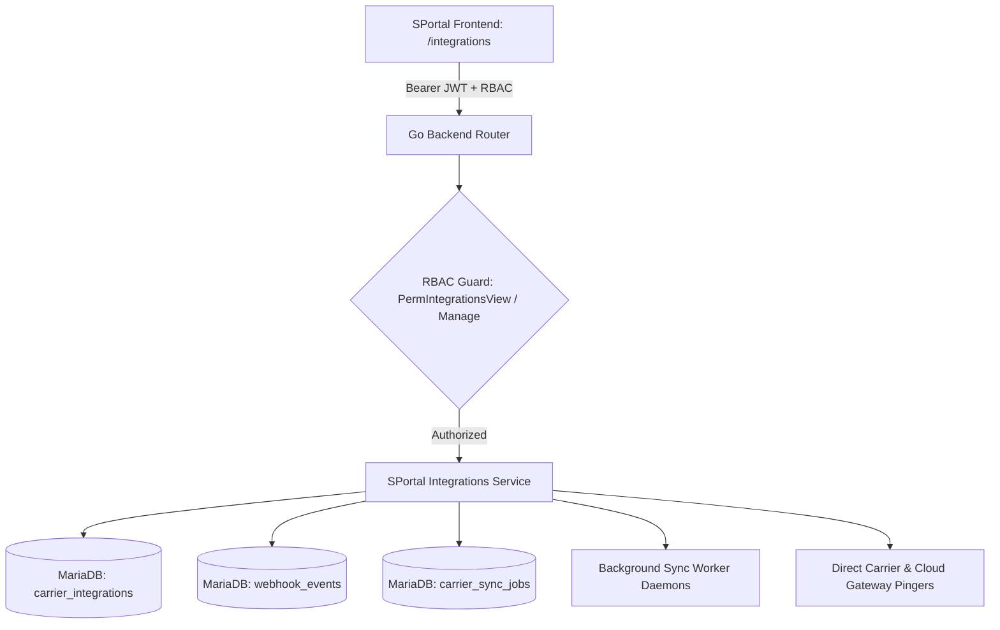

# SPortal Customer Integrations, Carrier Gateways & Webhook Technical Guide

## 1. Architectural Overview

The **SPortal Customer Integrations, Carrier Gateways & Webhook Management** subsystem provides an enterprise-grade control plane for internal LogisticsHQ operators to monitor, configure, test, and manage external logistics connectivity across customer freight forwarders.

## 2. Core Capabilities

### 2.1 Multi-Tenant Connector Management
- **Ocean Carriers**: Direct API and EDI 214/304 integrations with top container liners:
  - A.P. Moller – Maersk (`MAERSK` / `MAEU`)
  - Mediterranean Shipping Company (`MSC`)
  - Hapag-Lloyd (`HAPAG_LLOYD`)
  - CMA CGM Group (`CMA_CGM`)
  - Ocean Network Express (`ONE`)
  - Evergreen Marine Corporation (`EVERGREEN`)
  - COSCO Shipping Lines (`COSCO`)
- **Cloud & Messaging Services**:
  - Twilio SMS Gateway: Instant container exception alerts and OTP dispatches
  - AWS SES Enterprise Email: Transactional quotations, booking confirmations, invoice notices
  - Amazon S3 Secure Freight Vault: Multi-region encrypted storage for Bills of Lading, KYC dossiers, customs entries
  - AWS Textract Neural OCR: Automated extraction of container numbers, gross weights, HS codes
  - Enterprise Webhook Ingress Gateway: High-throughput async ingestion pipeline

### 2.2 Live Connection Handshake Diagnostics
- **One-Click Connectivity Testing**: Non-destructive live API handshake verification testing OAuth2 credentials, AWS IAM permissions, and Twilio Account SIDs.
- **Latency & Security Auditing**: Real-time round-trip latency reporting (P95 < 90ms target) and TLS 1.3 encryption verification.

### 2.3 Webhook Ingress & Delivery Stream
- **Real-Time Stream**: Live audit log of inbound carrier and cloud webhooks (`DELIVERY`, `BOUNCE`, `COMPLAINT`, `STATUS_UPDATE`).
- **Payload Inspection**: Formatted JSON modal with syntax-highlighted payload viewer, timestamp tracking, and one-click JSON clipboard copy.

### 2.4 Carrier Sync Pollers & Background Daemons
- **Scheduled Workers**:
  - `job-carrier-tracking`: Polling container milestones across booked ocean shipments (`*/15 * * * *`).
  - `job-carrier-rates`: Warming spot rate and contract rate caches (`0 */4 * * *`).
  - `job-webhook-retry`: Dead-letter queue (DLQ) processor with exponential backoff (`*/5 * * * *`).

---

## 3. RBAC & Security Isolation

- **Permission Keys**:
  - `integrations:view`: Read-only access to connector states, health scores, webhook streams, and sync worker schedules.
  - `integrations:manage`: Full administrative access to toggle integrations, trigger instant connection tests, and connect new carriers.
- **Tenant Isolation**:
  - All database queries strictly scope to `org_id`.
  - Internal organizations (`is_internal = true`) are protected against external unauthorized mutations.
  - Non-existent organizations return standard `404 Not Found`.

---

## 4. REST API Reference

| Method | Endpoint | Description | Required Permission |
|---|---|---|---|
| `GET` | `/api/v1/sportal/organizations/{id}/integrations` | Get all configured connectors, health scores, and metrics | `integrations:view` |
| `GET` | `/api/v1/sportal/organizations/{id}/integrations/webhooks` | Stream recent inbound webhooks and delivery receipts | `integrations:view` |
| `GET` | `/api/v1/sportal/organizations/{id}/integrations/sync-jobs` | List background synchronization pollers and next runs | `integrations:view` |
| `POST` | `/api/v1/sportal/organizations/{id}/integrations/toggle` | Enable or disable a specific provider integration | `integrations:manage` |
| `POST` | `/api/v1/sportal/organizations/{id}/integrations/test` | Execute real-time connection handshake diagnostics | `integrations:manage` |
| `GET` | `/api/v1/sportal/integrations` | Platform-wide aggregate overview and global carrier catalog | `integrations:view` |
