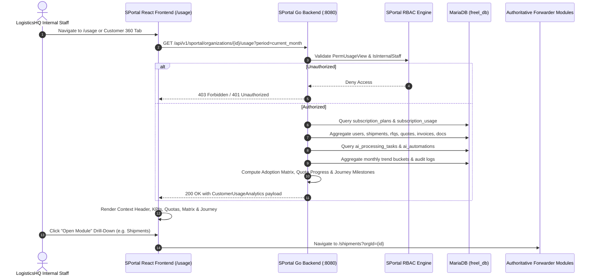

# SPortal Customer Usage, Platform Analytics, Consumption & Adoption Intelligence
## Comprehensive Business, Functional, and Technical Architecture Workflow Specification

---

### Executive Summary

The **SPortal Customer Usage & Platform Analytics** subsystem (Task S10) delivers an authoritative, single-pane operational consumption and adoption intelligence interface for LogisticsHQ internal personnel (Executives, Customer Success Managers, Support Staff, Operations Leads, and Billing Administrators).

The core objective is to empower authorized internal staff to inspect any customer organization (freight forwarder) and instantly understand:
1. **Platform Activity**: How actively is the forwarder operating inside LogisticsHQ?
2. **Module Adoption Matrix**: Which of the 15 enterprise modules are actively utilized, underutilized, or unconfigured?
3. **Adoption Journey Progression**: Where is the customer situated along the 10 sequential adoption milestones (from onboarding to external API integrations)?
4. **Quota Limits & Approaching Caps**: Is the customer approaching or exceeding legitimate plan quotas (>80% or 100%)?
5. **Operational Trends**: How is usage tracking over time across shipments, RFQs, quotes, and AI tasks (honestly handling sparse history)?
6. **Health Signals & Cross-Module Drill-Downs**: How healthy is the account, and how can internal staff immediately jump into the authoritative module to assist them?

---

### Core Principles & Architecture Guardrails

1. **Truthful, Persistent Data (Zero Manufactured Numbers)**:
   - All counters, milestones, timestamps, and quotas are queried live from authoritative MariaDB tables:
     - `organizations`
     - `users`
     - `subscription_plans` and `subscription_usage`
     - `shipments`
     - `rfqs` and `quotes` / `rate_requests`
     - `customer_invoices`
     - `contracts`
     - `shipment_exceptions`
     - `shipment_documents`
     - `ai_processing_tasks` and `ai_automations`
     - `audit_logs`
   - If a customer has 0 quotes issued, it reports `0` with status `NO_RECORDED_ACTIVITY`.
   - If historical trends span only 1 billing cycle, the system explicitly reports `"Insufficient historical data"` rather than extrapolating or fabricating fictitious graphs.

2. **No Shadow Schemas or Duplicate Analytics DBs**:
   - Computations occur dynamically via optimized SQL aggregations with tenant isolation (`WHERE org_id = ?`).
   - Uses zero separate analytics engines or shadow replica stores.

3. **Strict Internal RBAC & Multi-Tenant Isolation**:
   - Enforced by Go middleware `RequirePermission(PermUsageView)` (`"usage:view"`).
   - Only authorized internal staff (`is_internal: true`) can query platform usage.
   - Non-internal customer tokens are strictly rejected with `403 Forbidden` / `401 Unauthorized`.
   - Customer queries are strictly isolated to the specified tenant.

4. **Safe AI & Automation Telemetry**:
   - Reports task types, counts, and completion status.
   - Never exposes raw email bodies, customer prompts, system messages, or reasoning secrets.

---

### End-to-End Technical Workflow



---

### Data Models & Contracts

#### `CustomerUsageAnalytics` Payload Structure

```json
{
  "org_id": 1,
  "org_name": "Freel Global Logistics Pvt Ltd",
  "plan_name": "Growth Plan",
  "plan_code": "growth",
  "subscription_status": "ACTIVE",
  "billing_cycle": "monthly",
  "period": "current_month",
  "usage_status": "HIGH_CONSUMPTION",
  "active_users_count": 5,
  "total_users_count": 5,
  "pending_invites_count": 0,
  "shipments_count": 4,
  "active_shipments_count": 4,
  "rfqs_count": 11,
  "quotes_count": 0,
  "bookings_count": 4,
  "exceptions_count": 5,
  "invoices_count": 11,
  "total_invoiced_amount": 157410.00,
  "documents_count": 6,
  "ai_tasks_count": 37,
  "completed_ai_tasks_count": 27,
  "automations_count": 3,
  "active_automations_count": 3,
  "integrations_count": 1,
  "total_audit_events": 8449,
  "quota_limits": [
    {
      "metric_key": "users",
      "label": "User Seats",
      "current_usage": 5,
      "limit_amount": 25,
      "unlimited": false,
      "remaining": 20,
      "utilization_pct": 20,
      "status": "NORMAL",
      "unit": "seats"
    },
    {
      "metric_key": "rfqs_monthly",
      "label": "RFQs (Monthly)",
      "current_usage": 11,
      "limit_amount": 100,
      "unlimited": false,
      "remaining": 89,
      "utilization_pct": 11,
      "status": "NORMAL",
      "unit": "RFQs"
    }
  ],
  "module_adoption": [
    {
      "module_key": "shipments",
      "module_name": "Shipments (Consignment Operations)",
      "category": "Operations",
      "total_activity": 4,
      "period_activity": 4,
      "active_actors": 5,
      "status": "ACTIVE",
      "last_activity_at": "2026-09-13T00:21:19Z",
      "drill_down_url": "/shipments?orgId=1"
    }
  ],
  "adoption_score": 93,
  "active_modules_count": 14,
  "total_modules_count": 15,
  "adoption_journey": [
    {
      "milestone_key": "onboarded",
      "title": "Organization Onboarded",
      "description": "Tenant registered and enterprise workspace initialized",
      "completed": true,
      "completed_at": "2026-09-06T16:38:50Z",
      "sequence_order": 1
    }
  ],
  "monthly_trends": [
    {
      "month_key": "2026-09",
      "month_label": "Sep 2026",
      "shipments_count": 4,
      "rfqs_count": 11,
      "quotes_count": 0,
      "ai_tasks_count": 37,
      "audit_events_count": 8449
    }
  ],
  "has_sufficient_trend_data": false,
  "health_signals": [
    "High Engagement: 5 team members actively operating in workspace",
    "Active Cargo Flow: 4 consignments currently moving or scheduled",
    "AI Adoption: 27 autonomous intelligence tasks successfully executed"
  ],
  "health_status": "GOOD"
}
```

---

### The 15 Platform Modules Evaluated

| # | Module Key | Name | Category | Status Classification Rule | Drill-Down Target |
|---|---|---|---|---|---|
| 1 | `dashboard` | Executive Dashboard | Platform | Audit events > 0 | `/sportal/organizations/:id` |
| 2 | `customers` | Leads & Customer Directory | Commercial | Leads count > 0 | `/customers?orgId=:id` |
| 3 | `rfqs` | RFQs (Rate Inquiries) | Commercial | RFQs count > 0 | `/rfqs?orgId=:id` |
| 4 | `quotations` | Quotations & Rate Engine | Commercial | Quotes formulated > 0 | `/quotations?orgId=:id` |
| 5 | `bookings` | Bookings & Confirmations | Operations | Confirmed bookings > 0 | `/bookings?orgId=:id` |
| 6 | `shipments` | Shipments (Consignments) | Operations | Active consignments > 0 | `/shipments?orgId=:id` |
| 7 | `exceptions` | Shipment Exceptions | Operations | Logged disruptions > 0 | `/exceptions?orgId=:id` |
| 8 | `finance` | Invoices, Receivables & Settlement | Finance | Customer invoices > 0 | `/finance?orgId=:id` |
| 9 | `contracts` | Carrier & Customer Contracts | Commercial | Active contracts > 0 | `/contracts?orgId=:id` |
| 10 | `compliance` | Customs & Regulatory Compliance | Operations | Tracked customs items > 0 | `/compliance?orgId=:id` |
| 11 | `ai_workforce` | AI Workforce (Agents) | Intelligence | Executed AI tasks > 0 | `/ai-workforce?orgId=:id` |
| 12 | `automations` | Autonomous Workflow Engine | Intelligence | Active automation routines > 0 | `/automations?orgId=:id` |
| 13 | `control_tower` | Control Tower & Visibility | Operations | Monitored consignments > 0 | `/control-tower?orgId=:id` |
| 14 | `integrations` | External API & Gateways | Platform | Carrier EDI/API connections > 0 | `/integrations?orgId=:id` |
| 15 | `documents` | Documents & Digital Vault | Operations | Uploaded consignment files > 0 | `/documents?orgId=:id` |

---

### 10 Sequential Customer Adoption Milestones

1. **Step 01 — Organization Onboarded**: Tenant entity registered in `organizations`.
2. **Step 02 — Team Members Joined**: First user created in `users`.
3. **Step 03 — First RFQ Initiated**: First record in `rfqs`.
4. **Step 04 — First Quotation Issued**: First record in `quotes`.
5. **Step 05 — First Booking Confirmed**: First record in `bookings`.
6. **Step 06 — First Operational Shipment**: First record in `shipments`.
7. **Step 07 — Finance Billing Activated**: First invoice created in `customer_invoices`.
8. **Step 08 — AI Workforce Utilized**: First automated task in `ai_processing_tasks`.
9. **Step 09 — Autonomous Workflow Configured**: First active automation in `ai_automations`.
10. **Step 10 — External Integration Connected**: First active carrier connection in `carrier_integrations`.

---

### UI/UX Design System Compliance

- **Navy Sidebar**: `#0B192C` with active pill highlighting for `/usage`.
- **Light Theme**: Background `bg-slate-50`, card containers `bg-white`, borders `border-slate-200`.
- **Status Badges**:
  - `ACTIVE`: Emerald green (`bg-emerald-50 text-emerald-700 border-emerald-200`)
  - `LOW_ACTIVITY`: Soft blue (`bg-blue-50 text-blue-700 border-blue-200`)
  - `NO_RECORDED_ACTIVITY`: Amber gold (`bg-amber-50 text-amber-700 border-amber-200`)
  - `NOT_CONFIGURED`: Neutral slate (`bg-slate-100 text-slate-500 border-slate-200`)
- **Quota Progress Bars**:
  - `< 80%`: Blue (`bg-blue-600`)
  - `80% - 99%`: Amber warning (`bg-amber-500`)
  - `>= 100%`: Red critical (`bg-red-600`)
- **Responsive Layouts**: Reflows flawlessly across 1440px, 1280px, 1024px, and 768px viewports.
- **Browser Zoom**: Tested and sharp from 80% to 125% zoom levels.
