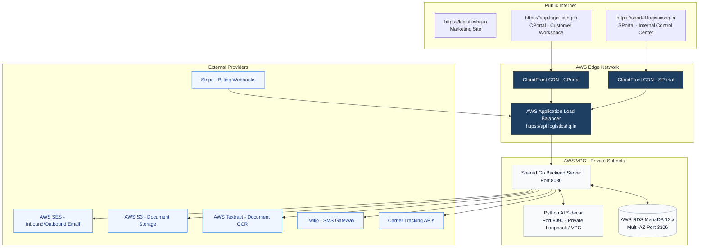
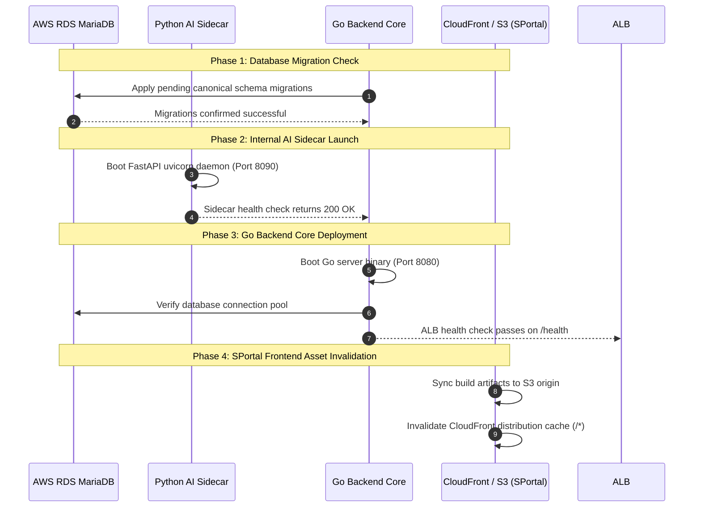

# SPortal Production Deployment Readiness Guide

## 1. Production Architecture Overview

The **LogisticsHQ** platform consists of two distinct frontend experiences powered by a single, unified enterprise core backend, an authoritative MariaDB database, and a governed Python AI sidecar.

---

## 2. Domain & Routing Topology

| Domain | Application Role | Hosting & Delivery | Target Backend |
| :--- | :--- | :--- | :--- |
| `https://logisticshq.in` | Public Marketing & Product Information | AWS CloudFront + S3 Origin | Static Content |
| `https://app.logisticshq.in` | CPortal: Customer Freight Forwarder Workspace | AWS CloudFront + S3 Origin | `https://api.logisticshq.in` |
| `https://sportal.logisticshq.in` | SPortal: Internal SaaS Control Plane | AWS CloudFront + S3 Origin | `https://api.logisticshq.in` |
| `https://api.logisticshq.in` | Core Backend & API Gateway | AWS ALB + ECS Fargate / EC2 | Shared MariaDB & Python Sidecar |

---

## 3. Environment & Secret Categories

In strict accordance with security policies, secret values must never be committed to source code or hardcoded in repositories. All secrets must be provisioned via AWS Secrets Manager or Parameter Store.

### Secret Categories Required for Production

1. **Database Credentials:**
   - Database Master Username
   - Database Master Password
   - Database Connection String / Host / Port / Database Name (`freel_mysql`)
2. **Authentication & Session Signing:**
   - JWT Signing Secret (`JWT_SECRET`)
   - AWS Cognito User Pool ID & Client Secret (for customer authentication)
3. **Internal Machine-to-Machine Service Keys:**
   - `INTERNAL_SERVICE_TOKEN` (Mandatory constant-time token shared between Go backend and Python AI sidecar)
4. **Third-Party Integrations:**
   - AWS SES SMTP Credentials
   - Twilio Account SID & Auth Token
   - Carrier Tracking API Keys
   - Stripe Secret Key & Webhook Signing Secret

---

## 4. Subsystem Requirements

### 4.1 Database (AWS RDS MariaDB)
- **Engine Version:** MariaDB 12.3 (or 11.4+ LTS).
- **Topology:** Multi-AZ with automatic failover enabled.
- **Storage:** General Purpose SSD (gp3) with automated storage autoscaling.
- **Backup Window:** Daily automated snapshots with 7-day point-in-time recovery (PITR).
- **Subnet:** Strictly isolated inside private database subnets with security group rules allowing inbound traffic exclusively from Go backend instances on port 3306.

### 4.2 Core Go Backend
- **Compute:** AWS ECS Fargate or EC2 instances running behind an Application Load Balancer.
- **Health Check Endpoint:** `GET /health` and `GET /api/v1/sportal/health` returning `200 OK`.
- **CORS Rules:** Strictly restrict `AllowedOrigins` to `https://app.logisticshq.in` and `https://sportal.logisticshq.in`.
- **Security Headers:** Enforce `X-Content-Type-Options: nosniff`, `X-Frame-Options: DENY`, `Referrer-Policy: strict-origin-when-cross-origin`, `Strict-Transport-Security: max-age=31536000; includeSubDomains`.

### 4.3 Python AI Sidecar
- **Role:** Pure analytical reasoning, predictions, and recommendations.
- **Isolation:** Bound to `127.0.0.1:8090` (internal loopback or private VPC endpoint). Never exposed directly to the public internet or customer traffic.
- **Process Supervision:** Supervised via PM2 or systemd with auto-restart on memory threshold exceedance (400 MB).

### 4.4 SPortal Frontend (SPA)
- **Hosting:** AWS S3 static website bucket fronted by AWS CloudFront.
- **TLS:** Valid SSL/TLS certificate managed via AWS Certificate Manager (ACM).
- **SPA Routing Fallback:** Configure CloudFront Error Response 403 and 404 to return `/index.html` with HTTP 200 to support React Router client-side routing.

---

## 5. Deployment Sequence

To ensure zero-downtime and data integrity, production deployment must execute in the following exact sequence:

---

## 6. Pre-Production Launch Checklist

Before promoting to live customer traffic:

- [x] **Zero Monolithic Bundles:** Verify SPortal route-level code splitting is active (initial bundle < 400 kB).
- [x] **Error Boundary Active:** Verify unhandled rendering exceptions display clean recovery fallback without crashing the portal shell.
- [x] **RBAC Verification:** Confirm customer tokens from Organization 2+ are rejected with HTTP 403 on all `/api/v1/sportal/*` routes.
- [x] **Dev Bypass Tokens Closed:** Verify `test-token` shortcuts are rejected outside explicit development environments.
- [x] **Security Headers Active:** Confirm response headers contain `nosniff`, `DENY`, and `Strict-Transport-Security`.
- [x] **Fail-Closed Service Keys:** Verify missing `INTERNAL_SERVICE_TOKEN` causes backend startup failure rather than silent bypass.
- [x] **Secrets Scan:** Confirm zero API keys, passwords, or hashes exist in public frontend bundles or API JSON payloads.
- [x] **Health Checks Green:** Confirm both `/health` and `/api/v1/sportal/health` return HTTP 200.
- [x] **Database Point-in-Time Recovery:** Ensure RDS daily backups and multi-AZ failover are operational.
- [x] **CloudFront 404 Rewrite:** Ensure CloudFront error responses route to `/index.html` with status 200.
