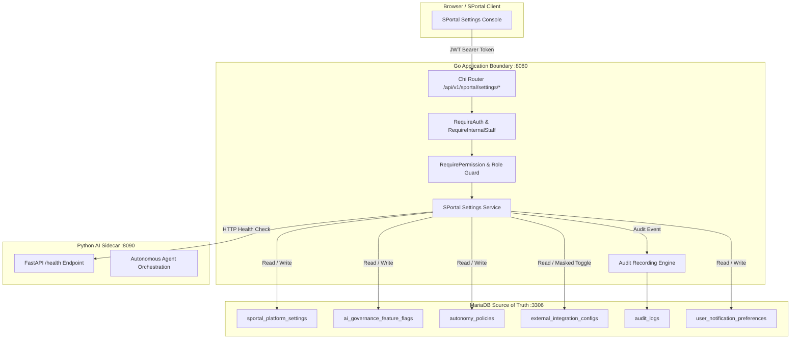
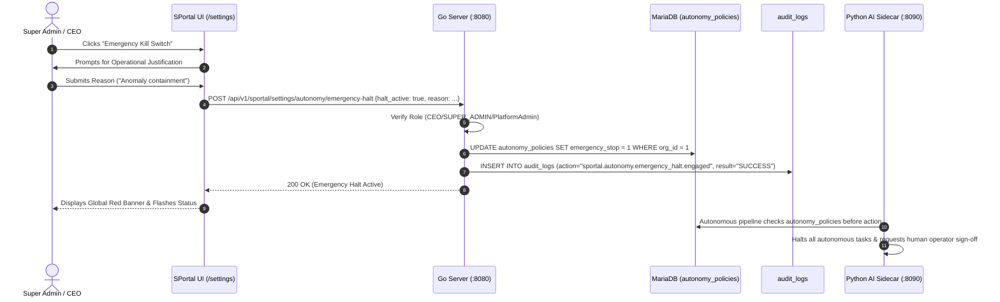

# SPortal Settings, Platform Administration & Operational Controls
## Business and Technical Architecture & Operational Workflow Handbook

---

## 1. Business Architecture & Operational Overview

### 1.1 What SPortal Settings Is
**SPortal Settings** is the internal administrative control area for **LogisticsHQ**. It provides authorized LogisticsHQ internal personnel (Executives, Platform Administrators, Operations Leads, Support Engineers, and Finance Officers) with a governed, centralized console to inspect and manage enterprise platform-level configuration.

Crucially, SPortal Settings **does not create**:
- A second backend
- A second database
- A second authentication system
- Unsafe direct access to infrastructure or raw `.env` files

All operations are strictly routed through the authoritative **Go control plane (`:8080`)**, backed by the persistent **MariaDB (`:3306`)** source of truth, and monitored in coordination with the **Python AI Sidecar (`:8090`)**.



---

### 1.2 Information Architecture & Functional Domains

SPortal Settings is structured into eight distinct administrative domains:

| Category | Purpose & Governance | Target Audience | Primary Actions |
| :--- | :--- | :--- | :--- |
| **1. Platform & Account** | Personal staff identity, active session status, alert severity preferences, and notification subscriptions. | All Internal Staff | Update name, change alert severity threshold, toggle notification channels. |
| **2. Platform Defaults** | Platform-wide operational defaults: display name, maintenance mode, currency, timezone, measurement units, and session timeouts. | Super Admin, CEO, Admin | Modify platform display name, toggle maintenance banner, adjust session timeout. |
| **3. Feature Flags** | Governs AI capabilities and production workflow activation across customer tenants without code deploys. | Super Admin, Admin | Enable/disable capability flags, toggle human approval requirements, set max autonomy levels. |
| **4. AI & Autonomy Controls** | Operational autonomy policies for domain modules (Shipments, Pricing, Invoices, Compliance, Exceptions) and Global Emergency Kill Switch. | CEO, Super Admin | Engage/clear platform kill switch, halt individual domain modules, inspect confidence thresholds. |
| **5. Integrations & Gateways** | Status of external communication channels (Twilio SMS, SES Email, Carrier tracking, S3 storage, OCR). Strictly masked credentials. | Super Admin, Operations | Enable/disable external integrations, review gateway health messages. |
| **6. Security & Access Policy** | Transparency into Cognito auth pools, password complexity, session timeout policy, rate limiting, and tenant boundary isolation. | All Staff / Security | Inspect session governance rules, verify tenant isolation boundaries. |
| **7. Subsystem Telemetry** | Real-time health metrics across Core Go Backend, MariaDB, Python AI Sidecar, and Enterprise Event Mesh dead letters. | Operations, Technical | Trigger live health evaluation, monitor active worker counts. |
| **8. Audit Trail** | Immutable log of administrative modifications, role actions, setting edits, flag changes, and security events. | Super Admin, Compliance | Search and filter administrative audit logs with IP and actor details. |

---

### 1.3 Who Can Change What (RBAC Matrix)

Every administrative action in SPortal Settings is protected by server-side Go permission checks:

| Role | View Settings (`settings:view`) | Manage Settings (`settings:manage`) | Platform Admin (`platform:admin`) | Manage Gateways (`integrations:manage`) | Emergency Kill Switch |
| :--- | :---: | :---: | :---: | :---: | :---: |
| **SUPER_ADMIN** | Yes | Yes | Yes | Yes | **Yes** |
| **CEO / OWNER** | Yes | Yes | Yes | Yes | **Yes** |
| **ADMIN / SPORTAL_ADMIN** | Yes | Yes | Yes | Yes | Requires Exec |
| **OPERATIONS** | Yes | Read-only | Read-only | Yes | Read-only |
| **CUSTOMER_SUCCESS** | Yes | Read-only | Read-only | Read-only | Read-only |
| **FINANCE** | Yes | Read-only | Read-only | Read-only | Read-only |
| **SUPPORT** | Yes | Read-only | Read-only | Read-only | Read-only |
| **Customer CPortal Users** | **Blocked (403)** | **Blocked (403)** | **Blocked (403)** | **Blocked (403)** | **Blocked (403)** |

---

### 1.4 Why Sensitive Settings & Secrets Are Strictly Guarded

SPortal Settings strictly enforces the **Zero-Secrets-in-Browser Principle**:
1. **No Raw Environment Variables:** SPortal does not provide any "view .env" or "edit environment" interface. Environment secrets (DB passwords, AWS secret access keys, Twilio auth tokens, encryption master keys) remain strictly on the server.
2. **Masked Gateway Identities:** Integrations display safe public descriptions (e.g. `SMS Gateway (TWILIO)`, `Masked Identity: ***MASKED***`).
3. **Structured Typed Settings:** Platform configuration is managed via discrete typed keys (`STRING`, `BOOLEAN`, `INTEGER`) in MariaDB table `sportal_platform_settings`, preventing arbitrary code or command injection.
4. **Mandatory Audit Logging:** Every single write or toggle operation generates an immutable audit record in `audit_logs` storing the actor ID, actor role, previous/new value, and client IP address.

---

## 2. Technical Architecture & Component Specifications

### 2.1 MariaDB Schema Source of Truth

#### 1. Platform Settings (`sportal_platform_settings`)
```sql
CREATE TABLE IF NOT EXISTS sportal_platform_settings (
    setting_key VARCHAR(100) NOT NULL PRIMARY KEY,
    setting_value TEXT NOT NULL,
    category VARCHAR(50) NOT NULL DEFAULT 'GENERAL',
    data_type VARCHAR(20) NOT NULL DEFAULT 'STRING',
    description TEXT NULL,
    is_sensitive TINYINT(1) NOT NULL DEFAULT 0,
    updated_by VARCHAR(255) NULL,
    updated_at TIMESTAMP NOT NULL DEFAULT CURRENT_TIMESTAMP ON UPDATE CURRENT_TIMESTAMP
);
```

#### 2. Feature Flags (`ai_governance_feature_flags`)
```sql
CREATE TABLE IF NOT EXISTS ai_governance_feature_flags (
    id BIGINT AUTO_INCREMENT PRIMARY KEY,
    org_id BIGINT NOT NULL,
    flag_key VARCHAR(100) NOT NULL,
    flag_name VARCHAR(255) NOT NULL,
    is_enabled TINYINT(1) NOT NULL DEFAULT 0,
    max_autonomy_level INT NOT NULL DEFAULT 1,
    requires_approval TINYINT(1) NOT NULL DEFAULT 1,
    description TEXT,
    updated_by_id BIGINT,
    updated_at TIMESTAMP DEFAULT CURRENT_TIMESTAMP ON UPDATE CURRENT_TIMESTAMP,
    UNIQUE KEY uk_org_flag (org_id, flag_key)
);
```

#### 3. Autonomy Policies & Kill Switch (`autonomy_policies`)
```sql
CREATE TABLE IF NOT EXISTS autonomy_policies (
    id BIGINT AUTO_INCREMENT PRIMARY KEY,
    org_id BIGINT NOT NULL,
    module VARCHAR(50) NOT NULL,
    autonomy_level VARCHAR(50) NOT NULL,
    requires_approval TINYINT(1) NOT NULL DEFAULT 1,
    max_monetary_threshold DECIMAL(15,2) DEFAULT 0.00,
    customer_impact_threshold VARCHAR(50) DEFAULT 'MEDIUM',
    min_confidence_threshold DECIMAL(5,2) DEFAULT 0.80,
    emergency_stop TINYINT(1) NOT NULL DEFAULT 0,
    is_active TINYINT(1) NOT NULL DEFAULT 1,
    policy_version INT NOT NULL DEFAULT 1,
    updated_at TIMESTAMP DEFAULT CURRENT_TIMESTAMP ON UPDATE CURRENT_TIMESTAMP,
    UNIQUE KEY uk_org_module (org_id, module)
);
```

---

### 2.2 Go Control Plane REST API Endpoints

All endpoints are rooted at `/api/v1/sportal/settings` and guarded by `authGuard.RequireAuth`, `sportal.RequireInternalStaff`, and granular permissions:

```
GET    /api/v1/sportal/settings/overview        -> Aggregated platform control plane overview
GET    /api/v1/sportal/settings/profile         -> Authenticated staff profile & preferences
PATCH  /api/v1/sportal/settings/profile         -> Update staff names & notification filters
GET    /api/v1/sportal/settings/platform        -> List safe platform configuration defaults
PATCH  /api/v1/sportal/settings/platform/{key}  -> Update typed setting value (Audited)
GET    /api/v1/sportal/settings/feature-flags   -> List AI & system feature flags
PATCH  /api/v1/sportal/settings/feature-flags/{key} -> Configure flag enablement & autonomy
GET    /api/v1/sportal/settings/autonomy        -> List module autonomy policies & halt status
POST   /api/v1/sportal/settings/autonomy/emergency-halt -> Trigger/clear emergency kill switch
GET    /api/v1/sportal/settings/integrations    -> List external gateway statuses (Masked)
PATCH  /api/v1/sportal/settings/integrations/{type}/toggle -> Enable/disable gateway provider
GET    /api/v1/sportal/settings/audit           -> Paginated administrative audit log records
GET    /api/v1/sportal/settings/operations      -> Truthful real-time subsystem telemetry
```

---

### 2.3 Emergency Kill Switch Workflow



---

### 2.4 Tenant Boundary & CPortal Isolation

LogisticsHQ maintains strict cryptographic and architectural isolation between internal SPortal and customer CPortal:

1. **Organization ID Boundary:** Organization `#1` is permanently dedicated to LogisticsHQ internal staff. Customer freight-forwarding organizations are strictly assigned IDs `>= 2`.
2. **Customer Token Rejection:** If a customer user or forwarder admin token attempts to reach `/api/v1/sportal/*`, `RequireInternalStaff` rejects the request immediately with HTTP 403 Forbidden and writes an audit log entry tagged `sportal.forbidden_access_attempt`.
3. **No IDOR across Organizations:** Setting updates cannot modify customer-specific pricing, users, or subscription limits without explicitly passing through organization-scoped services.
