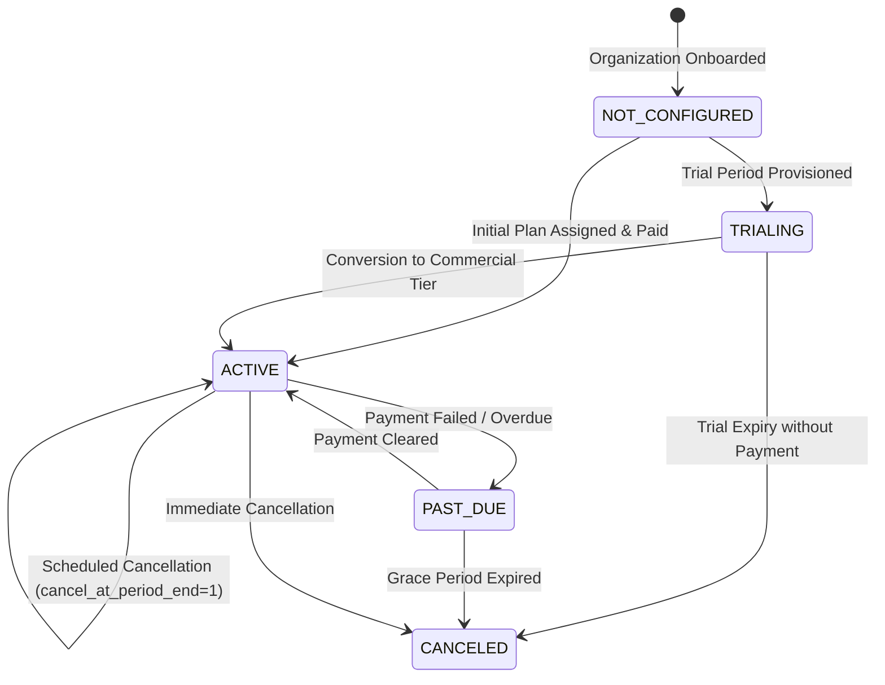
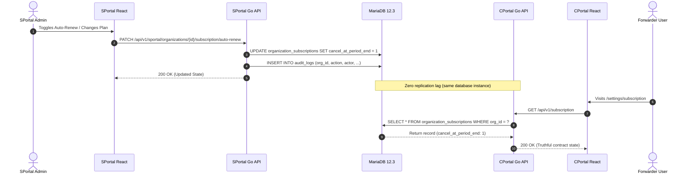

# SPortal Subscription Business & Technical Workflow

This document details the commercial subscription model, billing lifecycle, administrative capabilities in SPortal, customer visibility in CPortal, and the underlying technical architecture for **LogisticsHQ**.

---

## 1. Business Workflow & Commercial Model

### 1.1 What a LogisticsHQ Subscription Is
A **LogisticsHQ Subscription** represents the commercial SaaS contract between LogisticsHQ (the SaaS provider) and an individual freight-forwarding customer organization. The subscription dictates:
* The customer's operational entitlements (team member seats, AI email parsing quotas, RFQs, active shipments, carrier connections, and document storage).
* The commercial pricing tier ($99/mo Starter, $299/mo Growth, $599/mo Professional).
* The contract term and recurrence interval (monthly or discounted annual billing).
* Contract health, auto-renewal status, and commercial standing with LogisticsHQ.

### 1.2 How a Customer Gets a Subscription
1. **Onboarding / Registration**: When a new freight-forwarding organization completes onboarding (Task S4), an initial subscription is either self-selected or provisioned by LogisticsHQ internal staff.
2. **Administrative Provisioning**: For unconfigured sandbox organizations (`NOT_CONFIGURED`), authorized LogisticsHQ internal staff can assign an initial tier via SPortal (`POST /api/v1/sportal/organizations/{id}/subscription`).
3. **Activation**: Upon assignment or first billing settlement, the status transitions to `ACTIVE`, which enables full platform entitlements across CPortal.

---

## 2. Commercial Plans & Pricing Catalog

LogisticsHQ maintains three canonical subscription tiers defined directly in MariaDB (`subscription_plans` table):

| Plan Tier | Monthly Price | Annual Price (Discounted) | Included Team Seats | AI Email Processing / Mo | RFQs / Mo | Active Shipments / Mo | Direct Carrier Integrations | Cloud Storage | Target Forwarder Segment |
| :--- | :--- | :--- | :--- | :--- | :--- | :--- | :--- | :--- | :--- |
| **Starter** | **$99 / mo** | $950.40 / yr | 5 users | 500 emails | 100 RFQs | 100 Shipments | 1 carrier | 10 GB | Small forwarders & boutique brokers |
| **Growth** *(Most Popular)* | **$299 / mo** | $2,870.40 / yr | Unlimited (-1) | 2,000 emails | 300 RFQs | 300 Shipments | 10 carriers | 100 GB | Mid-market expanding freight agencies |
| **Professional** | **$599 / mo** | $5,750.40 / yr | Unlimited (-1) | 5,000 emails | 1,000 RFQs | 1,000 Shipments | 50 carriers | 500 GB | Enterprise & multi-branch global logistics |

---

## 3. Subscription Lifecycle & State Machine



### 3.1 Upgrade / Downgrade Workflow
* **Trigger**: Customer requests an upgrade/downgrade or internal sales amends the tier.
* **SPortal Action**: Staff opens `ChangeSubscriptionPlanModal`, selects target tier (Starter, Growth, Professional), chooses billing cycle (monthly, annual), and enters an audit note.
* **Persistence**: Backend updates `organization_subscriptions.plan_id` and `organization_subscriptions.billing_cycle`.
* **Instant CPortal Sync**: CPortal reads the updated `plan_id` in real-time, instantly adjusting resource quota caps.

### 3.2 Renewal & Auto-Renewal Management
* **Auto-Renew Setting**: Stored as `cancel_at_period_end` (boolean) in MariaDB.
  * `auto_renew = true` corresponds to `cancel_at_period_end = 0`.
  * `auto_renew = false` corresponds to `cancel_at_period_end = 1`.
* **Truthful UI**: The toggle switch in both SPortal Directory and Dossier interacts with real persistent backend endpoints (`PATCH /api/v1/sportal/organizations/{id}/subscription/auto-renew`). When disabled, the subscription will not auto-renew and will lapse at period end.
* **Manual Extension**: SPortal staff can grant manual period extensions (+1, +3, +6, or +12 months) via `RenewSubscriptionModal` when offline payments or manual wire transfers clear.

### 3.3 Cancellation Schedule
* **Graceful (Period End)**: Sets `cancel_at_period_end = 1`. Customer preserves active service until `current_period_end`.
* **Immediate**: Sets `status = 'canceled'` and `cancel_at_period_end = 1`. Quotas are frozen immediately.

---

## 4. CPortal Customer Visibility & Synchronization

### 4.1 Shared Single Source of Truth
Neither application maintains separate or duplicate subscription tables. Both SPortal and CPortal connect to the same MariaDB database instance:
* **CPortal**: Reads through `backend/internal/subscription/repository.go` (`SELECT * FROM organization_subscriptions WHERE org_id = ?`).
* **SPortal**: Reads and mutates through `backend/internal/sportal/repository.go` (`SELECT os.*, o.name, sp.name as plan_name ...`).

### 4.2 Cross-Portal Synchronization Architecture



---

## 5. Billing & Finance Module Integration

SPortal does not duplicate the Finance module. Instead:
1. **Source of Truth**: The Finance ledger (`invoices`, `payments`, `billing_records`) remains authoritative.
2. **Contextual Navigation**: SPortal subscription dossier provides direct links into `/finance` with customer organization pre-filtered.
3. **Payment State**: Subscription records reflect live commercial ledger standing (`CURRENT`, `PENDING`, `PAST_DUE`).
4. **Sensitive Data Protection**: Bank account numbers, raw Stripe tokens, and webhook secrets are never exposed to frontend views or audit log text.

---

## 6. Technical Mapping & Architecture

### 6.1 Database Schema Reference

```sql
-- Commercial Subscription Plans Catalog
CREATE TABLE subscription_plans (
    id BIGINT AUTO_INCREMENT PRIMARY KEY,
    name VARCHAR(100) NOT NULL,
    description TEXT,
    price_monthly DECIMAL(10,2) NOT NULL,
    price_annual DECIMAL(10,2) NOT NULL,
    features JSON,
    limits JSON,
    provider_product_id VARCHAR(255),
    is_active BOOLEAN DEFAULT TRUE,
    created_at DATETIME NOT NULL,
    updated_at DATETIME NOT NULL
);

-- Organization Commercial Subscriptions
CREATE TABLE organization_subscriptions (
    id BIGINT AUTO_INCREMENT PRIMARY KEY,
    org_id BIGINT NOT NULL UNIQUE,
    plan_id BIGINT NOT NULL,
    status VARCHAR(50) NOT NULL, -- 'active', 'trialing', 'past_due', 'canceled'
    billing_cycle VARCHAR(20) NOT NULL, -- 'monthly', 'annual'
    current_period_start DATETIME,
    current_period_end DATETIME,
    cancel_at_period_end BOOLEAN DEFAULT FALSE,
    provider_subscription_id VARCHAR(255),
    created_at DATETIME NOT NULL,
    updated_at DATETIME NOT NULL,
    FOREIGN KEY (org_id) REFERENCES organizations(id),
    FOREIGN KEY (plan_id) REFERENCES subscription_plans(id)
);

-- Immutable Commercial Audit Trail
CREATE TABLE audit_logs (
    id BIGINT AUTO_INCREMENT PRIMARY KEY,
    org_id BIGINT NOT NULL,
    user_id BIGINT NULL,
    actor_name VARCHAR(255),
    actor_role VARCHAR(100),
    action VARCHAR(100) NOT NULL,
    module VARCHAR(100) NOT NULL DEFAULT 'PAYMENTS',
    resource_type VARCHAR(100) NOT NULL, -- 'SUBSCRIPTION'
    resource_id VARCHAR(255) NOT NULL,   -- Target Org ID
    description TEXT NOT NULL,
    created_at DATETIME NOT NULL DEFAULT CURRENT_TIMESTAMP
);
```

### 6.2 API Endpoints Reference

| Method | Endpoint | Authorization | Description |
| :--- | :--- | :--- | :--- |
| `GET` | `/api/v1/sportal/subscriptions` | `PermSubscriptionsView` | List customer subscriptions with metrics (MRR, ARR, active counts), search, filtering, and pagination. |
| `GET` | `/api/v1/sportal/subscriptions/plans` | `PermSubscriptionsView` | List available commercial plan tiers with features and quotas. |
| `GET` | `/api/v1/sportal/subscriptions/plans/{id}` | `PermSubscriptionsView` | Retrieve single plan tier configuration. |
| `POST` | `/api/v1/sportal/subscriptions/plans` | `PermSubscriptionsPlanManage` | Create a new commercial plan tier. |
| `PATCH` | `/api/v1/sportal/subscriptions/plans/{id}` | `PermSubscriptionsPlanManage` | Update commercial plan tier pricing, features, and quotas. |
| `GET` | `/api/v1/sportal/organizations/{id}/subscription` | `PermSubscriptionsView` | Get detailed subscription profile, real utilization vs limits, and audit history. |
| `POST` | `/api/v1/sportal/organizations/{id}/subscription` | `PermSubscriptionsCreate` | Assign initial commercial subscription to an organization. |
| `PATCH` | `/api/v1/sportal/organizations/{id}/subscription/plan` | `PermSubscriptionsUpdate` | Upgrade or downgrade customer plan tier or billing frequency. |
| `PATCH` | `/api/v1/sportal/organizations/{id}/subscription/auto-renew` | `PermSubscriptionsUpdate` | Toggle persistent auto-renew flag (`cancel_at_period_end`). |
| `POST` | `/api/v1/sportal/organizations/{id}/subscription/renew` | `PermSubscriptionsRenew` | Extend subscription period by N months with reason. |
| `POST` | `/api/v1/sportal/organizations/{id}/subscription/cancel` | `PermSubscriptionsCancel` | Cancel customer subscription immediately or at period end. |
| `GET` | `/api/v1/subscription` | Customer Auth (Org Scoped) | Customer-facing subscription, plan, and quota endpoint in CPortal. |

---

## 7. Operational Roles & Responsibilities

| Responsibility | SPortal (Internal LogisticsHQ Staff) | CPortal (Freight Forwarder Customer) |
| :--- | :--- | :--- |
| **Plan Definition** | Create and configure plan tiers, pricing, quotas, and capability flags. | View available plans and tier comparison. |
| **Contract Assignment** | Provision or modify subscription contracts for customer forwarders. | View current assigned plan and active period. |
| **Quota Overrides** | Extend operational limits or grant manual grace periods. | Monitor seat, RFQ, shipment, and AI email consumption. |
| **Period Extension** | Manually extend subscription terms upon receipt of offline wire/invoice. | Pay recurring charges online or request extensions. |
| **Cancellation Review** | Process churn requests, assess retention feedback, execute cancellations. | Schedule cancellation at period end. |
| **Auto-Renew Control** | Administrative override for auto-renewal state based on contract terms. | Opt out of automatic recurring card charges. |
| **Audit Oversight** | Inspect complete history of who made commercial changes and why. | Inspect billing receipts and downloaded invoice PDFs. |
