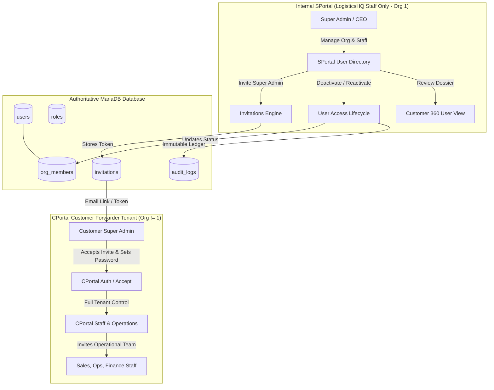
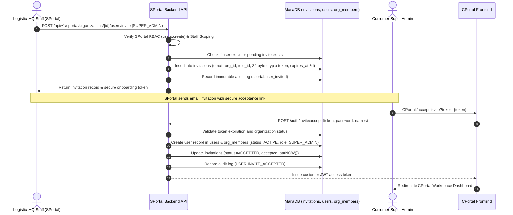

# SPortal Customer Users, Roles & Access Lifecycle: Business and Technical Workflow

**Author**: LogisticsHQ Core Architecture Team  
**Task**: S6 — Customer Super Admin Provisioning, Customer Users, Roles, Invitations & Access Lifecycle  
**Status**: Authoritative Reference Documentation  
**Version**: 1.0  
**Target Systems**: SPortal (Internal SaaS Administration) & CPortal (Freight Forwarder Customer Portal)

---

## 1. Executive Summary & Product Architecture

LogisticsHQ operates two distinct portal applications backed by a single shared multi-tenant backend:

1. **SPortal (SaaS Administration Portal)**:
   - Dedicated internal tool used exclusively by authorized LogisticsHQ staff (Executive, Admin, Support, Finance, Compliance).
   - Governed by internal organization scoping (`org_id = 1`: "Freel Global Logistics Pvt Ltd").
   - Protected by internal RBAC permissions (`users:view`, `users:create`, `users:update`, `users:disable`, `roles:view`).
   - Customer organization users (`org_id != 1`) are strictly denied access to SPortal.

2. **CPortal (Customer Freight Forwarder Portal)**:
   - Client-facing application where freight forwarding companies manage operations, bookings, air/ocean freight, quotes, customs, track & trace, and financial invoices.
   - Operates strictly within the customer's organization tenant context (`org_id > 1`).

Task S6 establishes the comprehensive view, governance foundation, and lifecycle management for customer organization users, the initial Super Admin provisioning, role distribution, invitations, and access states.



---

## 2. Customer User vs Internal Staff Boundary

LogisticsHQ enforces complete segregation between internal LogisticsHQ personnel and customer organization personnel:

| Dimension | Internal Staff (SPortal) | Customer Users (CPortal) |
| :--- | :--- | :--- |
| **Organization Context** | `org_id = 1` ("Freel Global Logistics Pvt Ltd") | `org_id != 1` (e.g. `org_id = 2` "Varun Logistics") |
| **Portal Access** | SPortal only (`http://localhost:5174`) | CPortal only (`http://localhost:5173`) |
| **Portal Boundary Enforcement** | Middleware `RequireInternalStaff` blocks any customer user (`org_id != 1` or external role) | Login logic blocks customer users from logging into SPortal |
| **Cross-Tenant Directory** | Visible in SPortal `/users` across all customer organizations | Isolated strictly to own tenant in CPortal |
| **Role Model** | Internal roles: `CEO`, `SUPER_ADMIN`, `TECH_ADMIN`, `SUPPORT_LEAD`, `FINANCE_DIR` | Tenant roles: `SUPER_ADMIN`, `OPERATIONS`, `SALES`, `FINANCE`, `HR`, `DOCUMENTATION`, `PRICING` |
| **Protection Rules** | SPortal users cannot manage Org 1 users via customer endpoints | SPortal can administer customer user lifecycle without seeing secrets |

---

## 3. Initial Customer Super Admin Provisioning Workflow

When a new freight-forwarding company is onboarded to LogisticsHQ (via Task S4 onboarding workflow or manual commercial creation in S3/S5):



### Invitation Lifecycle States

| Status | Definition | Available Actions in SPortal |
| :--- | :--- | :--- |
| `NOT_INVITED` | Customer organization exists but no Super Admin invitation has been dispatched. | Send Initial Invitation |
| `SENT` / `PENDING` | Cryptographic token generated and invitation active (valid for 7 days). | Resend Invitation (regenerates token & extends expiry), Revoke Invitation |
| `ACCEPTED` | User clicked invitation, set password, and joined tenant organization as active member. | View Dossier, Deactivate Account |
| `EXPIRED` | 7-day token validity window lapsed without acceptance. | Resend Invitation (creates fresh token) |
| `REVOKED` | LogisticsHQ staff cancelled pending invitation prior to acceptance. | Re-invite User |

---

## 4. Post-Onboarding CPortal Handoff & Team Delegation

Once the Customer Super Admin accepts the invitation and accesses CPortal:

1. **Complete Tenant Ownership**:
   - The Customer Super Admin holds full operational authority inside CPortal for their organization.
   - They configure company settings, office branches, currency preferences, and default operational workflows.
2. **Autonomous Team Onboarding**:
   - The Customer Super Admin invites their internal forwarder team (Sales Representatives, Ocean/Air Freight Operators, Customs Brokers, Financial Accountants) directly through CPortal's user management interface.
3. **SPortal Administrative Fallback**:
   - If a customer organization experiences administrative lockout, requires emergency Super Admin recovery, or requests LogisticsHQ assistance, authorized SPortal staff can invite additional personnel or reset Super Admin credentials.

---

## 5. Roles & Permissions Architecture

### SPortal Internal Roles & Permissions (Org 1)

SPortal permissions enforce granular least-privilege access across internal staff:

- `users:view`: View global customer user directory, search/filter users, inspect User Dossier modal.
- `users:create` / `users:invite`: Dispatch customer invitations and resend invitation links.
- `users:update`: Update user details and reactivate deactivated accounts.
- `users:disable`: Deactivate customer user accounts and revoke pending invitations.
- `roles:view`: Retrieve customer tenant roles and view permissions breakdown.

### Customer Tenant Roles (Org != 1)

Customer tenant roles define operational responsibilities within CPortal:

- **SUPER_ADMIN**: Primary freight forwarder administrator with unrestricted authority across tenant settings, members, bookings, shipments, financials, and integrations.
- **OPERATIONS**: Operational coordinators managing consignments, ocean/air bookings, milestones, and exception handling.
- **SALES**: Commercial representatives managing customer accounts, inquiries, rate quotes, and tenders.
- **FINANCE**: Accounts receivable/payable personnel managing freight invoices, payment collections, and credit limits.
- **DOCUMENTATION**: Documentation specialists processing Bills of Lading (B/L), Air Waybills (AWB), and customs declarations.
- **PRICING**: Tariff managers maintaining carrier rate sheets, margins, and surcharge schedules.

---

## 6. Authoritative Database Schema

SPortal uses the existing production schema without creating duplicate tables:

```sql
-- 1. Persistent User Credentials & Profile
CREATE TABLE users (
    id BIGINT AUTO_INCREMENT PRIMARY KEY,
    email VARCHAR(255) NOT NULL UNIQUE,
    password_hash VARCHAR(255) NOT NULL,
    first_name VARCHAR(100) NOT NULL,
    last_name VARCHAR(100) NOT NULL,
    phone VARCHAR(50),
    status VARCHAR(50) NOT NULL DEFAULT 'ACTIVE', -- ACTIVE, INACTIVE, SUSPENDED
    created_at TIMESTAMP DEFAULT CURRENT_TIMESTAMP,
    updated_at TIMESTAMP DEFAULT CURRENT_TIMESTAMP ON UPDATE CURRENT_TIMESTAMP
);

-- 2. Tenant Organization Membership
CREATE TABLE org_members (
    id BIGINT AUTO_INCREMENT PRIMARY KEY,
    org_id BIGINT NOT NULL,
    user_id BIGINT NOT NULL,
    role_id BIGINT NOT NULL,
    status VARCHAR(50) NOT NULL DEFAULT 'ACTIVE', -- ACTIVE, INACTIVE, DISABLED
    created_at TIMESTAMP DEFAULT CURRENT_TIMESTAMP,
    updated_at TIMESTAMP DEFAULT CURRENT_TIMESTAMP ON UPDATE CURRENT_TIMESTAMP,
    CONSTRAINT fk_om_org FOREIGN KEY (org_id) REFERENCES organizations(id),
    CONSTRAINT fk_om_user FOREIGN KEY (user_id) REFERENCES users(id),
    CONSTRAINT fk_om_role FOREIGN KEY (role_id) REFERENCES roles(id),
    UNIQUE KEY uq_org_user (org_id, user_id)
);

-- 3. Cryptographic Invitations Ledger
CREATE TABLE invitations (
    id BIGINT AUTO_INCREMENT PRIMARY KEY,
    org_id BIGINT NOT NULL,
    role_id BIGINT NOT NULL,
    email VARCHAR(255) NOT NULL,
    token VARCHAR(255) NOT NULL UNIQUE,
    status VARCHAR(50) NOT NULL DEFAULT 'PENDING', -- PENDING, ACCEPTED, EXPIRED, REVOKED
    expires_at TIMESTAMP NOT NULL,
    accepted_at TIMESTAMP NULL,
    created_at TIMESTAMP DEFAULT CURRENT_TIMESTAMP,
    updated_at TIMESTAMP DEFAULT CURRENT_TIMESTAMP ON UPDATE CURRENT_TIMESTAMP,
    CONSTRAINT fk_inv_org FOREIGN KEY (org_id) REFERENCES organizations(id),
    CONSTRAINT fk_inv_role FOREIGN KEY (role_id) REFERENCES roles(id)
);

-- 4. Immutable Audit Trail
CREATE TABLE audit_logs (
    id BIGINT AUTO_INCREMENT PRIMARY KEY,
    user_id BIGINT NULL,
    org_id BIGINT NULL,
    action VARCHAR(100) NOT NULL,
    module VARCHAR(100) NOT NULL,
    description TEXT NOT NULL,
    metadata JSON NULL,
    result VARCHAR(50) NOT NULL DEFAULT 'SUCCESS',
    ip_address VARCHAR(45) NULL,
    user_agent TEXT NULL,
    created_at TIMESTAMP DEFAULT CURRENT_TIMESTAMP
);
```

---

## 7. Account Lifecycle & Deactivation Security Consequence

When an authorized SPortal administrator updates a customer user status to `INACTIVE`:

1. **Immediate Authentication Block**:
   `backend/internal/auth/service.go` explicitly enforces `WHERE om.status = 'ACTIVE'` during CPortal login:
   ```sql
   SELECT u.id, u.email, u.password_hash, om.status, om.role_id, om.org_id
   FROM users u
   JOIN org_members om ON u.id = om.user_id
   WHERE u.email = ? AND om.status = 'ACTIVE'
   ```
   Setting `om.status = 'INACTIVE'` causes immediate credential rejection at authentication time without deleting historical shipment references, consignments, or financial logs created by the user.

2. **Reactivation**:
   Setting `om.status = 'ACTIVE'` instantly restores login capability without requiring password resets.

3. **Audit Reason Requirement**:
   Every status change requires an administrative reason (e.g. "Customer employee offboarding", "Security suspension"), recorded immutably in `audit_logs`.

---

## 8. Cryptographic Privacy & Security Disclosures

- **Zero Exposure of Secrets**:
  Password hashes (`password_hash`), MFA secrets, and Cognito session tokens are strictly excluded from SPortal API responses (`json:"-"`).
- **Sanitized Dossier**:
  The SPortal User Dossier exposes operational metadata (assigned role, organization, registration date, last login timestamp, MFA enrollment status, and audit actions) while preserving data protection compliance.
- **Tenant Isolation**:
  Customer users attempting to hit `/api/v1/sportal/*` endpoints receive immediate `403 Forbidden` responses, and security failure alerts are written to `audit_logs`.
