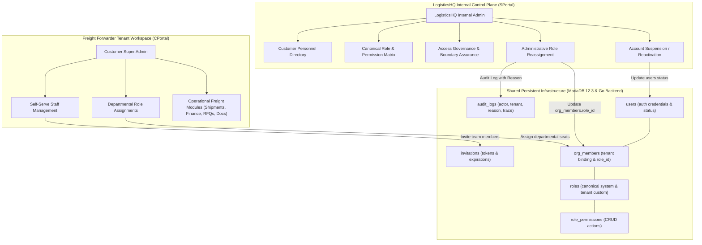
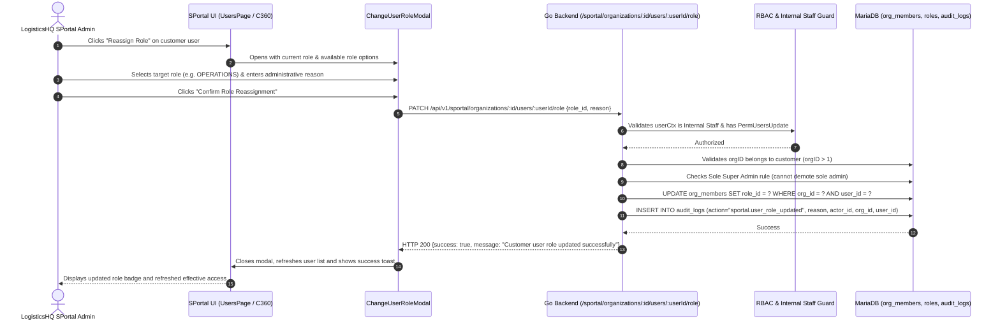
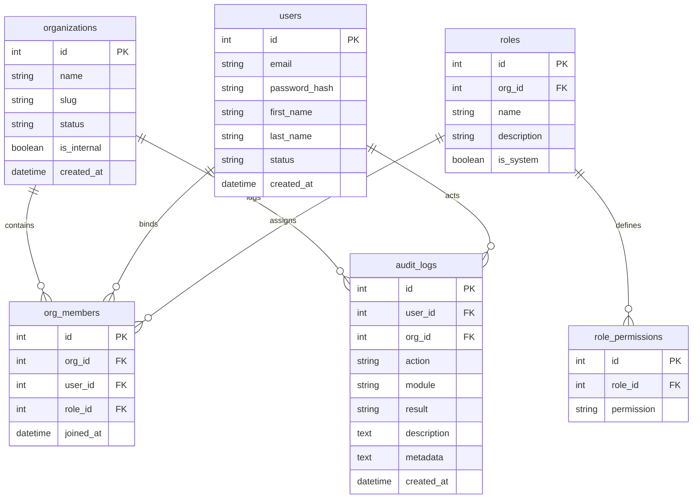

# LogisticsHQ SPortal — Customer Users, Roles, Permission Visibility & Access Administration
## Comprehensive Business & Technical Architecture Workflow

---

### Executive Summary

LogisticsHQ operates as a multi-tenant Freight Forwarding SaaS platform serving logistics operators, global forwarders, and trade intermediaries. To maintain security, commercial trust, and operational integrity, the platform enforces a strict division of responsibilities between **SPortal** (LogisticsHQ Internal SaaS Operations Control Plane) and **CPortal** (Customer Forwarder Tenant Workspace).

This document details the business and technical workflow for **Customer Users, Roles, Canonical Permissions, and Access Administration** implemented in Task S7 (extending Task S6).

---

## 1. Business Purpose & User Personas

### 1.1 Business Purpose
1. **Authoritative Governance**: Internal LogisticsHQ administrators must understand which personnel belong to each freight forwarder, their operational roles, and their effective capabilities.
2. **Support & Access Escalation**: Internal teams require the capability to inspect customer permissions to troubleshoot access issues, assist with initial Super Admin onboarding, and reassign roles during organizational transitions or support tickets with an immutable reason.
3. **Tenant Boundary Preservation**: LogisticsHQ must prevent cross-tenant traversal (IDOR) and ensure customer administrators retain self-serve sovereignty over internal staff within CPortal while internal staff retain platform oversight via SPortal.
4. **Transparency & Audit Compliance**: Every account status adjustment, invitation dispatch, and role reassignment must generate an immutable audit trail attributing actor, affected tenant, before/after states, and administrative justification.

### 1.2 User Personas & Role Matrix

| Persona | Portal | Scope | Primary Responsibilities |
| :--- | :--- | :--- | :--- |
| **LogisticsHQ Super Admin / CEO** | SPortal | Global Cross-Tenant | Full platform administration, subscription tiers, customer onboarding, initial Super Admin provisioning, role reassignments, account suspensions. |
| **LogisticsHQ Operations & Support** | SPortal | Authorized Tenants | Read-only visibility into customer personnel, inspection of canonical permissions, diagnostic support, invitation token refreshes. |
| **Customer Super Admin** | CPortal | Tenant Only (`org_id`) | Departmental role assignment, team invitations, branch settings, day-to-day freight operations (bookings, shipments, invoices). |
| **Customer Operational Staff** | CPortal | Tenant Only (`org_id`) | Departmental operations (Operations, Sales, Pricing, Finance, Documentation, HR) governed by assigned role permissions. |

---

## 2. Segregation of Duties: SPortal vs CPortal Responsibility Boundary



### Responsibility Breakdown

| Operational Capability | LogisticsHQ SPortal (Internal) | Freight Forwarder CPortal (Tenant) | Single Source of Truth |
| :--- | :--- | :--- | :--- |
| **Initial Super Admin Provisioning** | **Authoritative**: Invites, verifies, and provisions initial customer Super Admin upon forwarder onboarding. | **Restricted**: Cannot provision initial Super Admin; subsequent admins promoted by existing admins. | `users`, `org_members`, `invitations` |
| **Customer Team Lifecycle** | **Diagnostic Oversight**: Views all tenant staff, audits pending invites, resends/revokes tokens. | **Operational Authority**: Sends invites, assigns departmental seats, manages daily team membership. | `invitations`, `org_members` |
| **Customer Role Reassignment** | **Support & Compliance**: Can reassign roles with required administrative reason for escalations. | **Daily Management**: Customer Super Admin reassigns roles across Sales, Ops, Finance, etc. | `org_members.role_id` |
| **Account Suspension** | **Platform Safety**: Can deactivate customer accounts for billing default, terms violations, or abuse. | **Internal Team**: Customer Super Admin deactivates staff who have left the organization. | `users.status` |
| **Canonical Permissions** | **Platform Definition**: Defines canonical resources and system roles (`SUPER_ADMIN`, `OPERATIONS`, etc.). | **Policy Configuration**: Configures module permissions for custom non-protected roles. | `roles`, `role_permissions` |
| **Audit Ledger** | **Global Ledger**: Comprehensive cross-tenant audit trail with actor correlation ID. | **Tenant Ledger**: Activity logs visible to customer admins scoped strictly to `tenant_id`. | `audit_logs` |

---

## 3. Canonical Role Catalog & Effective Access Architecture

### 3.1 Canonical System Roles
The platform defines seven canonical system roles for freight-forwarder customer tenants:

1. **`SUPER_ADMIN`**: Full administrative and operational control over tenant resources, team users, and company configurations. Protected from demotion if sole active admin.
2. **`OPERATIONS`**: Specialized in shipment tracking, exception resolution, milestone management, container workflows, and associated documents.
3. **`SALES`**: Focused on CRM leads, spot freight inquiries, quotations, rate tariffs, and customer account management.
4. **`PRICING`**: Focused on freight tariffs, rate cards, carrier cost calculations, spot quotes, and RFQ responses.
5. **`FINANCE`**: Specialized in customer invoices, billing reconciliation, accounts receivable, and credit limits.
6. **`DOCUMENTATION`**: Focused on Bills of Lading (BL), Sea Waybills, Air Waybills (AWB), customs declarations, and compliance certificates.
7. **`HR`**: Dedicated to internal tenant personnel directories and staff records.

### 3.2 Canonical Platform Resource Catalog (10 Modules)
The RBAC model organizes customer capabilities into 10 canonical areas, each supporting four granular CRUD actions (`CREATE`, `READ`, `UPDATE`, `DELETE`):

| Resource Key | Area Name | Actions Supported | SPortal vs CPortal Control Boundary |
| :--- | :--- | :--- | :--- |
| **`SHIPMENTS`** | Shipments & Operations | `C`, `R`, `U`, `D` | Operational Module (CPortal) |
| **`DOCUMENTS`** | Documents & Compliance | `C`, `R`, `U`, `D` | Operational Module (CPortal) |
| **`FINANCE`** | Finance & Invoices | `C`, `R`, `U`, `D` | Operational Module (CPortal) |
| **`RFQS`** | RFQs & Pricing | `C`, `R`, `U`, `D` | Operational Module (CPortal) |
| **`COMPANIES`** | Companies & Customers | `C`, `R`, `U`, `D` | Operational Module (CPortal) |
| **`LEADS`** | CRM Leads & Inquiries | `C`, `R`, `U`, `D` | Operational Module (CPortal) |
| **`OPPORTUNITIES`** | Commercial Tenders | `C`, `R`, `U`, `D` | Operational Module (CPortal) |
| **`OUTREACH`** | Outreach & Broadcasts | `C`, `R`, `U`, `D` | Operational Module (CPortal) |
| **`USERS`** | Tenant Team & Users | `C`, `R`, `U`, `D` | Customer Admin (CPortal) |
| **`SETTINGS`** | Organization Settings | `C`, `R`, `U`, `D` | Customer Admin (CPortal) |

### 3.3 Effective Access Derivation Logic
Effective access is dynamically calculated from actual database permissions rather than hardcoded tables:
```
User (ID, Email)
  └─► Organization Membership (org_members.org_id)
        └─► Assigned Role (roles.id, roles.name)
              └─► Role Permissions (role_permissions.permission)
                    └─► Resource Action Map: [RESOURCE].[ACTION]
                          └─► Capability Level:
                                - FULL: Allowed C, R, U, D
                                - MANAGE: Allowed R, U, and C (without D)
                                - VIEW_ONLY: Allowed R only
                                - NONE: 0 permissions allowed
```

---

## 4. End-to-End Workflows

### 4.1 Role Reassignment Workflow with Audit Trail



### 4.2 Sole Super Admin Protection Guard
To safeguard customer organizations from accidental administrative lockout, the backend enforces a hard rule during role mutations or status deactivations:
1. When demoting a user currently holding `SUPER_ADMIN` in a customer organization, the repository counts how many active `SUPER_ADMIN` members remain in `org_members`.
2. If the count is `<= 1`, the mutation is immediately aborted with HTTP 400:
   `"cannot demote the sole active Super Admin in organization #N; assign another Super Admin first"`
3. Account deactivations (`status = INACTIVE`) apply an identical check, ensuring a freight forwarder never loses primary administrative access.

---

## 5. Security & Tenant Isolation Architecture

### 5.1 Defense-in-Depth IDOR Protection
1. **Server-Side Context Validation**: Every request validates `userCtx.OrgID == 1` (Internal SaaS Organization) and verifies that the internal role possesses `sportal:users:update` or `sportal:users:view`.
2. **Path Parameter Consistency**: The endpoint URL requires both `:id` (organization ID) and `:userId` (user ID). The SQL queries strictly bind both:
   `WHERE org_id = ? AND user_id = ?`
   Tampering with either parameter results in HTTP 404 (`"customer user #X not found in organization #Y"`), preventing cross-tenant user traversal.
3. **Environment-Gated Test Tokens**: Historical test tokens (`test-token`) are strictly gated behind `m.IsDevOrTest()` in `backend/internal/middleware/auth.go`. In staging or production environments (`APP_ENV=production`), test tokens return immediate HTTP 401 Unauthorized.
4. **Zero Credential Exposure**: Passwords, bcrypt hashes, JWT signing secrets, session tokens, and MFA seeds are excluded from all SPortal and CPortal user detail views and JSON serialization.

---

## 6. Database Schema & Mapping



---

## 7. Technical Reference: Endpoints & Handlers

| Method | Endpoint | Authorization Guard | Handler Function | Purpose |
| :--- | :--- | :--- | :--- | :--- |
| `GET` | `/api/v1/sportal/roles/matrix` | Internal Staff + `PermRolesView` | `h.GetPermissionMatrix` | Retrieves canonical 10-module catalog and 7 customer roles with CRUD matrix. |
| `PATCH` | `/api/v1/sportal/organizations/{id}/users/{userId}/role` | Internal Staff + `PermUsersUpdate` | `h.UpdateCustomerUserRole` | Reassigns customer user role with compliance reason and audit log. |
| `GET` | `/api/v1/sportal/organizations/{id}/users/{userId}` | Internal Staff + `PermUsersView` | `h.GetCustomerUserDetail` | Retrieves customer user dossier including `effective_access` summary. |
| `GET` | `/api/v1/sportal/users` | Internal Staff + `PermUsersView` | `h.GetCustomerUsers` | Lists all customer users across tenants with search, filter, and pagination. |
| `PATCH` | `/api/v1/sportal/organizations/{id}/users/{userId}/status` | Internal Staff + `PermUsersUpdate` | `h.UpdateCustomerUserStatus` | Suspends or reactivates customer user account with audit logging. |

---

## 8. Verification & Operational Health Checklist

- [x] SPortal users directory accurately filters by organization, role, and account status.
- [x] Canonical Permission Matrix provides side-by-side inspection across all 10 modules and 7 roles.
- [x] User Dossier explains User -> Organization -> Role -> Permissions -> Effective Module Access.
- [x] Role reassignment enforces mandatory administrative reason and updates `org_members`.
- [x] Sole Super Admin protection prevents customer tenant lockout.
- [x] SPortal and CPortal share identical MariaDB persistent records.
- [x] IDOR protection blocks cross-tenant tampering and returns HTTP 404.
- [x] Responsive layout verified at 768px, 1024px, 1280px, and 1440px with zoom 80%–125%.
