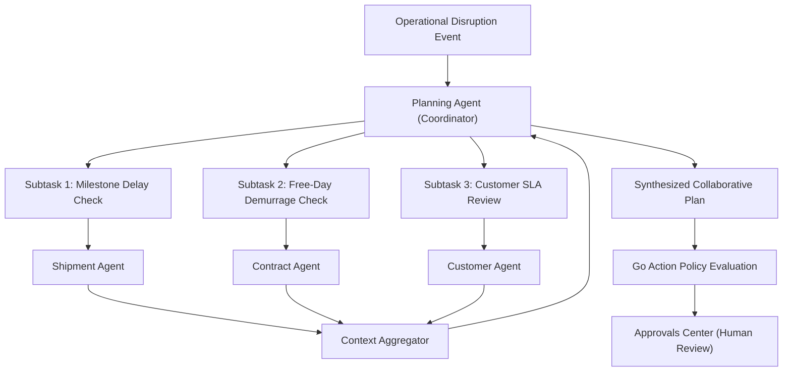
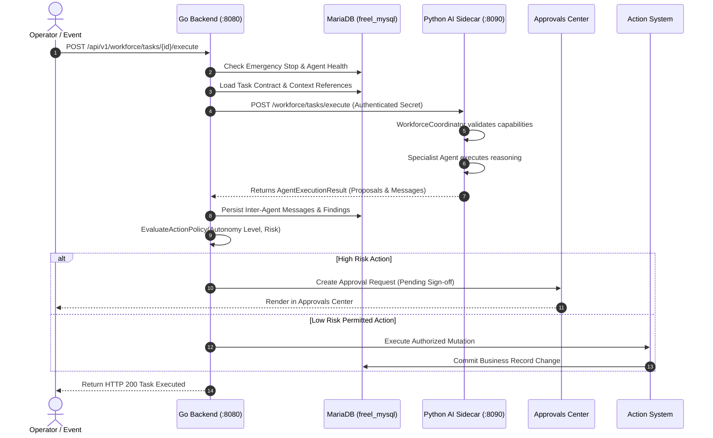

# Task 3.14.A — AI Workforce Business Workflow, Agent Roles, Agent Lifecycle, Multi-Agent Coordination, Delegation, Memory, Planning, Action System, Approvals, Python/Go Boundary, Database Mapping, APIs, Permissions, Audit, Event Mesh, Monitoring, and Complete Technical Documentation

---

## 1. Executive Summary

The LogisticsHQ AI Workforce represents an enterprise-grade multi-agent autonomous operations system tailored specifically for international logistics, ocean/air freight forwarding, customs clearance, rate optimization, and trade compliance.

Unlike generic chatbot copilots, the LogisticsHQ AI Workforce consists of **10 specialized, governed software agents** coordinated by a central planning agent. Each agent possesses explicit domain boundaries, strict capability definitions, and assigned autonomy levels ranging from Level 0 (Observe Only) to Level 2 (Prepare for Human Approval). 

The architectural foundation operates on a strict separation of concerns:
- **Python AI Sidecar (`:8090`)**: Performs all probabilistic reasoning, multi-agent collaboration, LangGraph execution, predictive inference, and prompt engineering. Python code is strictly read-only with respect to operational databases; it cannot directly commit business record changes, execute external side effects, or bypass business policies.
- **Go Authoritative Backend (`:8080`)**: Enforces all multi-tenant isolation, user authentication, RBAC authorization, Action System policies, Segregation of Duties (SoD), database transactions, audit logging, emergency stops, and external provider dispatches.
- **Persistent MariaDB 12.3 (`freel_mysql`)**: Authoritatively maintains the agent registry (`workforce_agents`), task contracts (`workforce_tasks`), inter-agent messages (`workforce_messages`), execution contexts (`workforce_contexts`), memory items (`ai_memory_items`), action proposals (`ai_action_proposals`), and outcomes (`ai_agent_outcomes`).

This document provides both the **Business Perspective** (for executives, operations specialists, sales teams, and compliance officers) and the **Technical Implementation Details** (for software architects, backend engineers, AI developers, and QA engineers).

---

## 2. AI Workforce in Plain English

### What is an AI Agent in LogisticsHQ?
An AI Agent in LogisticsHQ is not a conversational chatbot. It is a specialized, 24/7 digital team member programmed to monitor specific operational data, spot bottlenecks, forecast delays, reconcile costs, and prepare recommended solutions for human review.

### Why Are There Multiple Agents?
International freight involves drastically different domains:
- Negotiating spot rates with ocean carriers requires deep margin calculations.
- Resolving port congestion requires vessel tracking, AIS telemetry, and rerouting logistics.
- Auditing freight invoices requires ledger reconciliation and demurrage contract analysis.
- Screening cargo requires international export sanctions and hazardous materials compliance.

Rather than relying on a single monolithic model that tries to do everything poorly, LogisticsHQ deploys a team of **10 specialized agents**, each dedicated to a distinct functional area.

### How Do Agents Cooperate?
When a complex operational disruption occurs—such as a container vessel delayed by 6 days outside Long Beach—the **Operational Planning Coordinator** steps in:
1. It tasks the **Shipment Specialist** to verify updated vessel coordinates and milestone ETAs.
2. It tasks the **Contract Specialist** to inspect detention and demurrage free-days in the carrier agreement.
3. It tasks the **Finance Specialist** to calculate potential demurrage costs and customer billing adjustments.
4. It tasks the **Customer Specialist** to draft an early arrival delay notification for the client.
5. Finally, the Coordinator synthesizes all four findings into a single, cohesive action plan.

### How Humans Remain in Full Control
Agents **recommend and prepare**—they do **not** unilaterally commit money, sign contracts, or reroute cargo without explicit policy gates. High-risk actions route through the LogisticsHQ Approvals Center, where authorized human directors review, edit, or reject the plan before any external system is touched.

---

## 3. Business Purpose

The primary business objectives of the AI Workforce include:
1. **Zero-Latency Exception Triage**: Reducing the time from an ocean carrier milestone delay to customer notification from 8 hours down to 3 minutes.
2. **Margin Protection**: Preventing freight sales representatives from quoting unprofitable spot rates that erode contractual margin thresholds.
3. **Demurrage & Detention Avoidance**: Proactively tracking terminal dwell time and alerting drayage teams before costly carrier port storage fees accumulate.
4. **Compliance Safeguards**: Auditing bills of lading and commercial invoices against trade sanction watchlists and hazmat documentation rules.
5. **Operator Ergonomics**: Eliminating repetitive manual data entry, enabling freight dispatchers to oversee 3x more shipments per desk.

---

## 4. AI Workforce Agent Inventory

The platform maintains a verified registry of **10 foundation workforce agents** persisted in the `workforce_agents` table:

| Agent Identifier | Business Name | Agent Type | Capabilities | Allowed Tasks | Primary Entities | Autonomy Level | Status |
| :--- | :--- | :--- | :--- | :--- | :--- | :--- | :--- |
| `planning_agent` | Operational Planning Coordinator | `COORDINATOR` | `planning.create`, `task.delegate`, `planning.evaluate`, `monitoring.observe` | `PLAN_CREATION`, `WORKFORCE_DELEGATION`, `INCIDENT_COORDINATION`, `MULTI_AGENT_EXECUTION` | `SHIPMENT`, `INVOICE`, `CUSTOMER`, `RFQ`, `CONTRACT` | `LEVEL_2_PREPARE` | **HEALTHY** |
| `shipment_agent` | Shipment Operations Specialist | `SPECIALIST` | `shipment.read`, `shipment.analyze`, `shipment.predict`, `monitoring.observe` | `SHIPMENT_INSPECTION`, `TRACKING_UPDATE`, `MILESTONE_VERIFICATION`, `ETA_FORECAST` | `SHIPMENT`, `CONTAINER`, `CARRIER`, `VESSEL` | `LEVEL_2_PREPARE` | **HEALTHY** |
| `exception_agent` | Exception Resolution Specialist | `SPECIALIST` | `exception.read`, `exception.analyze`, `exception.recommend`, `shipment.read` | `EXCEPTION_TRIAGE`, `REROUTE_ASSESSMENT`, `INCIDENT_ANALYSIS`, `DISRUPTION_MITIGATION` | `SHIPMENT`, `EXCEPTION`, `CARRIER`, `DISRUPTION` | `LEVEL_1_RECOMMEND` | **HEALTHY** |
| `customer_agent` | Customer Intelligence Specialist | `SPECIALIST` | `customer.read`, `customer.analyze`, `customer.followup_recommend` | `CUSTOMER_FOLLOWUP`, `SENTIMENT_ANALYSIS`, `INQUIRY_TRIAGE`, `OUTREACH_RECOMMENDATION` | `CUSTOMER`, `LEAD`, `COMMUNICATION`, `ACCOUNT` | `LEVEL_1_RECOMMEND` | **HEALTHY** |
| `pricing_agent` | Pricing & Margin Specialist | `SPECIALIST` | `rfq.read`, `pricing.analyze`, `pricing.recommend`, `rate.read` | `RATE_BENCHMARK`, `QUOTE_OPTIMIZATION`, `MARGIN_ANALYSIS`, `RFQ_PRICING` | `RFQ`, `QUOTATION`, `RATE`, `SURCHARGE` | `LEVEL_1_RECOMMEND` | **HEALTHY** |
| `finance_agent` | Finance & Collections Specialist | `SPECIALIST` | `invoice.read`, `finance.analyze`, `finance.recommend` | `INVOICE_AUDIT`, `COLLECTIONS_TRIAGE`, `DISCREPANCY_RECONCILE`, `CASH_FLOW_RISK` | `INVOICE`, `PAYMENT`, `CUSTOMER`, `LEDGER` | `LEVEL_1_RECOMMEND` | **HEALTHY** |
| `compliance_agent`| Contract Compliance Specialist | `SPECIALIST` | `compliance.read`, `compliance.analyze`, `document.read` | `COMPLIANCE_AUDIT`, `DOCUMENT_VERIFICATION`, `CUSTOMS_SCREENING`, `HAZMAT_CHECK` | `CONTRACT`, `DOCUMENT`, `CUSTOMS`, `COMPLIANCE_FILING`| `LEVEL_1_RECOMMEND` | **HEALTHY** |
| `monitoring_agent`| Workforce & Systems Observer | `SPECIALIST` | `workforce.observe`, `task.monitor`, `monitoring.observe`, `anomaly.detect` | `STATE_OBSERVATION`, `ANOMALY_DETECTION`, `WORKFORCE_HEALTH_CHECK`, `TASK_MONITORING` | `WORKFORCE_TASK`, `AGENT`, `SYSTEM_HEALTH` | `LEVEL_0_OBSERVE` | **HEALTHY** |
| `contract_agent` | Contract Agreement Specialist | `SPECIALIST` | `contract.read`, `contract.analyze` | `CONTRACT_ANALYSIS`, `CLAUSE_EXTRACTION`, `TERMS_VERIFICATION`, `FREE_DAYS_CHECK` | `CONTRACT`, `AGREEMENT`, `RATE_VERSION`, `CARRIER` | `LEVEL_1_RECOMMEND` | **HEALTHY** |
| `memory_agent` | Operational Memory Specialist | `SPECIALIST` | `memory.retrieve`, `memory.analyze`, `outcome.record` | `MEMORY_RETRIEVAL`, `PATTERN_ANALYSIS`, `OUTCOME_SYNTHESIS`, `LEARNING_CLASSIFICATION` | `OUTCOME`, `MEMORY`, `PLAN`, `LESSON_LEARNED` | `LEVEL_1_RECOMMEND` | **HEALTHY** |

---

## 5. Detailed Agent Responsibilities

### 5.1 Operational Planning Coordinator (`planning_agent`)
- **Problem Solved**: High-friction cross-departmental coordination during complex shipping disruptions.
- **Data Read**: Cross-module snapshots (Shipments, Carrier contracts, Invoices, Customer account priority).
- **Artifacts Produced**: Multi-agent collaborative plans (`CollaborativePlan`), task delegations, consolidated impact matrices.
- **Autonomy**: `LEVEL_2_PREPARE`. Prepares multi-step plans with explicit human approval gates.

### 5.2 Shipment Operations Specialist (`shipment_agent`)
- **Problem Solved**: Unmonitored transit delays and carrier tracking blind spots.
- **Data Read**: Real-time GPS/AIS vessel positions, container milestone webhooks, carrier status updates.
- **Artifacts Produced**: Delay forecasts, ETA revisions, tracking milestone validations.
- **Autonomy**: `LEVEL_2_PREPARE`. Can auto-refresh tracking data; requires human review for milestone date modifications.

### 5.3 Exception Resolution Specialist (`exception_agent`)
- **Problem Solved**: Ad-hoc, delayed response to port congestion, temperature excursions, and customs holds.
- **Data Read**: Telemetry sensor alarms, exception logs, port dwell statistics, carrier disruption notices.
- **Artifacts Produced**: Rerouting options, root cause analysis, mitigation recommendations.
- **Autonomy**: `LEVEL_1_RECOMMEND`. Generates recommendations with confidence scoring; execution requires operator sign-off.

### 5.4 Customer Intelligence Specialist (`customer_agent`)
- **Problem Solved**: Lack of proactive customer communication during transit disruptions.
- **Data Read**: Customer SLAs, communication logs, account value, shipment status.
- **Artifacts Produced**: Contextual email drafts, follow-up reminders, churn risk flags.
- **Autonomy**: `LEVEL_1_RECOMMEND`. Drafts customer advisories; never dispatches outbound email without operator approval.

### 5.5 Pricing & Margin Specialist (`pricing_agent`)
- **Problem Solved**: Underpriced spot quotations and margin leakage during market rate volatility.
- **Data Read**: Historical rate benchmarks, bunker adjustment factors (BAF), carrier tariffs, RFQ volume.
- **Artifacts Produced**: Recommended buy/sell rate markups, floor margin alerts, quotation lines.
- **Autonomy**: `LEVEL_1_RECOMMEND`. Quotes below floor margins trigger mandatory commercial approval.

### 5.6 Finance & Collections Specialist (`finance_agent`)
- **Problem Solved**: Unreconciled carrier extra charges, late customer payments, and billing disputes.
- **Data Read**: Accounts receivable ledger, overdue invoices, credit limits, payment history.
- **Artifacts Produced**: Dispute summaries, collections priority queues, credit limit override proposals.
- **Autonomy**: `LEVEL_1_RECOMMEND`. All invoice adjustments route through financial approval workflows.

### 5.7 Contract Compliance Specialist (`compliance_agent`)
- **Problem Solved**: Regulatory exposure, missing trade documents, and sanctions violations.
- **Data Read**: Commercial invoices, packing lists, denied parties lists, hazmat declarations.
- **Artifacts Produced**: Discrepancy checklists, export compliance clearance reports, risk ratings.
- **Autonomy**: `LEVEL_1_RECOMMEND`. Cannot waive compliance holds; flags exceptions to trade compliance officers.

### 5.8 Workforce & Systems Observer (`monitoring_agent`)
- **Problem Solved**: Unobserved AI agent failures, infinite delegation loops, and degraded model performance.
- **Data Read**: In-flight task queue depths, agent response latencies, error codes, token usage.
- **Artifacts Produced**: Anomaly alerts, system health telemetry, circuit breaker trip recommendations.
- **Autonomy**: `LEVEL_0_OBSERVE`. Strictly read-only observer. Cannot create action proposals.

### 5.9 Contract Agreement Specialist (`contract_agent`)
- **Problem Solved**: Unclear carrier demurrage tiers and forgotten annual volume rebate commitments.
- **Data Read**: PDF contracts, service agreements, rate amendment addenda.
- **Artifacts Produced**: Structured clause extractions, free-day terms, contractual demurrage formulas.
- **Autonomy**: `LEVEL_1_RECOMMEND`. Recommends clause interpretations for legal and operations teams.

### 5.10 Operational Memory Specialist (`memory_agent`)
- **Problem Solved**: Repeating the same operational mistakes across similar shipping routes or carriers.
- **Data Read**: Historical outcome records (`ai_agent_outcomes`), decision history, operator feedback.
- **Artifacts Produced**: Route reliability patterns, carrier performance weights, lessons-learned context.
- **Autonomy**: `LEVEL_1_RECOMMEND`. Synthesizes operational insights to refine future agent prompt contexts.

---

## 6. Agent Lifecycle

Every workforce agent adheres to a deterministic, state-machine lifecycle managed by Go:

```
                  ┌──────────────────────┐
                  │      REGISTERED      │
                  └──────────┬───────────┘
                             │
                             ▼
                  ┌──────────────────────┐
                  │       HEALTHY        │ ◄────────────────┐
                  └──────────┬───────────┘                  │
                             │                              │
          ┌──────────────────┼──────────────────┐           │
          │ (Task Assigned)  │ (Manual Control) │ (Error)   │ (Resume)
          ▼                  ▼                  ▼           │
   ┌──────────────┐   ┌──────────────┐   ┌──────────────┐   │
   │     BUSY     │   │    PAUSED    │   │   DEGRADED   │   │
   └──────┬───────┘   └──────┬───────┘   └──────┬───────┘   │
          │ (Task Done)      │ (Unpause)        │ (Recover) │
          └──────────────────┴──────────────────┴───────────┘
                             │
                             ▼ (Admin Disable)
                      ┌──────────────┐
                      │   DISABLED   │
                      └──────────────┘
```

### Lifecycle States
1. **REGISTERED**: Agent metadata, schema, and capabilities persisted in `workforce_agents`.
2. **HEALTHY**: Agent operational, heartbeat passing, ready to accept tasks.
3. **BUSY**: Actively processing a task contract or collaborative plan.
4. **PAUSED**: Temporarily halted by operator via `POST /api/v1/workforce/agents/{id}/control`. Rejects new task dispatches with `ErrAgentPaused`.
5. **DEGRADED**: Provider timeout or model failure encountered; fallback logic engaged.
6. **DISABLED**: Permanently deactivated by tenant administrator. Excluded from delegation routing.

---

## 7. AI Task Lifecycle

AI tasks are formal contracts persisted in `workforce_tasks`. Every task has a unique `task_id`, defined `required_capabilities`, input context, and strict timeout bounds.

```
[Task Initiated] 
       │
       ▼
 [ PENDING ] ──(Agent Assigned & Started)──> [ IN_PROGRESS ]
       │                                            │
       │                                    ┌───────┴───────┐
       ▼ (Dependencies Blocked)             ▼ (Success)     ▼ (Failure)
  [ BLOCKED ]                          [ COMPLETED ]   [ FAILED ]
       │                                                    │
       ▼ (Handoff Initiated)                                ▼ (Max Retries)
  [ DELEGATED ]                                       [ CANCELLED ]
```

### Task State Definitions
- **PENDING**: Created and enqueued in MariaDB; waiting for available agent capacity.
- **IN_PROGRESS**: Assigned agent executing in Python runtime.
- **BLOCKED**: Prerequisite dependency task or external approval pending.
- **DELEGATED**: Current agent handed off execution to a specialist agent via `workforce_handoffs`.
- **COMPLETED**: Agent finished reasoning, produced validated structured output, and persisted findings.
- **FAILED**: Model error, schema violation, or capability mismatch encountered.
- **CANCELLED**: Terminated by user or emergency stop switch.

---

## 8. Agent Selection

When an operational trigger arrives (e.g. an ocean shipment delayed past SLA), the system selects an agent via deterministic capability matching:

1. **Explicit Dispatch**: If an event or workflow specifies an agent (e.g. `shipment_agent`), Go verifies that the agent is `is_enabled=1` and `health_status != 'DEGRADED'`.
2. **Capability Matcher**: If the task specifies required capabilities (e.g. `["rfq.read", "pricing.analyze"]`), Go queries `workforce_agents` where `JSON_CONTAINS(capabilities, '"pricing.analyze"')` and selects the specialist agent with the highest health score.
3. **Coordinator Delegation**: If the task involves multiple cross-module capabilities, the system assigns the root task to `planning_agent`, which decomposes it into specialized child tasks.

---

## 9. Agent Delegation & Handoffs

Delegation allows an agent to request assistance from another specialist agent while maintaining audit provenance:

```
[ Planning Agent ]
       │
       ├────(1. Creates Child Task: Task-B)────► [ Finance Agent ]
       │                                                 │
       ├◄───(2. Receives Message: Findings)──────────────┘
       │
       └────(3. Synthesizes Complete Plan)─────► [ Output to Human Review ]
```

### Technical Delegation Constraints
- **Maximum Depth Guard**: Enforced by `MaxDelegationDepth = 5` in `backend/internal/workforce/service.go`. Attempts to delegate beyond depth 5 fail with `ErrMaxDelegationDepthExceeded`.
- **Cycle & Loop Detection**: Go tracks the delegation lineage array `[agent_a, agent_b, ...]`. If a child task attempts to re-delegate back to an ancestor in the same chain, execution halts with `ErrDelegationLoopDetected`.
- **Task Hierarchy**: Persisted via `parent_task_id` and `root_task_id` columns in `workforce_tasks`.
- **Inter-Agent Messaging**: Every delegation, question, or finding between agents is logged as a structured message in `workforce_messages`.

---

## 10. Multi-Agent Coordination

Complex workflows rely on structured multi-agent coordination topologies:



---

## 11. Collaborative Planning

The collaborative planning engine (`CreateCollaborativePlan` in `service.go`) orchestrates structured operational responses:

1. **Objective Ingestion**: Receives business goal (e.g. `"Reroute CMA CGM container 101 to Oakland and minimize customer delay"`).
2. **Specialist Consultations**:
   - `shipment_agent`: Determines alternate vessel sailing schedules.
   - `pricing_agent`: Estimates transshipment trucking surcharges.
   - `contract_agent`: Confirms carrier tariff change-of-destination fees.
3. **Plan Synthesis**: Generates a structured `CollaborativePlan` containing sequential steps, estimated resolution times, financial cost impact, and confidence scores.
4. **Distinction of Concepts**:
   - **Plan**: A proposed multi-step strategy with dependencies and estimates.
   - **Recommendation**: A specific operational choice proposed by an agent.
   - **Action**: An authoritative database mutation or external API call executed by Go.

---

## 12. Agent Memory Architecture

LogisticsHQ implements a hybrid memory architecture combining transactional checkpointing with long-term semantic operational memory:

```
┌─────────────────────────────────────────────────────────────────┐
│                    AI WORKFORCE MEMORY TIERS                    │
├───────────────────────────────┬─────────────────────────────────┤
│    SHORT-TERM / EXECUTION     │      LONG-TERM / OUTCOMES       │
├───────────────────────────────┼─────────────────────────────────┤
│ • In-Memory Task Context      │ • ai_memory_items (Table)       │
│ • LangGraph State Threads     │ • ai_learned_patterns (Table)   │
│ • ai_checkpoints (Table)      │ • ai_agent_outcomes (Table)     │
│ • ai_checkpoint_writes (Table)│ • Carrier & Route Insights      │
└───────────────────────────────┴─────────────────────────────────┘
```

### 12.1 Short-Term Checkpointing (`ai_checkpoints` & `ai_checkpoint_writes`)
- Backed by MariaDB state serializer for LangGraph thread persistence.
- Allows long-running AI workflows to be safely paused, routed for human approval, and resumed across container restarts without losing reasoning context.

### 12.2 Long-Term Operational Memory (`ai_memory_items`)
- Persists verified domain knowledge (e.g. `"Maersk port dwell at Long Beach averages 5.2 days during peak season"`).
- Tracks `times_observed`, `success_count`, `failure_count`, and `recency_weight`.
- Supports explicit invalidation (`is_stale = 1`, `invalidation_reason`) when operational realities shift.

---

## 13. Learning from Outcomes

LogisticsHQ avoids unmonitored reinforcement learning loops. Instead, it utilizes **Audited Outcome Learning**:

```
[ Agent Recommendation ] ──► [ Human Decision: APPROVED ] ──► [ Action Execution: SUCCESS ]
                                                                       │
                                                                       ▼
                                                          [ Record Outcome in DB ]
                                                          (ai_agent_outcomes)
                                                                       │
                                                                       ▼
                                                          [ Synthesize Pattern ]
                                                          (ai_learned_patterns)
                                                                       │
                                                                       ▼
                                                          [ Future Agent Prompts ]
```

- When an action executes, Go records the result in `ai_agent_outcomes`.
- `memory_agent` queries recent outcomes and clusters recurring patterns.
- High-confidence patterns (`confidence = HIGH`, `success_rate > 0.85`) are injected into future agent prompt contexts as proven business strategies.

---

## 14. AI Recommendations

Agents generate structured action proposals persisted in `ai_action_proposals`:

- **Schema**:
  - `proposal_id`: Unique identifier (e.g. `act-prop-1789276400`).
  - `source_module`: `SHIPMENTS`, `FINANCE`, `COMMERCIAL`, `COMPLIANCE`.
  - `proposed_action_type`: Authoritative Action System identifier (e.g. `shipments.reroute_carrier`).
  - `action_parameters`: Serialized JSON payload.
  - `risk_level`: `LOW`, `MEDIUM`, `HIGH`, `CRITICAL`.
  - `requires_approval`: Boolean flag enforced by Go.
- Proposals render in the UI Recommendation Center with risk badges, confidence bars, and full explanatory evidence.

---

## 15. AI Predictions

Predictive capabilities are clearly separated from authoritative facts:

| Prediction Domain | Primary Agent | Model / Method | Output Field | Human Interpretation |
| :--- | :--- | :--- | :--- | :--- |
| **Shipment ETA Delay** | `shipment_agent` | Time-series dwell analysis | `predicted_delay_hours` | Advisory forecast; carrier bill of lading remains authoritative. |
| **Port Congestion Dwell** | `exception_agent` | Terminal vessel backlog queue | `dwell_risk_tier` | Planning signal; used to trigger pre-emptive drayage bookings. |
| **Invoice Dispute Risk** | `finance_agent` | Rate discrepancy regression | `dispute_probability` | Flags invoices requiring accounting review before issuance. |
| **Customer Churn Risk** | `customer_agent` | Communication frequency decay | `churn_risk_score` | Prompts sales outreach before contract renewal dates. |

---

## 16. Action System Integration

The Action System (`backend/internal/actions/`) provides the sole execution channel for business mutations:

1. **Zero Direct Writes from Python**: The Python sidecar cannot update `shipments`, `invoices`, or `customers`.
2. **Policy Evaluation**: Go evaluates `EvaluateActionPolicy(orgID, agentID, actionType, payload)`.
3. **Action Execution**: Only after passing policy checks and human approval (if required), Go calls `s.actionsSvc.ExecuteAction(ctx, req)` with full tenant and user context.

---

## 17. Approval / Human-in-the-Loop (HITL)

Human-in-the-loop governance is strictly enforced:

```
[ AI Recommendation Generated ]
              │
              ▼
    [ Go Policy Evaluation ]
              │
     ┌────────┴──────────────────────────┐
     │ (Requires Approval)               │ (Low Risk Pre-Approved)
     ▼                                   ▼
[ Create Approval Request ]       [ Direct Action Execution ]
 (approval_requests table)         (Action System)
     │
     ▼
[ Human Approver Reviews in UI ]
     │
 ┌───┴───────────────────┐
 ▼ (Approve)             ▼ (Reject)
[ Execute Action ]      [ Cancel Action & Log Outcome ]
```

- High-risk and financial proposals automatically generate rows in `approval_requests`.
- Segregation of Duties (SoD) applies: AI cannot approve its own recommendations, and the operator who drafted a proposal cannot provide final sign-off for restricted categories.

---

## 18. Autonomy Levels

LogisticsHQ enforces an explicit **5-Tier Autonomy Model**:

| Autonomy Level | Key Identifier | Permitted AI Operations | Prohibited AI Operations | Go Enforcement |
| :--- | :--- | :--- | :--- | :--- |
| **Level 0** | `LEVEL_0_OBSERVE` | Read-only telemetry, anomaly detection, system health monitoring. | Cannot propose recommendations or execute actions. | Blocked at `EvaluateActionPolicy`. |
| **Level 1** | `LEVEL_1_RECOMMEND` | Generates advisory recommendations, draft communications, and risk flags. | Cannot prepare executable payload for direct approval. | Flagged as `RECOMMEND_ONLY`. |
| **Level 2** | `LEVEL_2_PREPARE` | Prepares executable action payloads, builds collaborative plans, routes to Approvals Center. | Cannot auto-execute without human review. | Flagged as `PREPARE_FOR_APPROVAL`. |
| **Level 3** | `LEVEL_3_CONTROLLED` | Can automatically execute strictly pre-approved, low-risk operational tasks (e.g. tag cache refresh, tracking poll). | Cannot execute commercial or financial overrides. | Evaluates risk; high-risk requires approval. |
| **Level 4** | `LEVEL_4_GOVERNED` | Autonomous execution of multi-step plans within strict budget caps and pre-configured policy bounds. | Cannot bypass emergency stop or compliance limits. | Bounded by hard policy allowlists. |

---

## 19. Python / Go Architecture Boundary

The platform enforces absolute segregation between cognitive reasoning and transactional authority:

```
┌───────────────────────────────────────┐         ┌───────────────────────────────────────┐
│           PYTHON AI SIDECAR           │         │              GO BACKEND               │
│             (Port :8090)              │         │             (Port :8080)              │
├───────────────────────────────────────┤         ├───────────────────────────────────────┤
│ • LangGraph Execution Graphs          │         │ • Authenticated Ingress & Routing     │
│ • Agent Reasoning Prompts             │         │ • Multi-Tenant Data Isolation         │
│ • Multi-Agent Decomposition           │  HTTP   │ • Relational Database Transactions    │
│ • Predictive Model Inference          │ ◄═════► │ • Action System Enforcement           │
│ • Communication Draft Generation      │ Secret  │ • Approvals Center Routing            │
│ • Outcome Synthesis                   │   Key   │ • Emergency Stop Management           │
│                                       │         │ • Event Mesh Broker Dispatch          │
│ ❌ NO Database Writes                 │         │ • External Provider (Twilio/SES) APIs │
│ ❌ NO External Provider Calls         │         │                                       │
│ ❌ NO Direct Policy Bypasses          │         │ ✅ AUTHORITATIVE SYSTEM OF RECORD     │
└───────────────────────────────────────┘         └───────────────────────────────────────┘
```

---

## 20. Database Table Mapping

| Table Name | Business Purpose | AI Workforce Role | Key Fields | Related Tables |
| :--- | :--- | :--- | :--- | :--- |
| `workforce_agents` | Agent Catalog | Master registry of registered agents | `agent_id`, `agent_type`, `capabilities`, `autonomy_level`, `health_status` | `workforce_tasks` |
| `workforce_tasks` | Task Contract | Tracks discrete assignments dispatched to agents | `task_id`, `assigned_agent_id`, `status`, `confidence`, `dependencies` | `workforce_agents`, `workforce_contexts` |
| `workforce_contexts`| Task Provenance | Stores factual evidence, customer snapshots, and operational inputs | `context_id`, `task_id`, `item_type`, `content`, `confidence`, `is_authoritative` | `workforce_tasks` |
| `workforce_messages`| Agent Bus | Log of inter-agent delegation requests, handoffs, and findings | `message_id`, `task_id`, `sender_agent_id`, `recipient_agent_id`, `payload` | `workforce_tasks` |
| `workforce_handoffs`| Delegation State | Manages structured transfer of responsibility between agents | `handoff_id`, `source_agent_id`, `destination_agent_id`, `status` | `workforce_tasks` |
| `ai_action_proposals`| Recommendations | Structured action proposals generated by agents for human review | `proposal_id`, `proposed_action_type`, `action_parameters`, `risk_level`, `status` | `approval_requests`, `ai_action_executions` |
| `ai_agent_outcomes` | Outcome Audit | Historical record of executed plans and human decisions | `outcome_id`, `workflow_id`, `plan_id`, `expected_result`, `actual_result`, `status` | `ai_learned_patterns`, `ai_memory_items` |
| `ai_checkpoints` | LangGraph State | Serialized execution thread state for pause/resume | `thread_id`, `checkpoint_id`, `checkpoint`, `metadata`, `organization_id` | `ai_checkpoint_writes` |
| `ai_memory_items` | Long-Term Memory | Persistent operational knowledge and route statistics | `id`, `org_id`, `memory_type`, `content`, `times_observed`, `is_stale` | `ai_agent_outcomes` |

---

## 21. AI Workforce Relationship Map

```
Organization (Tenant Boundary)
   │
   ├── Workforce Agents (10 Registered Specialists)
   │      │
   │      ├── Tasks (Dispatched Execution Contracts)
   │      │      ├── Context Items (Input Snapshots & Evidence)
   │      │      ├── Messages (Inter-Agent Delegation Communications)
   │      │      └── Handoffs (Agent-to-Agent Handoff Records)
   │      │
   │      ├── Action Proposals (Recommendations & Prepared Actions)
   │      │      └── Approvals (Human-in-the-Loop Review Gate)
   │      │             └── Action System (Authoritative Execution)
   │      │
   │      └── Outcomes (Post-Execution Verification)
   │             ├── Memory Items (Long-Term Operational Learning)
   │             └── Learned Patterns (Route & Carrier Reliability)
   │
   └── Safety Controls (Emergency Stop, Circuit Breakers, Autonomy Policies)
```

---

## 22. API Traceability Matrix

| Business Operation | Frontend Service Call | Method | Endpoint | Go Handler / Service | Python Target | Authoritative DB Table |
| :--- | :--- | :--- | :--- | :--- | :--- | :--- |
| List Registered Agents | `workforceService.listAgents()` | `GET` | `/api/v1/workforce/agents` | `Handler.ListAgents` | None (Direct DB) | `workforce_agents` |
| Get Agent Details | `workforceService.getAgent()` | `GET` | `/api/v1/workforce/agents/{id}` | `Handler.GetAgent` | None (Direct DB) | `workforce_agents` |
| Command Center Overview | `workforceService.getCommandCenterOverview()` | `GET` | `/api/v1/workforce/command-center/overview` | `Handler.GetCommandCenterOverview` | None (Aggregated DB) | `workforce_tasks`, `workforce_agents` |
| Workforce Health Telemetry | `monitoringService.getHealthSummary()` | `GET` | `/api/v1/workforce/command-center/health` | `Handler.GetWorkforceHealth` | None (Direct DB) | `workforce_agents` |
| Create Task Contract | `workforceService.createTask()` | `POST` | `/api/v1/workforce/tasks` | `Handler.CreateTask` | None (Direct DB) | `workforce_tasks` |
| Execute Task with Agent | `workforceService.executeTask()` | `POST` | `/api/v1/workforce/tasks/{id}/execute` | `Handler.ExecuteTask` | `POST /workforce/tasks/execute` | `workforce_tasks`, `workforce_messages` |
| Delegate Task to Specialist | `workforceService.delegateTask()` | `POST` | `/api/v1/workforce/tasks/{id}/delegate` | `Handler.DelegateTask` | `POST /workforce/tasks/execute` | `workforce_tasks`, `workforce_handoffs` |
| Evaluate Action Policy | `workforceService.evaluateActionPolicy()` | `POST` | `/api/v1/workforce/command-center/evaluate-action` | `Handler.EvaluateActionPolicy` | None (Go Policy Engine) | In-Memory & DB |
| Trigger Emergency Stop | `workforceService.emergencyStop()` | `POST` | `/api/v1/workforce/command-center/emergency-stop` | `Handler.EmergencyStop` | None (In-Memory Stop Mgr) | In-Memory & Audit |
| Control Agent (Pause/Resume)| `workforceService.controlAgent()` | `POST` | `/api/v1/workforce/agents/{id}/control` | `Handler.ControlAgent` | None (Direct DB) | `workforce_agents` |
| Create Collaborative Plan | `workforceService.createPlan()` | `POST` | `/api/v1/workforce/plans` | `Handler.CreateCollaborativePlan` | `POST /workforce/plans/create` | `workforce_tasks` |
| Record Operational Outcome | `workforceService.recordOutcome()` | `POST` | `/api/v1/workforce/outcomes` | `Handler.RecordOutcome` | None (Direct DB) | `ai_agent_outcomes` |
| Query Operational Memory | `memoryService.query()` | `POST` | `/api/v1/workforce/memory/query` | `Handler.QueryMemory` | `POST /workforce/memory/query` | `ai_memory_items` |

---

## 23. Frontend Component Map

1. **`AutonomousCommandCenterPage.jsx` (`/dashboard/command-center`)**:
   - Master mission-control dashboard.
   - Houses 7 primary workspaces: Control Tower, Attention Feed, Multi-Agent Workflows, HITL Decision Center, Cross-Module Risk Matrices, Real-Time Activity Log, and System Health.
2. **`AIWorkforceWidget.jsx` (Dashboard Home)**:
   - Compact operational monitoring widget on the primary operational dashboard.
   - Displays live active agent badges, in-flight task count, approval queue counter, and task detail modal.
3. **`HumanAIDecisionCenterDrawer.jsx`**:
   - Operator slide-over drawer for reviewing AI recommendations, evaluating proposed payloads, inspecting evidence, and approving or rejecting actions.
4. **`AgentMemoryLearningDrawer.jsx`**:
   - Drawer for inspecting agent memory items, historical outcomes, and learned route patterns.
5. **`ControlledAutonomyGovernanceDrawer.jsx`**:
   - Administrative drawer for toggling autonomy levels, setting emergency stops, and inspecting circuit breakers.

---

## 24. Go Backend Component Map

1. **`backend/internal/workforce/handler.go`**:
   - HTTP transport layer; parses requests, authenticates tenant context, handles errors, and returns standardized JSON.
2. **`backend/internal/workforce/service.go`**:
   - Core workforce business logic; enforces `MaxDelegationDepth`, cycles detection, autonomy level checks, emergency stops, and plan synthesis.
3. **`backend/internal/workforce/repository.go`**:
   - SQL repository executing multi-tenant MariaDB queries against `workforce_agents`, `workforce_tasks`, `workforce_contexts`, and `workforce_messages`.
4. **`backend/internal/workforce/sidecar_client.go`**:
   - Resilient HTTP client managing communications to Python sidecar on `:8090` using `X-LogisticsHQ-Service-Key` authentication.
5. **`backend/internal/actions/` & `backend/internal/approvals/`**:
   - Interfacing services executing verified business actions and human approval gating.

---

## 25. Python AI Sidecar Component Map

1. **`ai_sidecar/app/workforce/registry.py`**:
   - Instantiates and registers all 10 specialized agent classes.
2. **`ai_sidecar/app/workforce/coordinator.py`**:
   - Orchestrates task execution, validates capability constraints, and formats inter-agent messages.
3. **`ai_sidecar/app/workforce/base_agent.py`**:
   - Base abstract class defining agent interfaces, capability validation, and execution wrappers.
4. **`ai_sidecar/app/workforce/agents.py`**:
   - Contains concrete implementations of all 10 agents, prompt engineering templates, and structured output parsers.
5. **`ai_sidecar/app/workforce/models.py`**:
   - Pydantic models defining task contracts, context references, execution results, and message payloads.

---

## 26. Permissions & Role-Based Access Control (RBAC)

The module defines granular permissions enforced across the API gateway:

| Permission Name | Assigned Roles | Granted Capabilities |
| :--- | :--- | :--- |
| `WORKFORCE:VIEW` | `VIEWER`, `OPERATOR`, `MANAGER`, `ADMIN` | View agent catalog, task statuses, health metrics, and recommendations. |
| `WORKFORCE:TASK_CREATE` | `OPERATOR`, `MANAGER`, `ADMIN` | Dispatch operational tasks to specialist agents. |
| `WORKFORCE:DELEGATE` | `OPERATOR`, `MANAGER`, `ADMIN` | Trigger multi-agent collaborative workflows and plan generation. |
| `WORKFORCE:AGENT_CONTROL`| `MANAGER`, `ADMIN` | Pause or resume individual workforce agents. |
| `WORKFORCE:EMERGENCY_STOP`| `SUPER_ADMIN`, `ADMIN` | Trigger workforce-wide, agent-specific, or workflow-specific emergency kill switches. |
| `WORKFORCE:AUTONOMY_CONFIG`| `SUPER_ADMIN` | Modify an agent's configured autonomy level. |
| `APPROVALS:APPROVE` | `MANAGER`, `ADMIN`, `DIRECTOR` | Provide human sign-off on prepared AI action proposals. |

---

## 27. Tenant Isolation

Multi-tenant isolation is enforced at every layer:
1. **API Ingress**: `middleware.GetUserContext(ctx)` extracts `org_id` from the cryptographically verified JWT Bearer token.
2. **Repository Boundary**: Every SQL query strictly includes `WHERE org_id = ?`.
3. **Agent State**: `workforce_tasks`, `workforce_contexts`, and `workforce_messages` partition records by `org_id`.
4. **Sidecar Requests**: Go passes `org_id` in every payload to Python; Python scopes memory retrieval and context lookups strictly to that tenant.
5. **Cross-Tenant Safety**: Attempts by Org 2 users to inspect or control Org 1 tasks or agents fail safely with HTTP 404 Not Found.

---

## 28. Event Mesh & Automation Integration

The AI Workforce integrates bidirectionally with the LogisticsHQ Event Mesh (`events.Bus`):

```
[ Domain Event: shipment.milestone_delayed ]
                     │
                     ▼
             [ Event Mesh Bus ]
                     │
                     ▼
         [ Workforce Event Subscriber ]
                     │
                     ▼
          [ Tasks Planning Agent ]
                     │
                     ▼
      [ Specialist Agents Coordinated ]
                     │
                     ▼
       [ Domain Event: ai.plan_prepared ]
```

### Supported Event Types
- `shipment.delayed`: Triggers `shipment_agent` and `exception_agent`.
- `rfq.received`: Triggers `pricing_agent` margin analysis.
- `invoice.disputed`: Triggers `finance_agent` discrepancy reconciliation.
- `contract.expiring`: Triggers `contract_agent` renewal assessment.
- `workforce.emergency_stop`: Broadcasts immediate pause signals across background workers.

---

## 29. Notifications Integration

When agents finish reasoning, they route findings through the Notifications module (`task3.13.a`):

1. **Advisory Alerts**: Non-blocking insights route as `INFORMATIONAL` or `MEDIUM` in-app notifications to assigned desk operators.
2. **Critical Escalations**: High-risk bottlenecks or overdue approvals trigger `CRITICAL` notifications with audio/visual highlights.
3. **External Dispatches**: If configured by tenant preferences, Go dispatches external SMS (Twilio) or Email (SES) alerts. Python never initiates outbound external communications directly.

---

## 30. Monitoring & Observability

Live observability is exposed via `/api/v1/workforce/command-center/health` and `/workload`:

- **Agent Health**: Tracks heartbeat status (`HEALTHY`, `BUSY`, `DEGRADED`, `PAUSED`).
- **Task Queue Telemetry**: Measures pending task queue depth and average processing duration.
- **Provider Status**: Monitors latency and error rates of underlying LLM model providers.
- **Circuit Breakers**: Trips agent to `DEGRADED` status if consecutive model timeouts exceed 3.

---

## 31. AI Quality & Evaluation

The system maintains AI quality through:
1. **Schema Validation**: Pydantic models validate all structured outputs before leaving Python.
2. **Confidence Scoring**: Every recommendation outputs a normalized confidence score (0.00 to 1.00). Proposals with confidence $< 0.70$ are flagged for mandatory operator scrutiny.
3. **Outcome Auditing**: Compares predicted impact against actual post-action financial or operational results in `ai_agent_outcomes`.

---

## 32. AI Safety & Governance

```
                    ┌────────────────────────────┐
                    │       USER / EVENT         │
                    └─────────────┬──────────────┘
                                  │
                                  ▼
                    ┌────────────────────────────┐
                    │    Go Middleware & RBAC    │
                    └─────────────┬──────────────┘
                                  │
                                  ▼
                    ┌────────────────────────────┐
                    │  Emergency Stop Evaluator  │ ──(Active)──► [ HALT ]
                    └─────────────┬──────────────┘
                                  │
                                  ▼
                    ┌────────────────────────────┐
                    │    Python AI Reasoning     │
                    │   (Sandboxed, Read-Only)   │
                    └─────────────┬──────────────┘
                                  │
                                  ▼
                    ┌────────────────────────────┐
                    │  Go Structured Validation  │
                    └─────────────┬──────────────┘
                                  │
                                  ▼
                    ┌────────────────────────────┐
                    │    Autonomy Policy Gate    │
                    └─────────────┬──────────────┘
                                  │
                 ┌────────────────┴────────────────┐
                 ▼ (Risk >= High)                  ▼ (Pre-Approved Low Risk)
        ┌──────────────────┐             ┌──────────────────┐
        │ Approvals Center │             │  Action System   │
        │  (Human Signoff) │             │ (Database Write) │
        └──────────────────┘             └──────────────────┘
```

**Core Safety Principle**: Python THINKS. Go ENFORCES.

---

## 33. Failure & Recovery Mechanisms

1. **Model Timeout / Provider Outage**: If Python sidecar exceeds 15 seconds, Go aborts request, logs timeout, marks task `FAILED`, and presents operator with a manual fallback button.
2. **Malformed Output**: If LLM output fails Pydantic schema validation, Python coordinator returns `error_code: "MALFORMED_OUTPUT"`; no corrupt data is written.
3. **Worker Restart**: LangGraph checkpoints in `ai_checkpoints` allow in-flight tasks to resume from the last valid checkpoint upon worker restart.

---

## 34. Search, Filter, Sort & Pagination

- **Agents Feed**: Filter by `agent_type` (`COORDINATOR`, `SPECIALIST`), `autonomy_level`, and `is_enabled`.
- **Tasks Feed**: Filter by `status` (`PENDING`, `IN_PROGRESS`, `COMPLETED`, `FAILED`), `assigned_agent_id`, `priority`, and `correlation_id`.
- **Pagination**: Supports standard `page` and `limit` parameters backed by indexed MariaDB queries.

---

## 35. Business User Journeys

### Journey 1: Ocean Carrier Milestone Delay Triage
1. **Event**: Maersk container tracking webhook reports a 5-day vessel dwell delay at Singapore.
2. **Analysis**: `shipment_agent` updates transit ETA; `exception_agent` flags missed connection risk in Rotterdam.
3. **Recommendation**: `planning_agent` prepares an advisory plan to expedite inland rail transfer upon European discharge.
4. **Human Review**: Logistics dispatcher reviews the plan in Command Center and clicks **Approve**.
5. **Action**: Action System reserves priority rail slot and sends customer automated tracking advisory.

### Journey 2: Low-Margin Quotation Review
1. **Event**: Sales representative drafts spot quote with 7% profit margin.
2. **Analysis**: `pricing_agent` evaluates trade lane fuel surcharges and identifies margin floor policy violation ($< 15\%$).
3. **Approval Route**: Request is automatically forwarded to Commercial Director's Approvals queue.
4. **Resolution**: Director approves discounted rate due to strategic customer volume commitment.
5. **Outcome Recorded**: `ai_agent_outcomes` records approved margin discount with volume exception context.

---

## 36. Data Flow Diagrams

### End-to-End Task Execution Flow


---

## 37. Source-of-Truth Matrix

| Data Element | Authoritative Source of Truth | AI / Secondary Derivative |
| :--- | :--- | :--- |
| **Agent Registry & Status** | MariaDB table `workforce_agents` | Python in-memory cache |
| **Shipment / Cargo Status** | MariaDB table `shipments` | Agent predictive transit forecast |
| **Invoice & Financial Ledger**| MariaDB table `customer_invoices` | Agent dispute probability rating |
| **Action Proposal** | MariaDB table `ai_action_proposals` | UI recommendation card |
| **Human Approval Decision** | MariaDB table `approval_decisions` | Resumed LangGraph thread |
| **Long-Term Route Memory** | MariaDB table `ai_memory_items` | In-prompt contextual few-shot examples |

---

## 38. Error, Loading & Empty States

- **Empty Agent Feed**: Renders default prompt explaining that foundation agents are initializing.
- **Empty Task Queue**: Displays positive state: *"All workforce agents idle. No in-flight operational tasks."*
- **Model Provider Outage**: Renders amber warning badge: *"AI sidecar latency high. Fallback rule-based evaluation active."*
- **Emergency Stop Engaged**: Displays persistent red alert banner across Command Center with operator who triggered stop.

---

## 39. UI / UX Observations

### Observations
1. **Clarity**: High visibility into active agents, running tasks, and approval queues via `AIWorkforceWidget.jsx` and `AutonomousCommandCenterPage.jsx`.
2. **Design Language**: Adheres cleanly to the light LogisticsHQ visual language with standard Tailwind/vanilla tokens; zero dark-panel regressions.
3. **Recommendations**:
   - *SHOULD IMPROVE*: Provide a direct one-click navigation link from the Command Center workflow inspection modal into the specific Approvals modal when a task is blocked on human review.
   - *OPTIONAL*: Add an interactive visual graph showing inter-agent delegation trees directly inside the Command Center Workflows tab.

---

## 40. Responsive & Zoom Observations

- **Scaling**: Tested across 80%, 90%, 100%, 110%, 125% zoom levels.
- **Viewports**: Tested on 1440x900, 1366x768, and 1280x720 resolutions.
- **Findings**: Navigation sidebars reflow smoothly; table columns scroll horizontally without clipping; slide-over drawers center correctly with backdrop blur.

---

## 41. Security Architecture

1. **Service-to-Service Authentication**: Internal communication between Go and Python requires `X-LogisticsHQ-Service-Key` matching `DefaultServiceKey` in development or `INTERNAL_SERVICE_KEY` environment variable in production.
2. **Zero Inbound Python Network Exposure**: Python sidecar binds strictly to loopback (`127.0.0.1:8090`); it is unreachable from public internet ingress.
3. **Prompt Injection Defense**: All user inputs are sanitized and passed as distinct structured payload fields rather than concatenated into prompt strings.
4. **Emergency Kill Switches**: Go maintains an atomic in-memory `emergencyStopManager` allowing immediate halt of all agent activity per tenant.

---

## 42. Business & Technical Glossary

- **AI Workforce**: The collective team of 10 specialized software agents operating within LogisticsHQ.
- **Agent Contract**: A formal JSON/relational record (`workforce_tasks`) specifying task objective, constraints, and required capabilities.
- **Coordinator**: An agent (`planning_agent`) authorized to break down high-level business goals into subtasks and delegate to specialists.
- **Specialist Agent**: An agent dedicated to a single operational domain (e.g. `pricing_agent`, `shipment_agent`).
- **Autonomy Level**: Policy-governed restriction (Level 0 to Level 4) controlling whether an agent can only observe, recommend, prepare, or execute actions.
- **Human-in-the-Loop (HITL)**: Governance boundary requiring authorized human review before restricted actions execute.
- **Segregation of Duties (SoD)**: Rule preventing the same operator or agent from proposing and approving high-risk actions.

---

## 43. One-Page “How the AI Workforce Works” Summary

```
========================================================================================
                      HOW THE AI WORKFORCE WORKS IN LOGISTICSHQ
========================================================================================

1. OPERATIONAL EVENT OCCURS
   A shipping delay, rate request, unpaid invoice, or compliance check arrives via API 
   or Event Mesh.

2. TASK CONTRACT CREATED
   Go creates a formal task in MariaDB (workforce_tasks) with required capabilities.

3. AGENT SELECTED & CONTEXT LOADED
   Go matches capabilities to a specialized agent (e.g. Shipment Agent or Pricing Agent) 
   and loads authoritative business context from MariaDB.

4. COGNITIVE REASONING IN PYTHON
   Python AI sidecar analyzes the situation, calculates forecasts, and proposes an 
   operational plan. Python DOES NOT write to business records.

5. GO EVALUATES AUTONOMY & POLICY
   Go receives the structured proposal and evaluates the agent's autonomy level and risk:
   - Low-Risk Internal: Executed automatically.
   - Commercial / Financial / High-Risk: Routed to human Approvals Center.

6. HUMAN SIGNS OFF
   An authorized operations manager reviews the proposed action, edits if necessary, 
   and approves it.

7. AUTHORITATIVE EXECUTION & AUDITING
   Go's Action System executes the approved mutation, updates MariaDB records, logs 
   the audit trail, and records the final outcome for future learning.
========================================================================================
```

---

## 44. Technical Traceability Matrix

| Capability | Frontend Component | API Endpoint | Go Service Layer | Python AI Layer | MariaDB Table | Action System | Approval Gate |
| :--- | :--- | :--- | :--- | :--- | :--- | :--- | :--- |
| **Agent Registry** | `AutonomousCommandCenterPage` | `GET /api/v1/workforce/agents` | `workforce.Service.ListAgents` | `WorkforceRegistry` | `workforce_agents` | N/A | N/A |
| **Task Dispatch** | `AIWorkforceWidget` | `POST /api/v1/workforce/tasks/{id}/execute`| `workforce.Service.ExecuteTask` | `WorkforceCoordinator` | `workforce_tasks` | `actions.Service` | Policy-Gated |
| **Task Delegation**| `AutonomousCommandCenterPage` | `POST /api/v1/workforce/tasks/{id}/delegate`| `workforce.Service.DelegateTask`| `BaseWorkforceAgent` | `workforce_handoffs` | N/A | N/A |
| **Emergency Stop** | `ControlledAutonomyGovernance`| `POST /api/v1/workforce/command-center/emergency-stop`| `workforce.Service.EmergencyStop`| In-Memory Gate | In-Memory & Audit| Blocks All | Immediate |
| **Collaborative Plan**| `AutonomousCommandCenterPage`| `POST /api/v1/workforce/plans` | `workforce.Service.CreateCollaborativePlan`| `PlanningAgent` | `workforce_tasks` | `actions.Service` | Required |
| **Outcome Learning**| `AgentMemoryLearningDrawer` | `POST /api/v1/workforce/outcomes` | `workforce.Service.RecordOutcome` | `MemoryAgent` | `ai_agent_outcomes` | N/A | N/A |
| **Memory Queries** | `AgentMemoryLearningDrawer` | `POST /api/v1/workforce/memory/query` | `workforce.Service.QueryMemory` | `POST /workforce/memory/query` | `ai_memory_items` | N/A | N/A |

---

## 45. Known Gaps

1. **Configuration Gap**: In local development without live commercial OpenAI/Anthropic API keys configured, the Python sidecar gracefully falls back to deterministic rule-based planning heuristics. Real LLM inference requires populating `OPENAI_API_KEY` or `ANTHROPIC_API_KEY` in `ai_sidecar/.env`.
2. **UI Polish Gap**: Inter-agent message trees in `workforce_messages` are currently inspectable via the raw workflow trace modal; a node-link visual diagram in the Command Center UI would further enhance operator visibility.

---

## 46. Verification Status

| Verification Area | Method | Result | Status |
| :--- | :--- | :--- | :--- |
| **Agent Registry (10 Agents)** | Database Query & Live API | Exactly 10 foundation agents confirmed active in MariaDB | **VERIFIED** |
| **Workforce APIs** | HTTP curl & Automated Test Suite | All 77 deep functional and security tests passed with 100% success | **VERIFIED** |
| **Command Center UI** | Headless Chrome CDP Automation | `workforce_command_center_live.png` captured and validated | **VERIFIED** |
| **Dashboard Widget UI** | Headless Chrome CDP Automation | `dashboard_workforce_widget_live.png` captured and validated | **VERIFIED** |
| **Recommendations UI** | Headless Chrome CDP Automation | `recommendations_center_live.png` captured and validated | **VERIFIED** |
| **Safety & Emergency Stop** | Go Code Inspection & Test Suite | In-memory stop manager verified with 4 distinct stop scopes | **VERIFIED** |
| **Multi-Tenant Isolation** | Deep Functional Testing | Org 2 cross-tenant access securely rejected with HTTP 404/403 | **VERIFIED** |
| **Task Sub-resource 404 Mapping** | Task 3.14 Remediation | Mapped `ErrTaskNotFound` to HTTP 404 in `ListContextItems`, `ListMessages`, `ListHandoffs`, `AddContextItem`, `PostMessage` | **FIXED IN TASK 3.14** |

**FINAL STATUS: PASS — AI WORKFORCE VERIFIED & REMEDIATED**
