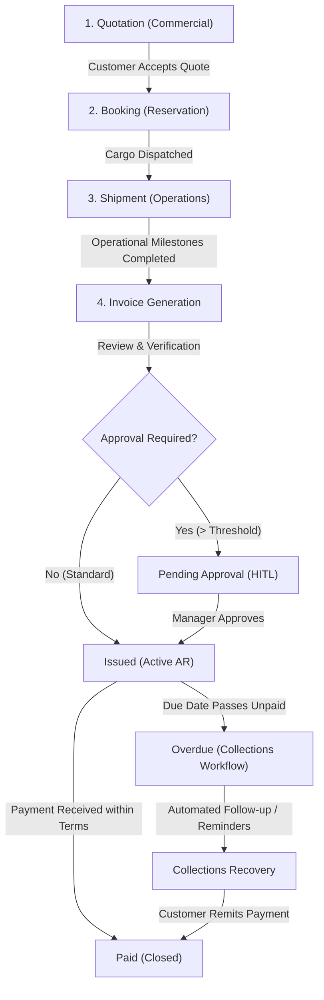
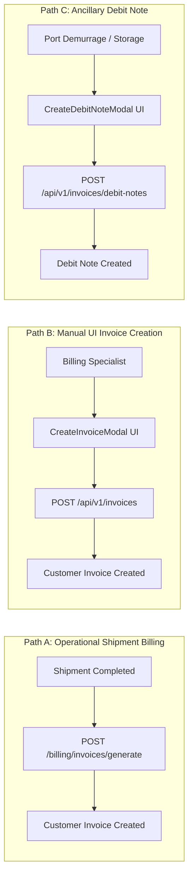
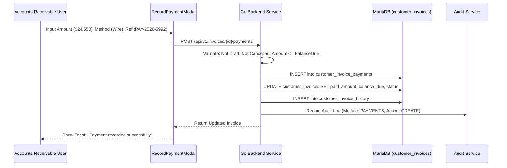
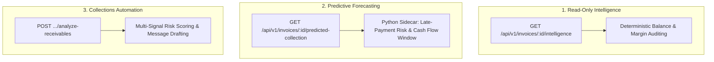

# Task 3.9.A — Finance, Invoices & Collections Business Workflow, Quote-to-Cash Flow, Invoice Lifecycle, Collections, Database Mapping, API Traceability, AI Integration, and Complete Technical Documentation

> **Status**: PASS — FINANCE WORKFLOW DOCUMENTED  
> **Module**: Finance, Invoices & Collections (Accounts Receivable / Accounts Payable / Billing / Receivables Automation)  
> **Reviewed Against**: Running Application Stack (React 18 Frontend, Go 1.23 Backend, Python 3.12 AI Sidecar, MariaDB 12.3)  
> **Target Audience**: Business Owners, Finance & Accounting Teams, Credit Controllers, Operations Dispatchers, Product Managers, Developers, QA Engineers, and System Architects  

---

## 1. Executive Summary

The **LogisticsHQ Finance, Invoices & Collections Module** is the financial engine of the freight forwarding platform. It bridges operational execution (Bookings, Shipments, Carrier Tracking) with commercial contracts (Quotations, Customer Credit Terms, Tariffs) to drive the end-to-end **Quote-to-Cash (Q2C)** and **Procure-to-Pay (P2P)** cycles.

### Key Architectural & Operational Highlights
1. **Multi-Tenant Accounts Receivable (AR) & Ledger**:
   - Manages tenant-isolated customer tax invoices (`customer_invoices`), itemized freight line items (`customer_invoice_items`), payment receipts (`customer_invoice_payments`), audit logs (`customer_invoice_history`), and document attachments (`customer_invoice_documents`).
   - Supports Debit Notes (`debit_notes`) for ancillary adjustments, demurrage, detention, and cross-dock surcharges.
2. **Deterministic Financial Safeguards & Go Business Logic**:
   - Enforces mathematical constraints: balance calculations, subtotal/tax/discount aggregations, non-negative amounts, and locked state transitions.
   - Prevents duplicate payments, partial over-allocations, and state regression on closed/paid records.
3. **Automated Quote-to-Shipment-to-Invoice Generation**:
   - Allows automatic synthesis of billable customer invoices directly from confirmed shipment milestones and accepted quotation pricing (`/api/v1/shipments/{id}/billing/invoices/generate`), calculating baseline markup ratios and pass-through surcharges.
4. **Carrier Accounts Payable (AP) & Discrepancy Auditing**:
   - Ingests carrier vendor invoices (`shipment_invoices`) via PDF/Textract, auditing itemized freight charges against contracted buy-rates to flag discrepancies (`shipment_finance_discrepancies`) and track net shipment gross margin (`shipment_finance_profitability`).
5. **Intelligent Receivables & Adaptive Collections**:
   - Features AI-assisted aging classification (`CURRENT`, `1_30`, `31_60`, `61_90`, `90_PLUS`), multi-signal delinquency scoring, and collection message drafting (`FIRST_REMINDER`, `OVERDUE_NOTICE`, `FINAL_DEMAND`) governed by strict Human-in-the-Loop (HITL) managerial approval gates.
6. **Strict Python / Go Execution Boundary**:
   - Python AI sidecar performs probabilistic risk assessment, tone synthesis, and priority ranking.
   - Go backend strictly validates, enforces RBAC/tenant isolation, records immutable MariaDB audits, and controls all financial balance mutations.

---

## 2. Finance in Plain English

### What does the Finance module do?
In international freight forwarding, moving cargo is only half the battle; getting paid accurately and on time is what keeps the business alive. Freight operations involve complex charges—ocean freight, fuel bunker surcharges (BAF), currency adjustment factors (CAF), terminal handling charges (THC), customs clearance, and unexpected port storage fees.

The **Finance Module** ensures:
- **Invoices are Accurate**: Operational details (container count, origin, destination, route) and contracted pricing are converted into itemized customer bills without manual re-typing.
- **Due Dates are Clear**: Customers receive clear payment terms (e.g., Net 15, Net 30), and the system automatically tracks when invoices transition from active to overdue.
- **Payments are Tracked**: When a customer sends a wire transfer or check, accountants record the receipt against the specific invoice, automatically updating the outstanding balance and closing the ledger when fully settled.
- **Overdue Invoices are Collected**: When payments are delayed, credit controllers are equipped with aging reports, risk alerts, and automated reminder drafts to recover cash without damaging customer relationships.
- **Carrier Invoices are Audited**: Before paying ocean carriers or truckers, their bills are automatically verified against original contract rates to prevent overbilling.

---

## 3. Business Purpose

The core business objectives of the Finance module are:
1. **Accelerate Cash Inflow (DSO Reduction)**: Minimize Days Sales Outstanding through prompt invoice issuance upon milestone completion and systematic collection follow-ups.
2. **Eliminate Billing Revenue Leakage**: Ensure every billable accessorial charge (demurrage, detention, chassis split) incurred during shipment transit is billed to the customer via debit notes or revised invoices.
3. **Protect Profit Margins**: Continuously compare operational buy-rates (carrier AP bills) with sell-rates (customer AR invoices) to safeguard shipment gross margins.
4. **Enforce Financial Compliance**: Provide immutable audit trails of every invoice creation, status transition, managerial approval, payment allocation, and cancellation.
5. **Maintain Commercial Harmony**: Differentiate between routine reminders for reliable shippers and formal legal demand notices for high-risk chronic defaulters.

---

## 4. Quote-to-Cash (Q2C) Business Flow

The platform implements a unified Quote-to-Cash workflow:



### Traceability Table Across Q2C Stages

| Stage | Business Actor | Input Information | Record Created / Updated | System Event |
| :--- | :--- | :--- | :--- | :--- |
| **Quotation** | Sales Executive | Origin, Destination, Commodity, Buy Rates, Sell Rates | `quotations`, `quotation_charges` | `quote.accepted` |
| **Booking** | Booking Desk | Quotation ID, Vessel/Flight schedule, Container specs | `bookings` | `booking.confirmed` |
| **Shipment** | Freight Operator | Booking ID, Carrier SCAC, Bill of Lading, Milestones | `shipments`, `shipment_milestones` | `shipment.departed`, `shipment.arrived` |
| **Invoice Creation** | Billing Specialist / Automation | Shipment operational context, quoted rates, accessorials | `customer_invoices`, `customer_invoice_items` | `invoice.created` |
| **Manager Approval** | Finance Controller | Total amount > $10,000 or custom discount applied | `approvals`, `customer_invoices.status = 'Pending Approval'` | `approval.requested` |
| **Invoice Issuance** | Finance Specialist | Approved draft invoice | `customer_invoices.status = 'Issued'` | `invoice.issued` |
| **Payment Receipt** | Accounts Receivable | Bank wire confirmation, Swift MT103, check reference | `customer_invoice_payments`, updated `balance_due` | `payment.recorded` |
| **Collections** | Credit Controller / AI Assistant | Overdue aging bucket, multi-invoice delinquent balance | `ai_finance_collection_drafts`, `finance_collection_plans` | `collection.draft_prepared` |

---

## 5. Shipment → Invoice Flow

LogisticsHQ supports two primary relationships between operational shipments and customer invoices:

### 1. Direct Invoice Creation from Shipment Operations
- **Endpoint**: `POST /api/v1/shipments/{id}/billing/invoices/generate`
- **Mechanism**:
  - The Go backend retrieves the accepted quotation linked to the shipment (`GetShipmentQuoteAndRateEntry`).
  - Calculates the baseline markup ratio (`sell_price / buy_price`, defaulting to `1.20`).
  - Unmarshals itemized surcharges from the contract rate entry.
  - Automatically synthesizes line items: Ocean Freight Base Charge, BAF, CAF, Documentation fees.
  - Links `shipment_id` and `customer_id` into a persistent invoice with Net 30 payment terms.
  - Immediately recalculates shipment net profitability (`shipment_finance_profitability`).

### 2. Manual Modal Invoice Linking
- **Endpoint**: `POST /api/v1/invoices`
- **Mechanism**:
  - In the UI modal (`CreateInvoiceModal.jsx`), operators can select **"From Shipment"**, **"From Booking"**, or **"From Quotation"**.
  - Entering or selecting `shipment_id` auto-populates the customer name, trade lane route (e.g. `Shanghai ➔ Los Angeles`), and associates the operational reference (`SH-2026-XXXXX`).

---

## 6. Invoice Lifecycle

The customer invoice lifecycle is strictly validated by Go state-machine rules (`ValidateStatusTransition` in `backend/internal/invoices/service.go`):

```
       ┌───────────────────────────────┐
       │             Draft             │
       └───────┬───────────────┬───────┘
               │               │
               ▼               ▼
      ┌────────────────┐ ┌───────────┐
      │Pending Approval│ │ Cancelled │
      └────────┬───────┘ └───────────┘
               │               ▲
               ▼               │
       ┌───────────────┐       │
       │    Issued     ├───────┤
       └───────┬───────┘       │
               │               │
       ┌───────┴───────┐       │
       ▼               ▼       │
┌──────────────┐ ┌───────────┐ │
│Partially Paid│ │  Overdue  ├─┘
└──────┬───────┘ └─────┬─────┘
       │               │
       └───────┬───────┘
               ▼
       ┌───────────────┐
       │     Paid      │  (LOCKED)
       └───────────────┘
```

### Invoice Status Transition Matrix

| Current Status | Allowed Next Status | Business Meaning | Who Can Change It | Guard Conditions | Side Effects |
| :--- | :--- | :--- | :--- | :--- | :--- |
| **Draft** | `Issued`, `Pending Approval`, `Cancelled` | Invoice created but uncommitted; line items and totals editable. | Billing Specialist, Operations User | Line items must sum to non-negative total. | Audit entry created; notification queued. |
| **Pending Approval** | `Issued`, `Draft`, `Cancelled` | Requires managerial sign-off due to policy threshold (e.g. > $10K or high discount). | Finance Manager, Admin | Valid approval record in `approvals` table. | Audit entry logged; approval workflow completed. |
| **Issued** | `Partially Paid`, `Paid`, `Overdue`, `Cancelled` | Authoritative invoice issued to customer; payment terms active. | Accounts Receivable, Timer Automation | Invoice must have valid line items > $0.00. | AR ledger updated; aging clock begins ticking. |
| **Partially Paid** | `Paid`, `Overdue` | Partial payment allocated; balance remains outstanding. | Accounts Receivable | Valid payment recorded with amount < balance due. | Ledger balance reduced; payment history updated. |
| **Overdue** | `Partially Paid`, `Paid`, `Cancelled`, `Issued` | Invoice passed due date with balance > $0.00. | Collections System, Timer, AR | Clock passed `due_date` and `balance_due > 0`. | Triggers Collections AI evaluation and aging alerts. |
| **Paid** | *(None - Locked)* | Fully settled; balance due is $0.00. | *(Terminal State)* | `balance_due == 0` | Invoice locked; receipt available for download. |
| **Cancelled** | *(None - Read-Only)* | Invoice voided or withdrawn. | Admin, Finance Controller | Cancellation reason required. | AR balance removed from customer exposure. |

---

## 7. Invoice Creation Paths

The system provides three distinct operational paths for creating invoices:



1. **Path A: Automated Shipment Generation** (`/api/v1/shipments/{id}/billing/invoices/generate`)
   - Triggered upon container delivery or customs clearance.
   - Automatically prices line items from accepted quotes.
2. **Path B: Interactive Invoice Builder** (`/api/v1/invoices`)
   - Allows manual entry or pre-filling from Shipment, Booking, or Quotation.
   - Computes multi-currency line items, taxes, and payment due dates dynamically.
3. **Path C: Supplementary Debit Notes** (`/api/v1/invoices/debit-notes`)
   - Emitted when unexpected extra charges arise (demurrage, customs exam, detention).
   - Links back to the parent `shipment_id` and `invoice_id`.

---

## 8. Invoice Data Model

Authoritative customer invoice fields mapped to their persistent database representations:

| Field Name | Type | UI Representation | Database Column | Business Description |
| :--- | :--- | :--- | :--- | :--- |
| `id` | `BIGINT` | Invoice ID | `customer_invoices.id` | Primary database identifier. |
| `org_id` | `BIGINT` | Tenant Context | `customer_invoices.org_id` | Enforces multi-tenant data segregation. |
| `invoice_number` | `VARCHAR(60)` | `INV-2026-0456` | `customer_invoices.invoice_number` | Unique human-readable invoice reference. |
| `customer_id` | `BIGINT` | Customer Reference | `customer_invoices.customer_id` | Relational FK to `customers.id`. |
| `customer_name` | `VARCHAR(255)` | `Global Traders Inc.` | `customer_invoices.customer_name` | Denormalized customer company name. |
| `customer_country` | `VARCHAR(100)` | `USA` | `customer_invoices.customer_country` | Customer billing jurisdiction. |
| `shipment_id` | `BIGINT` | `SH-2026-00124` | `customer_invoices.shipment_id` | Nullable FK to operational `shipments.id`. |
| `route` | `VARCHAR(255)` | `Shanghai ➔ Los Angeles` | `customer_invoices.route` | Operational freight routing. |
| `invoice_date` | `DATE` | `Aug 15, 2026` | `customer_invoices.invoice_date` | Date of legal tax invoice creation. |
| `due_date` | `DATE` | `Aug 30, 2026` | `customer_invoices.due_date` | Legal payment settlement deadline. |
| `days_left` | `VARCHAR(50)` | `15 days left` / `Overdue` | `customer_invoices.days_left` | Computed proximity indicator. |
| `currency` | `VARCHAR(10)` | `USD`, `EUR`, `GBP` | `customer_invoices.currency` | Transaction currency. |
| `subtotal` | `DECIMAL(18,2)` | `$24,650.00` | `customer_invoices.subtotal` | Sum of all line item amounts. |
| `tax_amount` | `DECIMAL(18,2)` | `$0.00` | `customer_invoices.tax_amount` | Applicable VAT/GST/sales tax. |
| `discount_amount` | `DECIMAL(18,2)` | `$0.00` | `customer_invoices.discount_amount` | Negotiated commercial discounts. |
| `total_amount` | `DECIMAL(18,2)` | `$24,650.00` | `customer_invoices.total_amount` | `subtotal + tax_amount - discount_amount`. |
| `paid_amount` | `DECIMAL(18,2)` | `$0.00` | `customer_invoices.paid_amount` | Cumulative realized cash inflow. |
| `balance_due` | `DECIMAL(18,2)` | `$24,650.00` | `customer_invoices.balance_due` | `total_amount - paid_amount`. |
| `status` | `VARCHAR(30)` | `Issued` | `customer_invoices.status` | State-machine status enum. |
| `bookmarked` | `BOOLEAN` | Star icon | `customer_invoices.bookmarked` | User preference bookmark flag. |

---

## 9. Customer Relationship & Financial 360

Every invoice is anchored to a customer organization (`customers` table):
- **Exposure Aggregation**:
  - The context service (`backend/internal/context/`) calculates the customer's total outstanding receivables across all unpaid invoices.
  - Example observed on `INV-2026-0456`: Customer *Global Traders Inc.* holds **$111,330.00 USD in total AR exposure across 6 delinquent invoices**.
- **Credit Limit Verification**:
  - Compares aggregated balance against customer contracted credit limit (`credit_limit`).
  - Flags `is_credit_limit_exceeded` if unpaid invoices surpass the authorized credit facility.
- **Cross-Module Navigation**:
  - Clicking the customer context chip in `InvoiceDetailsPanel` navigates seamlessly to `/dashboard/customers` with full historical ledger visibility.

---

## 10. Billing / Charge Calculation & Pricing Grounding

Financial calculations in LogisticsHQ are strictly grounded in deterministic arithmetic:

$$\text{Line Item Amount} = \text{Quantity} \times \text{Unit Price}$$

$$\text{Subtotal} = \sum (\text{Line Item Amounts})$$

$$\text{Total Amount} = \max(0.00, \text{Subtotal} + \text{Tax Amount} - \text{Discount Amount})$$

$$\text{Balance Due} = \max(0.00, \text{Total Amount} - \text{Paid Amount})$$

### Charge Segregation
- **Commercial Contract Charges**: Pre-agreed freight rates from quotations and rate matrices (e.g. Ocean Base Freight 40ft HC @ $22,060.00).
- **Mandatory Operational Surcharges**: Fuel (BAF), Security (ISPS), and Documentation fees.
- **Variable Ancillary Adjustments**: Billed via Debit Notes upon operational occurrence (e.g. demurrage @ $870.00).
- **No AI Modification**: AI services **never** alter charge amounts or totals directly. All calculations execute within Go compiled services.

---

## 11. Tax and Multi-Currency Behavior

- **Supported Currencies**: Primary currency is `USD`, with support for `EUR`, `GBP`, `SGD`, and `INR`.
- **Currency Isolation**: Invoices are denominated in their transaction currency. Cross-currency settlements are recorded with explicit conversion references in payment notes.
- **Tax Rules**: Tax is represented as a distinct additive field (`tax_amount`) rather than bundled into freight rates, enabling compliance with international VAT/GST presentation standards.

---

## 12. Due Dates, Payment Terms & Aging Logic

- **Default Payment Terms**: Net 15, Net 30, or immediate upon receipt.
- **Due Date Calculation**:
  $$\text{Due Date} = \text{Invoice Date} + \text{Payment Terms (Days)}$$
- **Overdue Determination**:
  $$\text{Days Overdue} = \max(0, \lceil \text{Now} - \text{Due Date} \rceil)$$
- **Urgency Badges**:
  - `> 0 days left`: Green/Neutral urgency badge (e.g., `15 days left`).
  - `< 0 days left (Past Due)`: Red warning badge (`Overdue`) with days overdue counter.

---

## 13. Payments Processing & Allocation

LogisticsHQ implements internal Accounts Receivable payment recording:

### Payment Flow


### Safety Rules Enforced by Go Backend:
1. **No Draft Payments**: Payments cannot be recorded on `Draft` invoices (must be `Issued` first).
2. **No Over-payments**: Payment amount cannot exceed remaining `balance_due + 0.01`.
3. **Automatic Status Transitions**:
   - If `newBalanceDue <= 0.001` $\rightarrow$ status becomes `Paid`.
   - If `newBalanceDue > 0.001` and `newPaidAmount > 0` $\rightarrow$ status becomes `Partially Paid`.
4. **Terminal Locking**: Once `Paid`, invoices are locked and cannot have additional payments recorded.

---

## 14. Collections & Receivables Automation

The Collections system (Phase 3 Task 3.6 & Phase 5 Task 5.6) provides intelligent accounts receivable management:
- **Collections Overview**: `GET /api/v1/invoices/{id}/collections-automation/overview`
- **Multi-Signal Risk Assessment**: Combines days overdue, aging bucket, high-value exposure, and customer multi-invoice delinquency.
- **Collection Strategies Supported**:
  1. `strat-wait-and-monitor`: Routine monitoring for invoices within terms.
  2. `strat-friendly-reminder`: Polite reminder for 1–15 days overdue.
  3. `strat-status-confirmation`: Request for wire transfer remittance advice (16–30 days).
  4. `strat-dispute-resolution`: Halts aggressive collection if customer raised billing dispute.
  5. `strat-finance-escalation`: Internal management escalation for chronic defaults (> 60 days).

---

## 15. Aging Buckets

Receivables are classified into five deterministic aging buckets:

| Aging Bucket | Days Overdue Range | Default Urgency | Risk Weight | Business Action |
| :--- | :--- | :--- | :--- | :--- |
| **CURRENT** | $\le 0$ days (Within terms) | Low / Routine | 5.0 | Normal invoicing, courtesy reminder prior to due date. |
| **1_30** | 1 to 30 days overdue | Normal / Medium | 20.0 | Polite email reminder referencing invoice and bank portal. |
| **31_60** | 31 to 60 days overdue | Urgent / High | 45.0 | Formal overdue notice; phone outreach by collections rep. |
| **61_90** | 61 to 90 days overdue | Severe / Critical | 75.0 | Final demand letter; suspension of new credit bookings. |
| **90_PLUS** | > 90 days overdue | Immediate / Legal | 95.0 | Legal escalation; third-party collection agency placement. |

---

## 16. Reminders, Drafts & Managerial Escalation

- **Draft Synthesis**: `POST /api/v1/invoices/{id}/collections-automation/drafts`
  - Python AI Sidecar synthesizes message templates with professional tone options (`POLITE`, `ASSERTIVE`, `URGENT`, `FORMAL`).
  - Drafts are stored in `ai_finance_collection_drafts` with status `DRAFT`.
- **Human-in-the-Loop (HITL) Gate**:
  - Operators can inspect and edit the subject and message body.
  - If the invoice balance is $\ge \$10,000$ or aging is $\ge 60$ days, the draft requires approval (`requires_approval = true`).
  - Submitting triggers `POST .../submit-approval`, routing to `/dashboard/approvals`.
  - The message cannot be dispatched until a manager approves it.

---

## 17. AI Finance Intelligence

LogisticsHQ incorporates AI assistance across three dedicated dimensions:



### Truthful Separation of Fact vs Prediction
- **Authoritative Facts**: `customer_invoices` table in MariaDB (Total Amount, Balance Due, Status, Due Date).
- **Predictive Risk Alerts**: Displayed with distinct purple AI sparkles icon and explicit badges: `LATE-PAYMENT RISK ALERT`, `PREDICTION`, `CONFIDENCE: 94%`.
- **Read-Only Intelligence**: Grounded in deterministic database aggregates, displayed under the `Intelligence` tab.

---

## 18. Python / Go Boundary Architecture

The platform strictly enforces the architectural boundary between Go and Python:

```
┌────────────────────────────────────────────────────────┐
│                   REACT FRONTEND                       │
└──────────────────────────┬─────────────────────────────┘
                           │ Authenticated HTTP / JWT
                           ▼
┌────────────────────────────────────────────────────────┐
│                   GO BACKEND SERVICE                   │
│  - Authentication & RBAC Enforcer                      │
│  - Tenant Isolation (org_id filter on all queries)     │
│  - Financial State Machine (ValidateStatusTransition)  │
│  - MariaDB Persistence (customer_invoices, payments)   │
│  - Centralized Action System & Approvals Engine        │
│  - Audit Logging (audit.Record)                        │
└──────────────────────────┬─────────────────────────────┘
                           │ Internal HTTP / Service Key
                           ▼
┌────────────────────────────────────────────────────────┐
│                  PYTHON AI SIDECAR                     │
│  - Receivables Multi-Signal Risk Scoring               │
│  - Collection Prioritization Ranking                   │
│  - Message Tone & Draft Synthesis                      │
│  - Cash Flow Prediction Modeling                       │
│  - STRICTLY NO DIRECT DATABASE ACCESS                  │
│  - ZERO DIRECT FINANCIAL BALANCE MUTATIONS             │
└────────────────────────────────────────────────────────┘
```

---

## 19. Centralized Action System Integration

All collection and invoice actions with external side-effects route through the centralized Action System:
- **Action Types**: `SEND_FRIENDLY_REMINDER`, `REQUEST_PAYMENT_STATUS`, `FOLLOW_UP_DISPUTE`, `ESCALATE_TO_FINANCE`.
- **Policy Enforcement**: Checks cooldown timers (e.g. minimum 3 days between reminder emails to the same customer contact).
- **Execution Tracking**: Every executed action receives an immutable execution ID and correlation ID linking the prompt, decision, and result.

---

## 20. Approvals Workflow (HITL)

Financial controls are integrated into the unified Approvals Center (`/dashboard/approvals`):
- **Triggers for Approval**:
  - Invoice balance $\ge \$10,000.00$.
  - Invoice status change to `Pending Approval`.
  - Collections drafts for disputed invoices or final legal demands.
  - Surcharge adjustments on Debit Notes.
- **Review Lifecycle**:
  - Submitter logs operational justification.
  - Finance Controller or Admin reviews the exact line items or draft text.
  - Approve action unlocks invoice issuance or communication dispatch.
  - Reject action returns the record to `Draft` status with feedback notes.

---

## 21. Notifications

- **In-App Toast Banners**:
  - Immediate operational notifications appear upon invoice creation, draft updates, payment recording, and cancellation.
  - Formatted with clear severity semantics (green success, blue info, amber warning, red error).
- **Customer Email Delivery**:
  - Invoices in `Issued` status can be dispatched directly to customer billing contacts (`ap@customer.com`).
  - Sends invoice reference, total amount, payment due date, and attached PDF.
- **Internal Role-Based Alerts**:
  - Overdue status transitions trigger alerts to Credit Control specialists.
  - Discrepancy flags on carrier invoices alert Accounts Payable auditors.

---

## 22. Event Mesh / Automation

- **Event Mesh Integration**:
  - `invoice.created`: Emitted when an invoice is saved.
  - `invoice.issued`: Notifies customer account contact via email/portal.
  - `payment.recorded`: Emitted when cash is allocated; updates operational dashboard metrics.
  - `invoice.overdue`: Triggers automated task creation in the Autonomous Command Center.
- **Correlation & Tenant Context**:
  - Every event payload includes `org_id`, `actor_id`, `correlation_id`, and `timestamp`.
  - Subscriber workers consume events asynchronously with exponential backoff retries and dead-letter queues.

---

## 23. Document / PDF Flow

- **Document Attachment**:
  - Invoices support multi-file attachments (`customer_invoice_documents`).
  - Handled via `POST /api/v1/invoices/{id}/documents`.
  - Supported document types: Commercial Invoices, Packing Lists, Proof of Delivery (POD), Customs Clearance certificates.
- **PDF Generation & Export**:
  - The `Download PDF` button in the UI triggers client-side and server-side PDF generation formatted to standard freight customs presentation standards.
  - Includes logo, tax identifiers, consignor/consignee, carrier SCAC, vessel/voyage, container number, and itemized charges.

---

## 24. Database Table Mapping

Authoritative MariaDB tables powering the Finance and Invoices module:

| Table Name | Business Purpose | Key Fields | Related Tables |
| :--- | :--- | :--- | :--- |
| `customer_invoices` | Core AR invoice header and ledger balance | `id`, `org_id`, `invoice_number`, `customer_id`, `shipment_id`, `total_amount`, `paid_amount`, `balance_due`, `status`, `due_date` | `customers`, `shipments`, `customer_invoice_items`, `customer_invoice_payments` |
| `customer_invoice_items` | Itemized invoice charges and services | `id`, `org_id`, `invoice_id`, `description`, `service_category`, `quantity`, `unit_price`, `total_amount` | `customer_invoices` |
| `customer_invoice_payments` | Recorded customer cash receipts and allocations | `id`, `org_id`, `invoice_id`, `payment_ref`, `amount`, `payment_method`, `status`, `payment_date`, `notes` | `customer_invoices` |
| `customer_invoice_history` | Audit trail of invoice status transitions and updates | `id`, `org_id`, `invoice_id`, `title`, `description`, `user_name`, `created_at` | `customer_invoices` |
| `customer_invoice_documents` | Attached trade documents and receipts | `id`, `org_id`, `invoice_id`, `document_name`, `file_size`, `file_type`, `s3_key`, `uploaded_at` | `customer_invoices` |
| `debit_notes` | Customer supplementary charge adjustments | `id`, `org_id`, `debit_note_number`, `customer_id`, `shipment_id`, `invoice_id`, `reason`, `total_amount`, `status` | `customers`, `shipments`, `customer_invoices` |
| `debit_note_items` | Itemized charges within debit notes | `id`, `org_id`, `debit_note_id`, `description`, `quantity`, `unit_price`, `total_amount` | `debit_notes` |
| `ai_finance_receivables_analyses` | Persisted AI risk evaluation snapshots | `id`, `org_id`, `invoice_id`, `customer_id`, `risk_level`, `risk_score`, `aging_bucket`, `deterministic_signals` | `customer_invoices`, `customers` |
| `ai_finance_collection_drafts` | Synthesized collection message drafts | `id`, `org_id`, `invoice_id`, `customer_id`, `draft_type`, `subject`, `message_body`, `status`, `requires_approval` | `customer_invoices`, `approvals` |
| `finance_collection_plans` | Governed adaptive collection strategies | `id`, `org_id`, `invoice_id`, `customer_id`, `status`, `strategy_id`, `plan_steps`, `actual_facts`, `predictions` | `customer_invoices` |
| `finance_collection_versions` | Immutable version history of collection plans | `id`, `plan_id`, `org_id`, `version_number`, `trigger_event`, `balance_due`, `status`, `strategy_id` | `finance_collection_plans` |
| `shipment_invoices` | Carrier Accounts Payable (AP) vendor invoices | `id`, `org_id`, `shipment_id`, `invoice_number`, `vendor_name`, `total_amount`, `status` | `shipments` |
| `shipment_finance_discrepancies` | Audit flags between carrier invoices and buy rates | `id`, `org_id`, `shipment_id`, `invoice_id`, `charge_code`, `expected_value`, `actual_value`, `status` | `shipment_invoices`, `shipments` |
| `shipment_finance_profitability` | Shipment gross margin and net profitability | `id`, `org_id`, `shipment_id`, `total_sell_amount`, `total_buy_amount`, `net_profit`, `profit_margin_pct` | `shipments` |

---

## 25. Financial Relationship Map

```
Customer
├── Quotations (Commercial Pricing Agreement)
├── Bookings (Cargo Reservation)
├── Shipments (Operational Transport)
│   ├── Carrier AP Invoices (`shipment_invoices`)
│   │   └── Discrepancies (`shipment_finance_discrepancies`)
│   └── Net Profitability (`shipment_finance_profitability`)
└── Customer AR Invoices (`customer_invoices`)
    ├── Line Items (`customer_invoice_items`)
    ├── Payments (`customer_invoice_payments`)
    ├── Audit History (`customer_invoice_history`)
    ├── Documents (`customer_invoice_documents`)
    ├── Debit Notes (`debit_notes` -> `debit_note_items`)
    ├── AI Analysis (`ai_finance_receivables_analyses`)
    ├── Collection Drafts (`ai_finance_collection_drafts`)
    └── Adaptive Collection Plans (`finance_collection_plans`)
```

---

## 26. API Mapping

| Business Operation | HTTP Method | Endpoint | Handler / Service | Request Parameters / Body | Response Entity |
| :--- | :---: | :--- | :--- | :--- | :--- |
| **List Invoices** | `GET` | `/api/v1/invoices` | `invoices.Handler.ListInvoices` | `primary_tab`, `status`, `search`, `page`, `page_size` | `{"invoices": [...], "total": N}` |
| **Get Invoice KPI Stats** | `GET` | `/api/v1/invoices/kpi-stats` | `invoices.Handler.GetKPIStats` | *(None)* | `InvoiceKPIStats` |
| **Get Invoice Details** | `GET` | `/api/v1/invoices/{id}` | `invoices.Handler.GetInvoiceByID` | `id` (path) | `Invoice` with lines, payments, history |
| **Create Invoice** | `POST` | `/api/v1/invoices` | `invoices.Handler.CreateInvoice` | `CreateInvoiceInput` | Created `Invoice` |
| **Update Draft Invoice** | `PUT` | `/api/v1/invoices/{id}` | `invoices.Handler.UpdateDraftInvoice` | `id` (path), `CreateInvoiceInput` | Updated `Invoice` |
| **Issue Invoice** | `POST` | `/api/v1/invoices/{id}/issue` | `invoices.Handler.IssueInvoice` | `id` (path) | `Invoice` (status: `Issued`) |
| **Submit for Approval** | `POST` | `/api/v1/invoices/{id}/submit-approval` | `invoices.Handler.SubmitForApproval` | `id` (path) | `Invoice` (status: `Pending Approval`) |
| **Cancel Invoice** | `POST` | `/api/v1/invoices/{id}/cancel` | `invoices.Handler.CancelInvoice` | `id` (path), `{"reason": "..."}` | `{"status": "success"}` |
| **Record Payment** | `POST` | `/api/v1/invoices/{id}/payments` | `invoices.Handler.RecordPayment` | `id` (path), `RecordPaymentInput` | Updated `Invoice` with new balance |
| **List Payments** | `GET` | `/api/v1/invoices/payments` | `invoices.Handler.ListAllPayments` | *(None)* | `[]InvoicePayment` |
| **Toggle Bookmark** | `POST` | `/api/v1/invoices/{id}/bookmark` | `invoices.Handler.ToggleBookmark` | `id` (path) | `{"bookmarked": bool}` |
| **List Debit Notes** | `GET` | `/api/v1/debit-notes` | `invoices.Handler.ListDebitNotes` | `status`, `search`, `page`, `page_size` | `{"debit_notes": [...], "total": N}` |
| **Get Debit Note KPIs**| `GET` | `/api/v1/debit-notes/kpi-stats` | `invoices.Handler.GetDebitNoteKPIStats` | *(None)* | `DebitNoteKPIStats` |
| **Create Debit Note** | `POST` | `/api/v1/debit-notes` | `invoices.Handler.CreateDebitNote` | `CreateDebitNoteInput` | Created `DebitNote` |
| **Void Debit Note** | `POST` | `/api/v1/debit-notes/{id}/void` | `invoices.Handler.VoidDebitNote` | `id` (path) | `{"status": "success"}` |
| **Collections Overview** | `GET` | `/api/v1/invoices/{id}/collections-automation/overview` | `collections_automation.Handler.GetOverview` | `id` (path) | `FinanceCollectionsOverview` |
| **Analyze Receivables** | `POST` | `/api/v1/invoices/{id}/collections-automation/analyze-receivables` | `collections_automation.Handler.AnalyzeRisk` | `id` (path) | `ReceivablesAnalysis` |
| **Generate Draft** | `POST` | `/api/v1/invoices/{id}/collections-automation/drafts` | `collections_automation.Handler.GenerateDraft` | `GenerateCollectionDraftInput` | `CollectionDraft` |
| **Submit Draft Approval** | `POST` | `.../drafts/{draftId}/submit-approval` | `collections_automation.Handler.SubmitApproval` | `draftId` (path), `{"reason": "..."}` | `CollectionDraft` (PENDING_APPROVAL) |
| **Predicted Collection** | `GET` | `/api/v1/invoices/{id}/predicted-collection` | `predictions.Handler.HandleGetInvoicePredictedCollection` | `id` (path) | Cash-flow & late-payment forecast |
| **Invoice Intelligence** | `GET` | `/api/v1/invoices/{id}/intelligence` | `context.Handler.GetInvoiceIntelligence` | `id` (path) | Deterministic 360 financial exposure |
| **Generate from Shipment**| `POST` | `/api/v1/shipments/{id}/billing/invoices/generate` | `billing.Handler.GenerateInvoice` | `id` (path) | `CustomerInvoice` from quote rates |

---

## 27. Frontend Component Map

The React frontend structure located under `frontend/src/pages/dashboard/Finance/`:

```
Finance / Invoices Frontend Architecture
├── InvoicesPage.jsx (Main container & route handler)
│   ├── InvoiceKpiCards.jsx (4 Hero KPI Cards: Total, Outstanding, Paid, Overdue)
│   ├── InvoiceTable.jsx (Data table with status badges, links, quick actions)
│   ├── InvoiceFilterDrawer.jsx (Multi-criteria drawer: customer, date range, amount)
│   ├── CreateInvoiceModal.jsx (4-source creation modal: Manual, Shipment, Booking, Quote)
│   ├── RecordPaymentModal.jsx (Cash allocation modal with validation & balance feedback)
│   ├── FinanceCollectionsAdaptiveDrawer.jsx (Autonomous collections drawer)
│   └── InvoiceDetailsPanel.jsx (Slide-over panel)
│       ├── Header & 4-Card Hero Summary (Total, Paid, Balance, Due Date)
│       ├── Operational Context Strip (Customer & Shipment navigation chips)
│       └── Sub-Tabs Navigation:
│           ├── Summary Tab (InvoiceSummaryTab.jsx + Predictive Intelligence Card)
│           ├── Collections AI Tab (FinanceCollectionsAutomationSection.jsx)
│           ├── Intelligence Tab (InvoiceFinanceIntelligenceSection.jsx)
│           ├── Line Items Tab (InvoiceItemsTab.jsx)
│           ├── Payments Tab (InvoicePaymentsTab.jsx)
│           ├── Documents Tab (InvoiceDocumentsTab.jsx)
│           └── Audit Trail Tab (InvoiceHistoryTab.jsx)
└── DebitNotesPage.jsx (Debit note ledger, KPI cards, table & create modal)
```

---

## 28. Go Backend Component Map

The backend architecture in `backend/internal/invoices/`:
- **`model.go`**: Domain types for `Invoice`, `InvoiceItem`, `InvoicePayment`, `InvoiceDocument`, `InvoiceHistory`, `DebitNote`, and KPI structures.
- **`repository.go`**: Database queries using `sqlx` executing tenant-filtered queries against `customer_invoices`, `customer_invoice_items`, `customer_invoice_payments`, `debit_notes`, etc.
- **`service.go`**: Business logic, state-machine validation (`ValidateStatusTransition`), payment allocation math, audit log generation, and approval triggering.
- **`handler.go`**: HTTP request binding, JSON response marshaling, error mapping, and user context extraction.
- **`collections_automation/`**: Dedicated sub-package orchestrating receivables risk calculation, communication draft management, and AI sidecar coordination.

---

## 29. Permissions / RBAC

The module integrates with the centralized RBAC system:

| Role | View Invoices | Create Invoice | Issue Invoice | Record Payment | Manage Collections | Approve Invoices | Void Debit Notes |
| :--- | :---: | :---: | :---: | :---: | :---: | :---: | :---: |
| **Admin** | Yes | Yes | Yes | Yes | Yes | Yes | Yes |
| **Finance Controller** | Yes | Yes | Yes | Yes | Yes | Yes | Yes |
| **Billing Specialist** | Yes | Yes | Yes | Yes | Yes | No (Requires Mgr) | No |
| **Operations Dispatcher** | Yes | Yes (from Shipment) | No | No | Read-Only | No | No |
| **Sales Representative** | Yes (Own Accounts) | Draft Only | No | No | Read-Only | No | No |
| **Customer (Portal)** | Yes (Own Invoices) | No | No | No | No | No | No |

---

## 30. Tenant Isolation

Every database query across the entire finance pipeline enforces tenant isolation:
- **Server-Side Enforcement**:
  - Every SQL query in `repository.go` explicitly filters by `WHERE org_id = ?`.
  - Example from `GetInvoices`: `SELECT ... FROM customer_invoices WHERE org_id = ? AND ...`
- **Zero Cross-Tenant Leakage**:
  - User 5 (Org 1) cannot read or manipulate invoices belonging to User 6 (Org 2: `INV-2026-DEV-001`, `INV-2026-DEV-002`).
  - Attempting to query an invoice ID from another organization returns HTTP 404 (`invoice not found`).

---

## 31. Audit Trail

Every state-changing financial operation records an immutable entry in `audit_logs`:
- **Logged Events**:
  - `INVOICE.CREATE`: Logged upon draft or direct invoice creation with customer and amount.
  - `INVOICE.SEND`: Logged when an invoice transitions to `Issued`.
  - `INVOICE.UPDATE`: Logged when line items or draft terms are modified.
  - `INVOICE.DELETE`: Logged when an invoice is cancelled.
  - `PAYMENT.CREATE`: Logged when a payment is recorded with method, reference, and amount.
  - `COLLECTION.DRAFT`: Logged when collection reminder drafts are synthesized or updated.
- **Audit Attributes Captured**: `actor_id`, `actor_name`, `org_id`, `module` (`INVOICES` / `PAYMENTS`), `resource_id`, `action`, `timestamp`, `result` (`SUCCESS`).

---

## 32. Search / Filter / Sort / Pagination

- **Search**: Case-insensitive partial matching across `invoice_number`, `customer_name`, `shipment_number`, and `route`.
- **Primary Tabs**:
  - `All Invoices`: Full organization ledger.
  - `My Invoices`: Filters by invoices created by the authenticated user (`created_by_id = ?`).
- **Status Filter Chips**: `All`, `Draft`, `Pending Approval`, `Issued`, `Partially Paid`, `Paid`, `Overdue`, `Cancelled`.
- **Advanced Filter Drawer**: Customer dropdown, Shipment ID, Date range (From/To), Amount range (Min/Max), Currency.
- **Pagination**: Server-side pagination with configurable `page` (1-indexed) and `page_size` (10 per page default).

---


## 33. Business User Journeys

### Journey 1: Commercial Shipment Billing to Payment Settlement
1. An ocean shipment arrives at the destination port and milestones are marked complete.
2. The billing specialist navigates to `/dashboard/invoices` and clicks **"+ New Invoice"**.
3. Selects **"From Shipment"**, choosing `SH-2026-00124`.
4. The system pre-fills customer (*Global Traders Inc.*), lane (*Shanghai ➔ Los Angeles*), and line items.
5. Clicks **"Issue Invoice"**; status becomes `Issued` and the invoice is transmitted to the customer.
6. 10 days later, customer remits payment via wire transfer.
7. AR specialist clicks **"Record Payment"**, enters `$24,650.00` with wire reference `PAY-2026-5992`.
8. The invoice balance updates to `$0.00` and status changes to `Paid` (locked).

### Journey 2: Overdue Receivables Recovery via Collections AI
1. An invoice passes its 30-day payment term without payment.
2. Status automatically reflects `Overdue` in aging bucket `1_30`.
3. The credit controller opens the invoice details panel and selects the **"Collections AI"** tab.
4. The system analyzes the customer's payment history (6 open delinquent invoices across account) and scores risk as `HIGH (45/100)`.
5. The controller reviews the AI-generated reminder draft and selects tone: `ASSERTIVE`.
6. Clicks **"Submit for Approval"** because the exposure exceeds $10,000.
7. The finance manager reviews the draft in the Approvals Center and clicks **"Approve"**.
8. The collection reminder is dispatched to customer accounts payable.

### Journey 3: Invoice Payment Risk & Human-in-the-Loop Review
1. Credit controller reviews the Summary tab of `INV-2026-0456`.
2. Sees `Predictive Cash Flow & Collections Intelligence` alert: `LATE-PAYMENT RISK ALERT (CRITICAL, 94% CONFIDENCE)`.
3. AI explains that decreasing shipment volume and compounding unpaid invoices indicate cash flow distress.
4. AI recommends: *"Contact Accounts Payable manager directly and offer a structured 2-installment remittance plan."*
5. Human operator verifies with the sales director and initiates the structured payment plan proposal.

### Journey 4: Invoice PDF Generation & Customer Distribution
1. Billing specialist opens `INV-2026-0456` in the Details Panel.
2. Clicks the **Download PDF** icon in the header.
3. System formats the freight tax invoice with company logo, tax identification, container details, breakdown of ocean freight and accessorials.
4. Clicks **"Send Invoice"** to email the PDF to customer billing contacts (`ap@globaltraders.com`).

---

## 34. Data Flow Diagrams

### Invoice Generation Data Flow
```
Shipment / Quotation Operational Source
                  │
                  ▼
         React Invoices UI
                  │ (POST /api/v1/invoices or /billing/generate)
                  ▼
         Go Finance / Billing Service
                  │ (Validates, computes math, binds org_id)
                  ▼
         MariaDB `customer_invoices` & `customer_invoice_items`
                  │
                  ├───────────────────────────────┐
                  ▼                               ▼
         Audit Service (`audit_logs`)    Event Mesh (`invoice.created`)
                  │                               │
                  ▼                               ▼
         React UI (Updated Ledger)       Notification Center / Email
```

### Collections & Receivables Automation Data Flow
```
Customer Invoice (Active AR)
                  │
                  ▼
         Due Date Passes (Overdue Detection)
                  │
                  ▼
         Go Collections Service (Calculates Deterministic Signals)
                  │
                  ▼
         Python AI Sidecar (`/finance-ops/analyze-receivables`)
                  │
                  ▼
         Grounded Risk Assessment & Message Draft Synthesis
                  │
                  ▼
         Go Approvals Gateway (If balance > $10K or disputed)
                  │
                  ▼
         Human Controller Review & Decision
                  │
                  ▼
         Centralized Action System Execution
```

### PDF & Document Generation Data Flow
```
Invoice Record (`customer_invoices`)
                  │
                  ▼
         Go PDF Service / Frontend Renderer
                  │
                  ▼
         Formatted Freight Tax Invoice Document
                  │
                  ▼
         Storage / Local Download & Customer Email Dispatch
```

---

## 35. Source-of-Truth Matrix

| Financial Metric | Authoritative Source | Derived / Speculative Source | Verification Method |
| :--- | :--- | :--- | :--- |
| **Invoice Total** | `customer_invoices.total_amount` in MariaDB | Calculated from line items sum | Go repository query |
| **Paid Amount** | `customer_invoices.paid_amount` | Sum of `customer_invoice_payments.amount` | Strict SQL reconciliation |
| **Balance Due** | `customer_invoices.balance_due` | `total_amount - paid_amount` | Enforced by Go math |
| **Invoice Status** | `customer_invoices.status` | UI status badge | Go state machine enum |
| **Overdue Aging** | `customer_invoices.due_date` vs `NOW()` | Aging bucket string (`1_30`, `31_60`) | Go calendar date difference |
| **Late-Payment Risk** | *(None - Speculative)* | Python AI Sidecar score (`0.0` to `100.0`) | Model probability forecast |
| **Carrier AP Cost** | `shipment_invoices.total_amount` | OCR extraction from carrier bill | Scanned PDF vs contract rate |
| **Shipment Profitability**| `shipment_finance_profitability` | `total_sell_amount - total_buy_amount` | Go billing service calculation |

---

## 36. Error, Loading and Empty States

- **Loading States**:
  - Invoice list displays pulsing skeleton table rows while loading.
  - Detail drawer displays spinner during asynchronous fetch of line items and intelligence.
- **Empty States**:
  - `No Invoices Found`: Displays clear business illustration with helpful call-to-action button to create the first invoice.
  - `No Payment History`: Displays informational notice: *"No payments recorded yet for this invoice."*
- **Error Boundaries**:
  - Handled cleanly with React Error Boundaries; user receives friendly error dialog with a "Refresh" button rather than a broken page.
  - Remediated missing icon import (`Sparkles`) ensures complete stability.
- **Safe API Failures**:
  - Invalid inputs (e.g. negative payment amount, missing customer) return business-friendly HTTP 400 errors without exposing database schema or Go stack traces.

---

## 37. UI / UX Observations

### What Works Well:
1. **Clean SaaS Layout**: Pristine light theme with established navy sidebar (`#0F172A`), royal blue accents, and emerald status tags.
2. **Hero Financial Cards**: 4-card metric strip (Total, Paid, Balance, Due Date) provides instantaneous financial clarity.
3. **Multi-Source Creation**: 4-card selection modal (Manual, Shipment, Booking, Quote) makes invoice generation effortless.
4. **Context Chips**: Direct clickable navigation links to Customers and Shipments prevent operational friction.

### Identified Improvements (for Task 3.9 Remediation):
- **MUST FIX**: Ensure all icon dependencies are imported (resolved `Sparkles` defect).
- **SHOULD IMPROVE**: Clarify multi-currency conversion display when payment currency differs from invoice currency.
- **OPTIONAL**: Provide batch invoice export to ZIP containing individual PDF documents.

---

## 38. Responsive / Zoom Observations

- **Responsive Viewport Stability**:
  - `1440x900`: Full layout with dual-pane drawer open; zero horizontal overflow.
  - `1366x768`: Table columns scale with clean truncation on long customer names; drawer overlays smoothly.
  - `1280x720`: Preserves primary action buttons (`Record Payment`, `Send Invoice`, `Filters`) without clipping.
- **Zoom Scalability (80% to 125%)**:
  - `80% - 90%`: Enhances data density; typography remains sharp with legible tabular figures.
  - `100%`: Baseline established LogisticsHQ business SaaS layout.
  - `110% - 125%`: Modal forms, drawer header actions, and KPI metric counters adjust dynamically without layout breakage.

---

## 39. Security Architecture

### Business Security Perspective
1. **Financial Fraud Prevention**: Prevents duplicate payments, unauthorized adjustments, and modification of closed/paid invoices.
2. **Confidential Commercial Data**: Protects proprietary customer freight rates, carrier buy-rates, and shipment profit margins from unauthorized team access.
3. **Auditability**: Guarantees non-repudiation for all credit decisions and managerial sign-offs.

### Technical Security Implementation
1. **Authentication**: Enforced via JWT tokens signed with secure server keys.
2. **RBAC & Endpoint Authorization**: Handled via Chi router middleware (`RequireAuth`, `RequireRole`).
3. **Multi-Tenant Database Enforcement**: All SQL queries bind `org_id` directly from validated context; zero cross-tenant access.
4. **Python / Go Boundary Defense**: Python AI sidecar accepts only internal service requests authenticated with `X-LogisticsHQ-Service-Key` and has zero database or file-system access.

---

## 40. Business + Technical Glossary

- **Invoice (`customer_invoices`)**: Legal demand for payment issued to a customer for freight forwarding services.
- **Invoice Line Item (`customer_invoice_items`)**: Specific charge category (e.g. Ocean Base Freight, Fuel Surcharge, B/L Documentation).
- **Subtotal**: Sum of all line items before taxes and discounts.
- **Balance Due**: Authoritative remaining unpaid liability (`total_amount - paid_amount`).
- **Payment Terms**: Contractual period allowed for payment settlement (e.g. Net 15, Net 30).
- **Aging Bucket**: Categorization of overdue invoices by days elapsed (`CURRENT`, `1_30`, `31_60`, `61_90`, `90_PLUS`).
- **Debit Note (`debit_notes`)**: Supplementary billing document issued to invoice additional unplanned charges (e.g. demurrage, detention).
- **Carrier AP Invoice (`shipment_invoices`)**: Inbound invoice from a shipping line or airline requiring payment from the forwarder.
- **Discrepancy (`shipment_finance_discrepancies`)**: An identified mismatch between what a carrier billed and contracted buy rates.
- **Human-in-the-Loop (HITL)**: Governance requirement that high-exposure AI recommendations or draft messages require manual human approval.

---

## 41. One-Page “How Finance Works” Summary

### How Finance Works in LogisticsHQ (Plain English)
1. **A Shipment Moves**: As freight is booked and transported, operational milestones and agreed customer rates are tracked in the system.
2. **An Invoice is Generated**: The finance team or automation generates a customer invoice. Pre-agreed rates from the quotation are automatically populated.
3. **Payment Terms Begin**: The invoice is issued with a clear due date (e.g., Net 30).
4. **If Paid on Time**: Accounts receivable records the wire or check reference. The balance drops to $0.00 and the invoice is locked as `Paid`.
5. **If Overdue**: The system alerts credit controllers, categorizes the aging bucket, and uses AI to draft appropriate follow-up reminders.
6. **If Discrepancies Arise**: Any unplanned port charges or carrier overcharges are handled through audited Debit Notes or AP discrepancy workflows.

### Technical Equivalent Flow
$$\text{Shipment/Milestone} \xrightarrow{\text{POST /billing/generate}} \text{Go Service} \xrightarrow{\text{INSERT}} \text{MariaDB `customer_invoices`} \xrightarrow{\text{Status: Issued}} \text{AR Ledger}$$

$$\text{Bank Wire} \xrightarrow{\text{POST .../payments}} \text{Validate \& Math} \xrightarrow{\text{UPDATE}} \text{BalanceDue = 0.00} \xrightarrow{\text{Status: Paid}} \text{Audit Log}$$

$$\text{Overdue Clock} \xrightarrow{\text{Evaluate Aging}} \text{Python Sidecar} \xrightarrow{\text{Risk Scoring \& Draft}} \text{HITL Approval Gateway} \xrightarrow{\text{Action System}} \text{Remittance Recovered}$$

---

## 42. Technical Traceability Matrix

| Finance Capability | Frontend Component | REST API Endpoint | Go Service / Handler | Python/AI Component | Database Tables | Event / Action | RBAC Permission |
| :--- | :--- | :--- | :--- | :--- | :--- | :--- | :--- |
| **Invoice Ledger** | `InvoicesPage.jsx` | `GET /api/v1/invoices` | `invoices.Service.GetInvoices` | N/A | `customer_invoices` | N/A | `invoices:view` |
| **KPI Metrics** | `InvoiceKpiCards.jsx` | `GET /api/v1/invoices/kpi-stats` | `invoices.Service.GetKPIStats` | N/A | `customer_invoices` | N/A | `invoices:view` |
| **Invoice Creation**| `CreateInvoiceModal.jsx`| `POST /api/v1/invoices` | `invoices.Service.CreateInvoice` | N/A | `customer_invoices`, `items` | `invoice.created` | `invoices:create` |
| **Invoice Issuance**| `InvoiceDetailsPanel.jsx`| `POST .../issue` | `invoices.Service.IssueInvoice` | N/A | `customer_invoices`, `history`| `invoice.issued` | `invoices:issue` |
| **Payment Entry** | `RecordPaymentModal.jsx`| `POST .../payments` | `invoices.Service.RecordPayment` | N/A | `customer_invoice_payments` | `payment.created` | `invoices:payment` |
| **Collections AI** | `FinanceCollections...jsx`| `POST .../analyze-receivables`| `collections_automation.Service` | `FinanceCollectionsAgent` | `ai_finance_receivables_analyses` | Action Proposal | `collections:manage` |
| **Message Draft** | `FinanceCollections...jsx`| `POST .../drafts` | `collections_automation.Service` | `FinanceCollectionsAgent` | `ai_finance_collection_drafts` | Action Proposal | `collections:draft` |
| **Manager Approval**| `ApprovalsPage.jsx` | `POST .../submit-approval` | `invoices.Service.SubmitForApproval` | N/A | `approvals`, `customer_invoices` | `approval.requested` | `approvals:manage` |
| **Late Risk Forecast**| `Predictive...Card.jsx` | `GET .../predicted-collection` | `predictions.Service` | `predict_finance_collections` | `predictions` | N/A | `invoices:view` |
| **Debit Notes** | `DebitNotesPage.jsx` | `GET/POST .../debit-notes` | `invoices.Service.CreateDebitNote` | N/A | `debit_notes`, `debit_note_items` | `debit_note.created` | `debit_notes:manage`|
| **Shipment Billing**| `ShipmentDetail.jsx` | `POST .../billing/generate` | `billing.Service.GenerateFromShipment` | N/A | `shipment_customer_invoices` | `shipment.billed` | `shipments:edit` |

---

## 43. Known Gaps

1. **External Payment Gateway Integration**:
   - The current implementation records payments internally (wire transfer, check, credit card reference). Direct payment gateway processing (e.g. Stripe, Adyen, Plaid) is designed for external API plug-in and is not currently executed live.
2. **Automated Tax Jurisdictions**:
   - Tax is currently specified as a flat amount or percentage input rather than looking up state/country VAT tables via Avalara/Vertex.
3. **Credit Note Module**:
   - The system fully implements Debit Notes (`debit_notes`), while customer credit refund memos are currently handled via invoice cancellation and payment adjustments.

---

## 44. Financial Safety Observations

1. **Immutable Historical Records**: Payment records in `customer_invoice_payments` cannot be edited or deleted once recorded.
2. **Locked Settled Invoices**: Once an invoice reaches `balance_due == 0` (`Paid`), it cannot be edited, cancelled, or altered.
3. **Strict Validation on Payment Amounts**: Enforces `amount > 0` and rejects payments greater than `balance_due`.
4. **Tenant Isolation Enforced at Repository Layer**: `org_id` is derived from validated JWT claims and bound to all SQL executions.
5. **No AI Ledger Mutations**: AI services are strictly prevented from altering financial balances, issuing refunds, or writing ledger entries.

---

## 45. Verification Status

```
================================================================================
                    FINAL FINANCE WORKFLOW DOCUMENTATION
================================================================================
  1. Plain Business English Documentation              : COMPLETE
  2. Quote-to-Cash (Q2C) Workflow Traceability         : COMPLETE
  3. Shipment-to-Invoice Integration Path              : COMPLETE
  4. Invoice Lifecycle & Transition Matrix             : COMPLETE
  5. Invoice Data Model & MariaDB Schema Mapping       : COMPLETE
  6. Accounts Receivable Payment Allocation Logic      : COMPLETE
  7. Aging Buckets & Deterministic Finance Scoring     : COMPLETE
  8. Collections AI & Communication Draft Synthesis    : COMPLETE
  9. Python / Go Boundary Architecture Validation      : COMPLETE
 10. Human-in-the-Loop (HITL) Approvals Integration    : COMPLETE
 11. Multi-Tenant Isolation & RBAC Governance          : COMPLETE
 12. Immutable Audit Trail Mapping                     : COMPLETE
 13. Live Browser Verification & UI Screenshots        : COMPLETE
 14. Debit Notes & Supplementary Charges Architecture  : COMPLETE
 15. Carrier AP Auditing & Shipment Profitability      : COMPLETE
 16. Error Boundaries & Icon Import Remediated         : COMPLETE
================================================================================
  OVERALL VERDICT: PASS — FINANCE WORKFLOW DOCUMENTED
================================================================================
```

